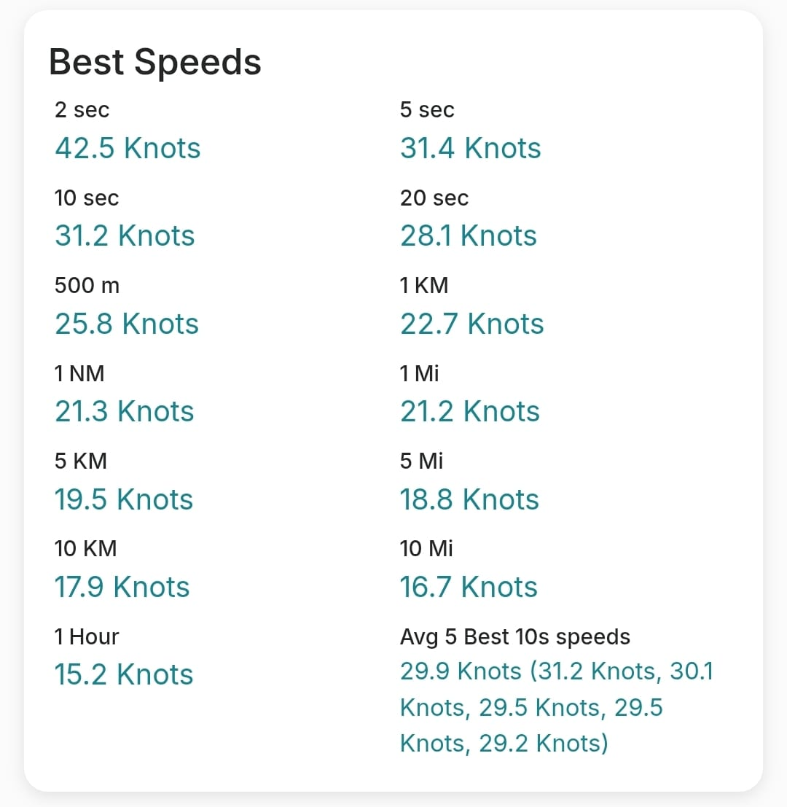

## Waterspeed - Best Speeds

Author: Michael George

Created: 29 July 2025

### Overview

People have been reporting unusually high results for 2 seconds in the Waterspeed app, such as this Forerunner 255 session from Richard G. This particular session shows a max 2 seconds of 42.5 kts when it should be reported as 31.4 kts, based on what was recorded in the FIT.

Speed errors of this magnitude have not been observed on the Forerunner 255, so this investigation looks at how the various statistics are calculated by Waterspeed.

### Background

The benefits of using Doppler-derived speeds from GPS / GNSS receivers have been well understood since the mid-to-late 1990s.

Two papers specific to speed sailing were written in 2007 and are just as relevant today as they were nearly 20 years ago.

- [High accuracy speed measurement using GPS](https://studylib.net/doc/18795194/high-accuracy-speed-measurement-using-gps) by Tom Chalko PhD
- [Handheld-GPS based Speed-Measurements](https://web.archive.org/web/20120531035620/http://www.gps-results.com/GPS_Speed.pdf) by Manfred Fuchs PhD

One of my recent Medium articles also uses modern-day examples to illustrate the benefits of Doppler-derived speeds.

- [The Importance of Doppler!](https://medium.com/@mikeg888/the-importance-of-doppler-b886b14bb65d) by Michael George

### Waterspeed App

A variety of test files have been used to ascertain how Waterspeed is calculating the various statistics.

1. Recent windsurfing session using a Garmin fenix 7 Pro - [link](session-1/README.md)
2. Past windsurfing session using the speedsurfing mode of a COROS APEX Pro - [link](session-2/README.md)
3. Indoor skating session (open roof) using a Garmin epix Pro - [link](session-3/README.md)
4. Past wingfoiling session using the windsurfing mode of a COROS APEX Pro - [link](session-4/README.md)
5. Driving session using the speedsurfing mode of a COROS APEX Pro - [link](session-5/README.md)

These sessions were specifically chosen for their different characteristics and useful diagnostics.

### Findings

- Doppler-derived speed is used by Waterspeed for speed graph and various statistics; e.g. summary, Foiling/Planing, Tacks & Jibes
- Position-derived speeds appear to be used for the majority of the top speed stats. This is an undesirable approach
- Recorded speeds appear to influence the 5 sec + 10 sec + 20 sec results but the calculation is unclear
- GPX imports don't make use of the speed data when present; e.g. GPX 1.0, GPX 1.1 (Waterspeed) and GPX 1.1 (COROS)
- Alpha results are incorrect for some of the sessions

### Next Steps

Hopefully Waterspeed can make the time to look at this more closely and maximize the use of speed data in FIT + GPX files.

Modern watches record the Doppler-derived speed in this field (when using an appropriate activity type) and ignoring it will often lead to erroneous results. The Doppler-derived speeds are the foundation for dependable speed statistics, but additional filters can also be beneficial.

I'd be happy to discuss the various opportunities, primarily in the interests of the wider watersports community.
