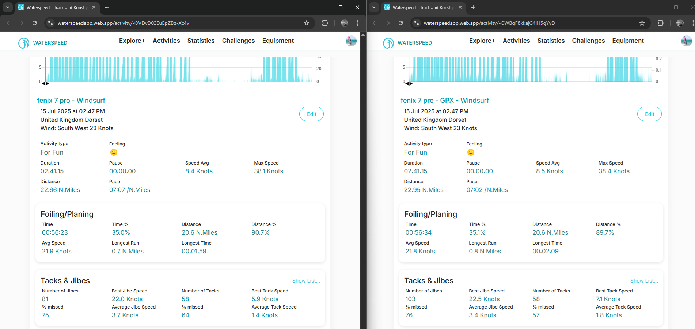
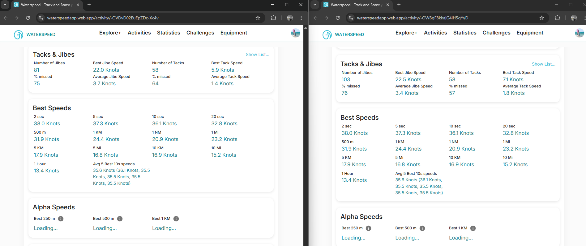

## Waterspeed - Best Speeds #1

### Overview

This is a recent windsurfing session using a Garmin fenix 7 Pro.

- Original FIT was uploaded automatically via Garmin Connect.
- Additional GPX import was modified to ensure the Doppler-derived speeds were absent.

### Quick Comparison

Headline figures such as Speed Avg, Max Speed, Foiling/Planing, Tacks & Jibes differ slightly.

This is fine (and to be expected) if Waterspeed is using Doppler-derived speeds on the left (FIT) and position-derived speeds on the right (GPX).

It is notable that the Best Speeds are completely identical though, which wouldn't be the case if Doppler-derived speeds were being used for the FIT.

It is also unclear how the 5/10/20 sec results are being calculated. The de-facto speedsurfing software tools report 33.9 kts for both the Doppler-derived and position-derived 20 sec speeds.

### Memory Issue

Unrelated to the speed investigation this session hammers my PC when viewed in Chrome. The CPU usage is excessive and it makes the fan work hard, eventually resulting in an out of memory error in Chrome.

### Summary

This session showed that Doppler-derived speeds are being used in some places, but potentially ignored for Best Speeds.

Further tests were used to explore in more detail.

### Links

The sessions can be accessed via a browser.

- [FIT](https://waterspeedapp.web.app/activity/-OVDvD02EuEpZDz-Xc4v)
- [GPX](https://waterspeedapp.web.app/activity/-OWBgF8kkajG4iH5gYyD)