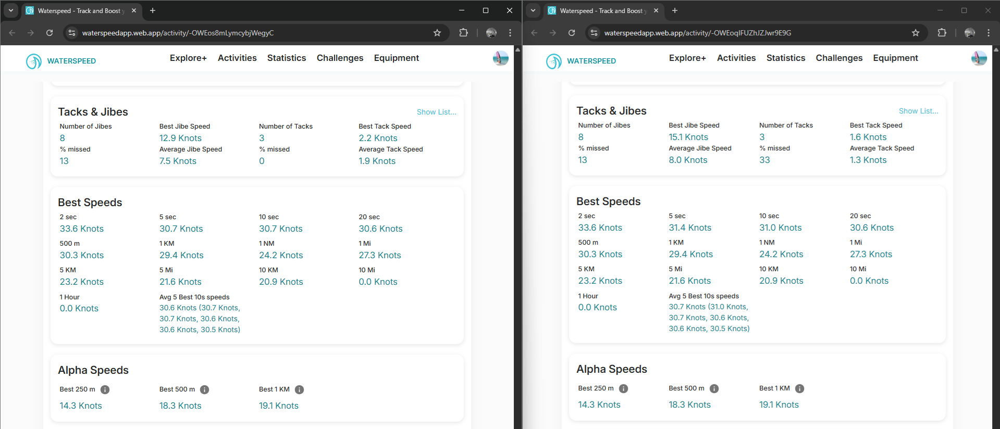

## Waterspeed - Best Speeds #2

### Overview

This is a past windsurfing session (26 Feb 2025) using the speedsurfing mode of a COROS APEX Pro.

- Original FIT was manually imported using the Waterspeed web app
- GPX was created using GPSBabel and conforms to the GPX 1.0 schema, including the original speed data

### Quick Comparison

It is notable that the speed graph differs and is more "noisy" on the right (GPX).

This is to be expected if Waterspeed is using Doppler-derived speeds on the left (FIT) and position-derived speeds on the right (GPX).

The headline figures differ - e.g. Max Speed of 30.7 kts (FIT) vs 34.1 kts (GPX).

This is to be expected if Waterspeed is using Doppler-derived speeds on the left (FIT) and position-derived speeds on the right (GPX).

The Tacks & Jibes statistics differ, which will likely be due to use of speeds present in the FIT and use of positional data in the GPX.

Almost all of the Best Speeds are identical, which wouldn't be the case if the Doppler-derived speeds were being used for analysis of the FIT.

In this instance the 5 sec and 10 sec results differ for the FIT and GPX, suggesting some involvement of the Doppler-derived speeds in the FIT file.

The alpha speeds are identical but the figures are not as expected.

### GPX Import

It is worth mentioning that Waterspeed should import speed data from GPX files, when present.

All of the stats should be identical regardless of whether a FIT or GPX is imported into Waterspeed, so long as speed is present in the GPX.

Full details about the various ways that speed can appear in GPX files is available via this [link](https://logiqx.github.io/gps-wizard/gpx/speed.html).

### Summary

This session shows that Doppler-derived speeds are being used in some places, but potentially ignored for most of the Best Speeds.

Further testing explores this in more detail.

### Links

The sessions can be accessed via a browser.

- [FIT](https://waterspeedapp.web.app/activity/-OWEos8mLymcybjWegyC)
- [GPX](https://waterspeedapp.web.app/activity/-OWEoqIFUZhJZJwr9E9G)