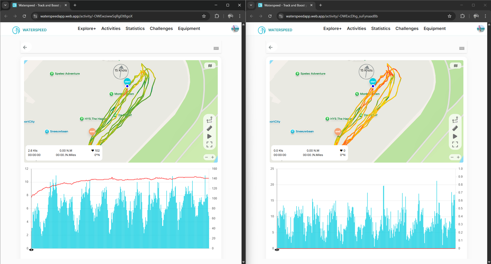
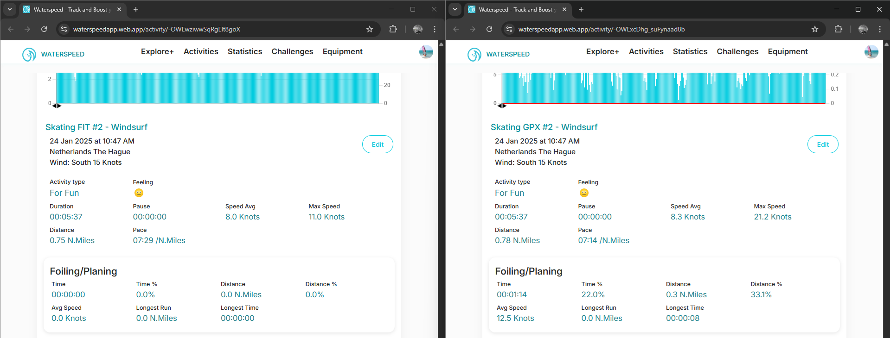
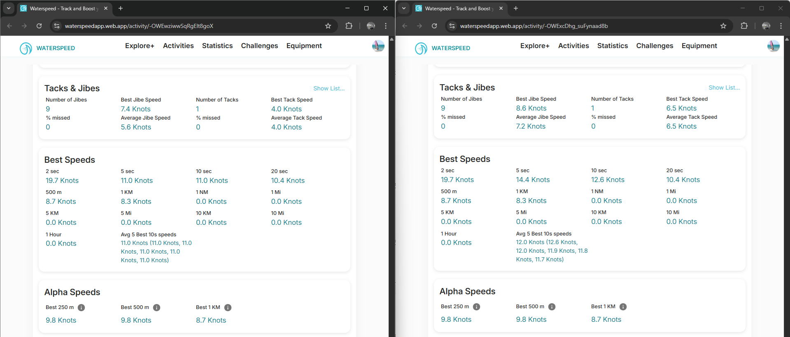

## Waterspeed - Best Speeds #3

### Overview

This is an indoor skating sessions (open roof) using the windsurfing mode of a Garmin epix Pro.

- Original FIT was manually imported using the Waterspeed web app
- GPX was created using [GPS Wizard](https://logiqx.github.io/gps-wizard/) and conforms to the GPX 1.0 schema, including the original speed data

The interesting thing about this session is that the environment (skating rink with open roof) impacts positional accuracy far more than speed accuracy.

### Quick Comparison

It is notable that the scales of the speed graph differ by a lot, which is due to the poor accuracy of the position-derived speeds.

This is to be expected if Waterspeed is using Doppler-derived speeds on the left (FIT) and position-derived speeds on the right (GPX).

The headline figures differ - e.g. Max Speed of 11.0 kts vs 21.2 kts.

This is fine (and to be expected) if Waterspeed is using Doppler-derived speeds on the left (FIT) and position-derived speeds on the right (GPX).

The Tacks & Jibes statistics differ, which will likely be due to use of speeds present in the FIT and use of positional data in the GPX.

Almost all of the Best Speeds are identical, which wouldn't be the case if the Doppler-derived speeds were being used for the FIT.

It is worth noting the 2 sec result of 19.7 kts is significantly higher than the max of 11.0 kts.

In this instance the 5 sec and 10 sec results differ for the FIT and GPX, suggesting some involvement of the Doppler-derived speeds in the FIT file.

It is unclear exactly how 5 sec and 10 sec are calculated because 11.0 kts is somewhere between the correct Doppler-derived speeds and position-derived speeds reported by the de-facto speed sailing applications.

The alpha speeds are identical but appear to be calculated from the positional data.

### GPX Import

It is worth mentioning that Waterspeed should import speed data from GPX files, when present.

Full details about the various ways that speed can appear in GPX files is available via this [link](https://logiqx.github.io/gps-wizard/gpx/speed.html).

### Summary

This session showed that Doppler-derived speeds are being used in some places, but potentially ignored for most of the Best Speeds, except perhaps 5 sec and 10 sec.

Further testing explores this in more detail.

### Links

The sessions can be accessed via a browser.

- [FIT](https://waterspeedapp.web.app/activity/-OWEwziwwSqRgElt8goX)
- [GPX](https://waterspeedapp.web.app/activity/-OWExcDhg_suFynaad8b)