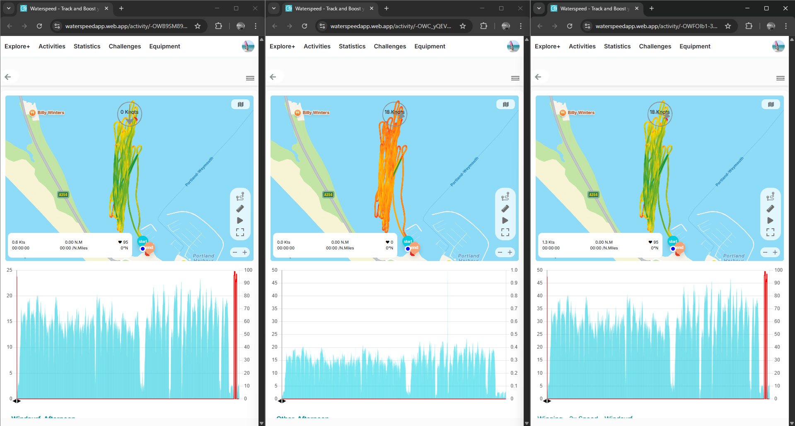
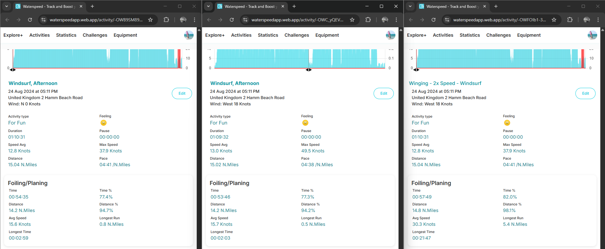
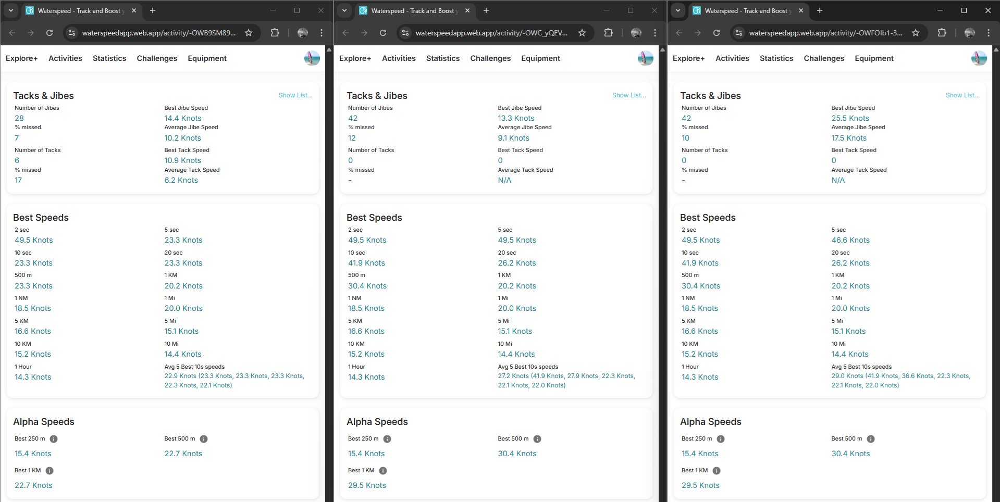

## Waterspeed - Best Speeds #4

### Overview

This is past wingfoiling session (24 Aug 2024) using the windsurfing mode of a COROS APEX Pro.

- Original FIT was manually imported using the Waterspeed web app
- GPX was created using the Waterspeed web app and conforms to the GPX 1.1 schema, including the original speed data
- Modified FIT doubles the speeds, hoping to shed more light on speed calculations

One of the reasons for choosing this session is because it there is a 49.5 kts spike in the positional-derived speed data.

### Quick Comparison

The scales differ quite a lot.

- left = original FIT
- center = GPX, position-derived speeds result in the big spike and thus the scale up to 50 kts
- right = modified FIT, 2x speeds result in a larger scale

This is all as expected based on the earlier tests.

The headline figures differ - e.g. Max Speed of 37.9 kts in both FIT files and 49.5 kts in the GPX.

The 37.9 kts is a bad record in the FIT which is missing latitude and longitude, and it shouldn't be reported by Waterspeed.

It's a big odd that the Max Speed is reported as 37.9 kts on the right though... that file contains a 2x speed of 46.6 kts.

The Foiling/Planing stats for the two FIT files obviously differ because of the speed modifications.

The Tacks & Jibes statistics are significantly higher in the modified FIT, which suggests they are using the intended speeds.

Almost all of the Best Speeds are identical, which wouldn't be the case if the Doppler-derived speeds were being used for the FIT.

It's rather odd that the original FIT produces a 5s + 10s + 20s + 500m of 23.3 kts since this is the true 2s speed.

The GPX and the modified FIT file produce identical results for everything except for 5 sec.

It is unclear exactly how 5 sec + 10 sec + 20 sec are calculated but the distance-based results appear to be position-derived speeds. The most accurate way to calculate them is using accumulated distances from the record speed, not position-derived speeds.

The alpha speeds are identical for the GPX and modified FIT but appear to be calculated from the positional data. It's unclear where the 22.7 kts alphas originate from in the original FIT.

### GPX Import

It is worth mentioning that Waterspeed should import speed data from GPX files, when present.

Full details about the various ways that speed can appear in GPX files is available via this [link](https://logiqx.github.io/gps-wizard/gpx/speed.html).

### Summary

This session showed that Doppler-derived speeds are being used in some places, but potentially ignored for most of the Best Speeds, except perhaps influencing 5 sec and 10 sec.

There also appears to be a bug that affects processing of the original FIT file, propagating 23.3 kts through 5 sec + 10 sec + 20 sec + 500 m.

One final controlled test explores this further.

### Links

The sessions can be accessed via a browser.

- [Original FIT](https://waterspeedapp.web.app/activity/-OWB9SM899syGniZPmuB)
- [GPX](https://waterspeedapp.web.app/activity/-OWC_yQEV5fm0ho77FSN)
- [Modified FIT](https://waterspeedapp.web.app/activity/-OWFOIb1-3kjP5Tiv8iU)