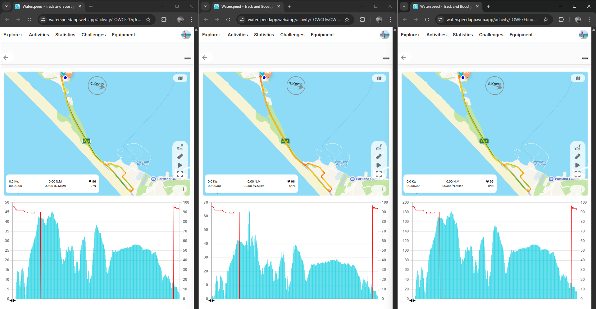
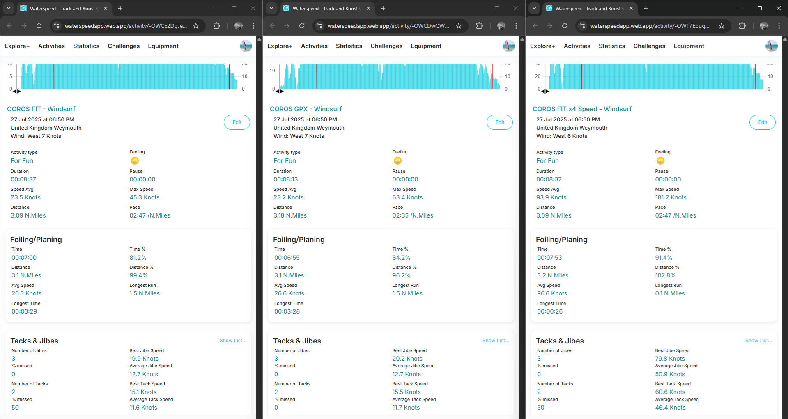
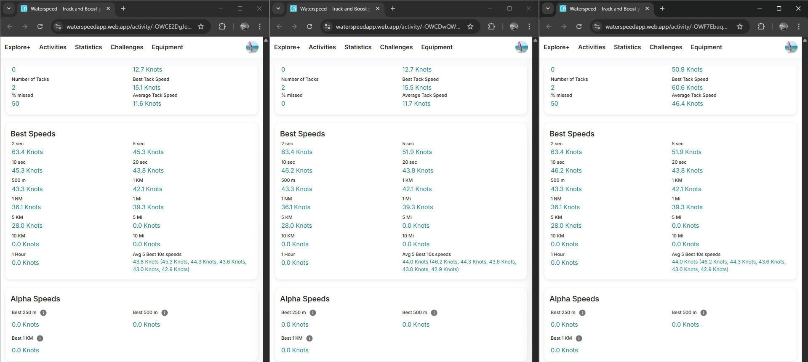

## Waterspeed - Best Speeds #5

### Overview

This controlled test is a driving session using the speedsurfing mode of a COROS APEX Pro.

- Original FIT was manually uploaded to Waterspeed via the web app
- GPX was exported from COROS and contains the original speed data
- Modified FIT quadruples the original speeds

It should also be noted that there is a 63.5 kts spike in the positional-derived speed data.

### Quick Comparison

The scales differ quite a lot.

- left = original FIT
- center = GPX, position-derived speeds result in the big spike and thus the scale up to 70 kts
- right = modified FIT, 4x speeds result in a scale up to 200 kts

This is all as expected based on the earlier tests. The spike in position-derived speeds is clearly visible in the center image.

The headline figures differ - e.g. Max Speed of 45.3 kts in the original FIT vs 63.4 kts in the GPX.

The Foiling/Planing + Tacks & Gybes stats differ for the two FIT files because of the speed modifications. This appears to be correct.

Almost all of the Best Speeds are identical, which wouldn't be the case if the Doppler-derived speeds were being used for the FIT.

All of the files show identical results for everything except for 5 sec + 10 sec.

5 sec + 10 sec are clearly position-derived for the GPX and modified FIT but the calculation for the original FIT is unclear. The recorded speeds influence the 5s and 10s but the specifics are unclear.

As per the earlier tests, distance-based best speeds appear to be using position-derived speeds. The most accurate way to calculate them would be using accumulated distances from the record speed, not position-derived speeds.

The alpha speeds are all zero for this test since the test drive did not qualify for any alpha results.

### GPX Import

It is worth mentioning that Waterspeed should import speed data from GPX files, when present.

All of the stats should be identical regardless of whether a FIT or GPX is imported into Waterspeed, so long as speed is present in the GPX.

Full details about the various ways that speed can appear in GPX files is available via this [link](https://logiqx.github.io/gps-wizard/gpx/speed.html).

### Summary

This session showed that Doppler-derived speeds are being used in some places, but potentially ignored for most of the Best Speeds, except perhaps influencing 5 sec and 10 sec.

Unlike the [previous test](../session-4/README.md) the modified FIT also showed higher summary stats. Perhaps Waterspeed uses the session summaries from COROS files but not Garmin files?

### Links

The sessions can be accessed via a browser.

- [Original FIT](https://waterspeedapp.web.app/activity/-OWCE2DgJeZZNR0sAxTa)
- [GPX](https://waterspeedapp.web.app/activity/-OWCDwQWB_uqZFFyvyDb)
- [Modified FIT](https://waterspeedapp.web.app/activity/-OWF7EbuqCwkH9ZwdtiQ)