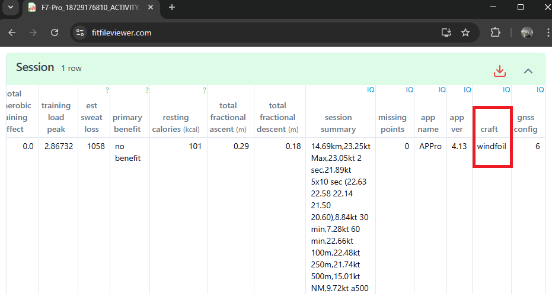

## Waterspeed - Android App

Author: Michael George

Created: 6 Apr 2025


### First Impressions

The Android app looks nice and the data sync works well.

This document will focus on suggestions / feedback and use numbered section headings for clarity.


### 1. New Sessions

#### 1.1 Sport Type

It would be very useful if sessions were to detect the sport / craft type, when imported from Garmin FIT files.

The most popular Garmin app in the speedsurfing community is [APPro Windsurf](https://apps.garmin.com/apps/9567700b-6587-44be-9708-879bfc844791), which records the craft type in FIT files.

The first place the craft / sport can be found is the "craft" field of the "session" record:




The second place is in the "name" field of the "sport" record:


Here is the full list supported by APPro Windsurf:

| craft    | name        |
| -------- | ----------- |
| windsurf | Windsurfing |
| windfoil | Windfoiling |
| kitesurf | Kitesurfing |
| kitefoil | Kitefoiling |
| wingfoil | Wingfoiling |


It would be very useful if sessions were to detect the sport / craft type, when imported from Garmin FIT files.


#### 1.2 Activity Type

It would also be good to be able to choose a default activity type (e.g. Training) and default feeling (e.g. cheery) for imports.


### 2. Speed Results

#### 2.1 Minor Differences

It has been noted that there are often differences between the results calculated by Waterspeed and dedicated speedsurfing software / websites such as GPSResults + GPSAR + GPS Speedreader. This often affects 2s, 5s, 10s the most and sometimes ± half a knot which may be significant.

Since Waterspeed reports the max speed reported by the GPS, it is assumed that it is using the speeds from the FIT. However, it may then be doing some kind of filtering (e.g. spline interpolation) which causes results to differ, especially the shorter time periods.


#### 2. 2 Major Differences

5 x 10s is the primary ranking on GPS-Speedsurfing (and related websites), but major differences are often apparent in Waterspeed.

In the following example, Waterspeed is reporting an average of 19.5 kts, which is 11.6 kts lower than the actual 31.1 kts.


### 3. Usability / Cosmetic

#### 3.1 Word Wrap

The sessions list would benefit from an intelligent word wrap.

e.g. "Weymouth and Portland" \<new line> "Windsurfing", instead of a line saying "ndsurfing"


#### 3.2 Position within Sessions

After viewing an individual session then closing it, the previous position in the list of sessions is lost.

It's quite disorienting to the user and makes browsing of sessions difficult.

Ideally the session list should restore its prior state, looking just like it was prior to viewing an individual session.


#### 3.3 Sport Filter

It would be convenient if the search / filter only listed the sports which are actually present for the user, not all sports.

e.g. windsurfing, windfoiling, wingfoiling for myself


### 4. Enhancements

#### 4.1 Watch Type / Model

I do a lot of device testing and often wearing multiple watches. It would be really helpful is the watch model were to be shown in the session, perhaps beneath the wind strength / direction. It is possible to determine the latest descriptions for Garmin watches using the JSON data from their Connect IQ SDK, which for convenience I have uploaded to [GitHub](https://logiqx.github.io/gps-details/devices/garmin/products/).


#### 4.2 Speed over 250 meters

A very popular speed category for official events on GPS Speedsurfing (and related websites) is 250 meters.

For example, 250 meters is used by all of the Dunkerbeck Speed Challenges, and many national speed ladders.

Perhaps 250 meters results can be added to Waterspeed?


### 5. GPX Export

The GPX export is compliant with the relevant schemas, but fails to validate because of an HTTP re-direct:

```
xsi:schemaLocation="http://www.topografix.com/GPX/1/1 http://www.topografix.com/GPX/1/1/gpx.xsd
```

The actual XSD is accessible via an HTTPS address:

```
xsi:schemaLocation="http://www.topografix.com/GPX/1/1 https://www.topografix.com/GPX/1/1/gpx.xsd
```

I have made the necessary change to [gpx-builder](https://github.com/fabulator/gpx-builder) and submitted [PR #234](https://github.com/fabulator/gpx-builder/pull/234). Perhaps you can apply the pull request to your branch?
