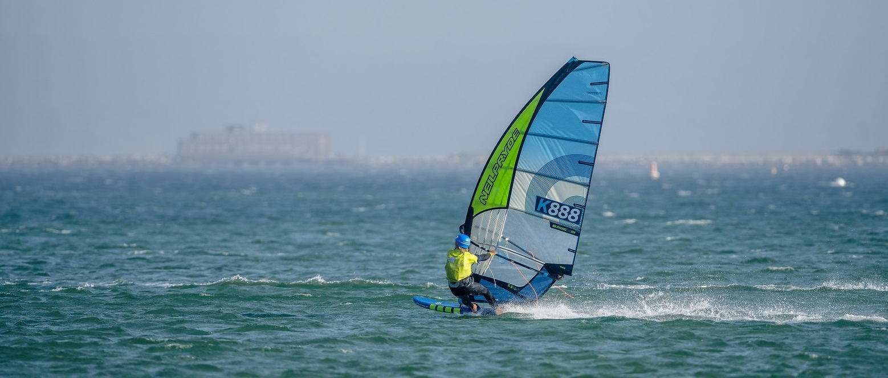

## GPS Articles

### Welcome to my GPS / GNSS Series!

Date created: 2024-01-23

I've been extremely interested, you might even say passionate about GPS / GNSS technology for more than 15 years. These technologies are at the heart of one of my favorite disciplines in windsurfing, referred to as speedsailing or speedsurfing. Yes, it's a relatively niche part of the watersports world but dedicated windsurfers, kitesurfers, and now wingfoilers are striving to push their personal limits, and measure their performances using GNSS technology.

[GNSS](https://en.wikipedia.org/wiki/Satellite_navigation) is the acronym for a Global Navigation Satellite System. The [Global Positioning System](https://en.wikipedia.org/wiki/Global_Positioning_System) (GPS) has been supported by consumer devices since the early 1990's but in recent years we've seen the addition of [GLONASS](https://en.wikipedia.org/wiki/GLONASS) from Russia, [Galileo](https://en.wikipedia.org/wiki/Galileo_(satellite_navigation)) from the European Union, and [BeiDou](https://en.wikipedia.org/wiki/BeiDou) from China. Regional systems also exist, such as [QZSS](https://en.wikipedia.org/wiki/Quasi-Zenith_Satellite_System) from Japan and [NavIC](https://en.wikipedia.org/wiki/Indian_Regional_Navigation_Satellite_System) from India. In common parlance, references to GPS will often mean multi-GNSS.

Most of my professional career has been spent in software engineering and data engineering teams, deriving insights from real-world data. My natural curiosity had me investigating GPS technology as soon as I started measuring my own speeds on the water back in 2007, striving for a better understanding of the strengths and weaknesses of GPS technology and nowadays the wider range of GNSS technologies.

For several years now, I've been the tech guy for [Weymouth Speed Week](https://weymouthspeedweek.com/) which is the longest running speed sailing competition in the world, starting way back in 1972. Between 2010 and 2022 we were running the competition using the [Locosys GT-31](https://www.locosystech.com/en/product/gps-handheld-data-logger-gt-31.html) which was great for its time, but in 2023 we fully adopted the [Motion Mini](https://www.motion-gps.com/motion/index.html) for its improved accuracy, convenience of WiFi connectivity, and to improve the general running of the competition.

It is now February 2024 and I've decided to write a series of short articles that I think will be of interest to any [windsport](https://en.wikipedia.org/wiki/Windsport) enthusiasts who wish to measure their own speeds. Which devices should be used? How to use them properly? When / whether to trust them? How do they really work? These are all topics that I see being asked on a regular basis. My goal is to cover all of these topics, and more besides in a series of short online articles.

Before I go into any brand / device specifics, I'll kick off with a short [series](https://medium.com/@mikeg888/list/about-gps-gnss-3fd1bc0923f6) of articles that provide some insight into how GNSS technologies work. It's rare to see an article that explains how speed is calculated by a GNSS receiver, and rarer still to see an article about how speed is actually a simple derivative of the GNSS signal tracking, not derived from position. I plan to avoid any unnecessary complexities and mathematics, simply explain the key concepts.

After a quick summary of GPS / GNSS technology, I will kick off with the [GPS / GNSS signals](https://medium.com/@mikeg888/what-are-the-gps-gnss-signals-4bdd032887fc) themselves. I believe that a basic understanding of the GNSS signals, acquisition and tracking will provide a solid foundation for later topics, ultimately leading to a better understanding of the available GNSS technologies. The intention is to do this in a way that most readers will easily understand. I hope you enjoy this series and feel free to follow if you want to receive notifications of future articles!

Mike George - K888
