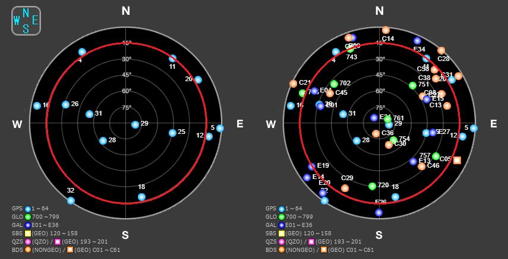
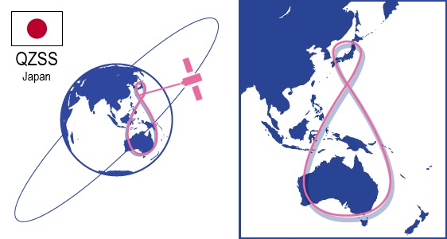
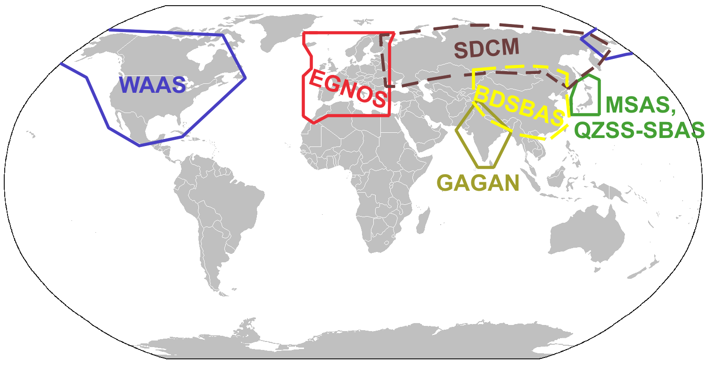
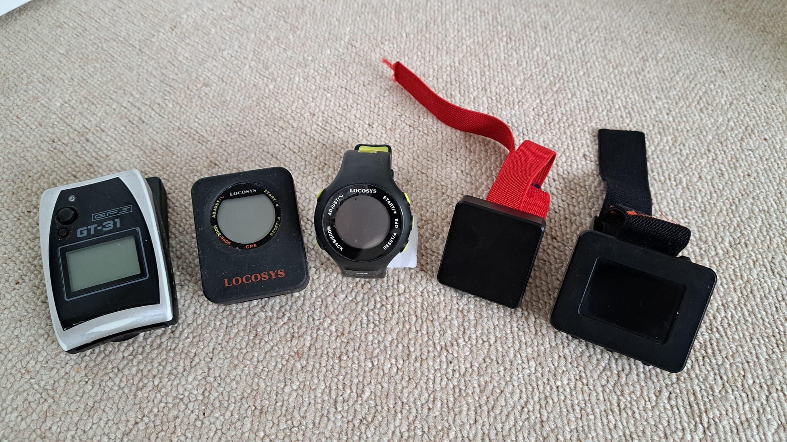

## GPS Articles

### What is GPS / GNSS?

Date created: 2024-01-25

[GNSS](https://en.wikipedia.org/wiki/Satellite_navigation) is the acronym for a Global Navigation Satellite System. The [Global Positioning System](https://en.wikipedia.org/wiki/Global_Positioning_System) (GPS) has been supported by consumer devices since the early 1990's but in recent years we've seen the addition of [GLONASS](https://en.wikipedia.org/wiki/GLONASS) from Russia, [Galileo](https://en.wikipedia.org/wiki/Galileo_(satellite_navigation)) from the European Union, and [BeiDou](https://en.wikipedia.org/wiki/BeiDou) from China. Regional systems also exist, such as [QZSS](https://en.wikipedia.org/wiki/Quasi-Zenith_Satellite_System) from Japan and [NavIC](https://en.wikipedia.org/wiki/Indian_Regional_Navigation_Satellite_System) from India. In common parlance, references to GPS will often mean multi-GNSS.

All of the different GNSS operate using similar principles, so for simplicity I'll focus mainly on the GPS satellites / signals but highlight any significant variations where applicable. This series of short GNSS articles will kick off with the basic principles behind these technologies, starting with the satellites. The GPS satellites themselves are in what is known as a [medium earth orbit](https://en.wikipedia.org/wiki/Medium_Earth_orbit) (MEO), approximately 20,000 km above the surface of the earth.

The satellites are neither geostationary nor geosynchronous as they are orbiting the earth approximately once every 12 hours. If you want to be more accurate, GPS satellites orbit the earth twice every [sidereal day](https://en.wikipedia.org/wiki/Sidereal_time) which is approximately 23h 56m. GLONASS, Galileo and BeiDou satellites have slightly different altitudes and thus different orbital periods, but all in the region of 20,000 - 23,000 km above the earth and orbiting the earth approximately twice a day.

The [animation](https://commons.wikimedia.org/wiki/File:GPS24golden.gif) below shows 21 GPS satellites orbiting the earth in 6 different [orbital planes](https://en.wikipedia.org/wiki/Orbital_plane). It can be seen that the number of visible satellites from a specific location changes over time and is shown in red. Right now in February 2024 there are roughly 30 operational GPS satellites. GLONASS, Galileo and BeiDou each have around have 24 operational satellites, so there are in excess of 100 operational GNSS satellites orbiting the earth.

One might wonder why there are so many systems and satellites? Well, it should be pretty obvious why some nations would not want to be dependent solely on the technology of another nation when it comes matters of national security. However, consumers also benefit greatly from multi-GNSS because it significantly increases the number of visible satellites and thus the accuracy of receivers. The image below shows London on 1 Jan 2024, around 4:48 pm.

 

Since the signals from satellites close to the horizon are typically subject to greater errors, 15 degrees of elevation has been highlighted in red. It can be seen clearly that there were only 6 GPS satellites (above 15 degrees) visible at this time but 28 GNSS satellites (above 15 degrees) were visible in total. At the risk of a gross oversimplification, more satellites spread over a wider area will typically lead to more accurate results from the GNSS receiver.

It is also worth mentioning the regional systems such as QZSS (Japan) and NavIC / IRNSS (India). Their [geosynchronous](https://en.wikipedia.org/wiki/Geosynchronous_orbit) orbits are in excess of 30,000 km above the surface of the earth and the resulting [ground track](https://en.wikipedia.org/wiki/Ground_track) covers a specific geographic region. The QZSS service area covers East Asia and the Oceania region, whereas NavIC / IRNSS covers India, the entire Indian Ocean region, parts of South Asia, Southeast Asia, and the Middle East.

Whilst satellites for the global systems (GPS, GLONASS, Galileo, BeiDou) will be visible from locations all over the planet, satellites for the regional systems (QZSS and NavIC / IRNSS) are only visible from specific regions. In addition to QZSS and NavIC / IRNSS, South Korea is also planning a regional [Korean Positioning System](https://en.wikipedia.org/wiki/Korea_Aerospace_Research_Institute#Korea_Positioning_System_(KPS)) (KPS) for 2035.

You may have seen references to WAAS, MSAS, GAGAN, EGNOS, etc. In short these are [Satellite Based Augmentation Systems](https://www.euspa.europa.eu/european-space/eu-space-programme/what-sbas) (SBAS) and they broadcast correction data which allows compatible GNSS receivers to produce more accurate results. The [image](https://commons.wikimedia.org/wiki/File:SBAS_Service_Areas.png) below shows the typical coverage of the most well known systems. SBAS satellites are in [geostationary](https://en.wikipedia.org/wiki/Geostationary_orbit) orbits, thus orbiting the earth approximately 35,000 km above equator.

So what else can be said about GNSS technology before moving on to details about how GNSS really works?

We've already touched on the fact that the GNSS satellites are in medium-earth orbits (MEO) and move across the sky, rising and setting approximately twice a day. The regional systems QZSS and NavIC use geostationary + geosynchronous orbits (GEO + GSO), but BeiDou actually uses a mixture of all 3 orbit types. The Korean KPS will be yet another regional system in the near future. The SBAS satellites have geostationary orbits as therefore provide regional coverage.

GNSS receivers are passive devices in the sense that they only receive signals from the satellites and do not broadcast any signals back to the satellites. There are many reasons that this is advantageous, such as not giving away ones position during times of conflict, but it also makes low power GNSS receivers possible. The fact that GNSS receivers are passive and only receive signals from the satellites is one of the key design principles.

Somewhat related to the previous point is the fact that GNSS receivers do not require their own high-precision time keeping (e.g. [atomic clock](https://en.wikipedia.org/wiki/Atomic_clock)) in order to operate and to produce accurate results. They typically use an inexpensive [crystal oscillator](https://en.wikipedia.org/wiki/Crystal_oscillator), which is akin to the accuracy of a [quartz watch](https://en.wikipedia.org/wiki/Quartz_clock). Whilst calculating position the GNSS receiver also works out the difference between its own (imprecise) clock and the atomic (precise) clocks on the satellites.

A relatively interesting point to note is that GNSS signals are incredibly weak by the time they reach the surface of the earth, approximately 1 million times weaker than your home WiFi signal. Despite the satellite signals being so weak and much lower than the levels of background noise, GNSS receivers can still isolate the satellite signals from the background noise and use them to determine their position, velocity and time (aka PVT).

Acquisition and tracking of the GNSS signals is absolutely key to the operation of a GNSS receiver. The next article in this series will go into the signals in more detail but in this article, it is perhaps worth mentioning [assisted GPS](https://en.wikipedia.org/wiki/Assisted_GNSS) (A-GPS) which is a technique to reduce the signal acquisition time. Assisted GPS is the reason that your mobile device (e.g. phone or watch) can often acquire the signals from GPS / GNSS satellites in a matter of seconds.

Hopefully this article has been useful and some of the common terms are a bit more familiar. GNSS receivers are in essence passive devices, tasked with acquiring and tracking the satellite signals, without broadcasting their own signals. This article touched on the global systems (GPS, GLONASS, Galileo, BeiDou), regional systems (QZSS, NavIC / IRNSS and KPS), SBAS (WAAS, MSAS, GAGAN, EGNOS), and A-GPS.

The next article will describe the GPS / GNSS signals themselves and how they are received / processed, ultimately enabling the GNSS receiver to determine its position, velocity and time (aka PVT).
