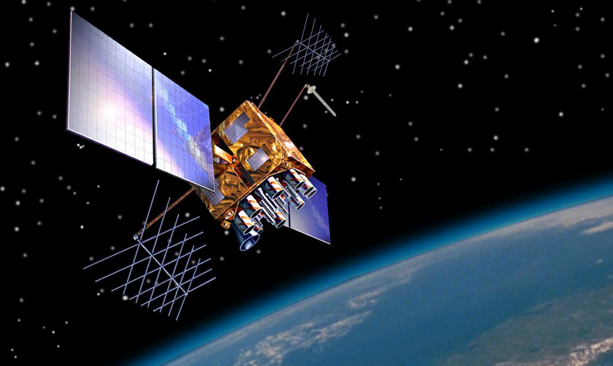
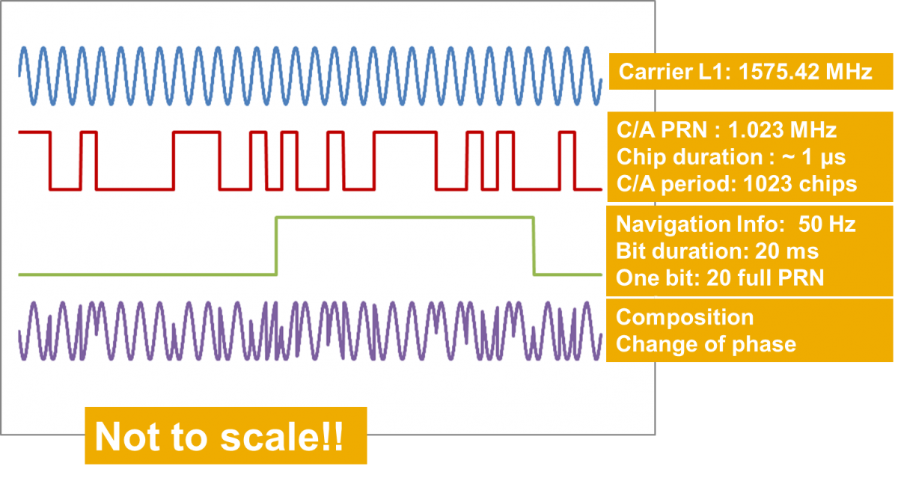
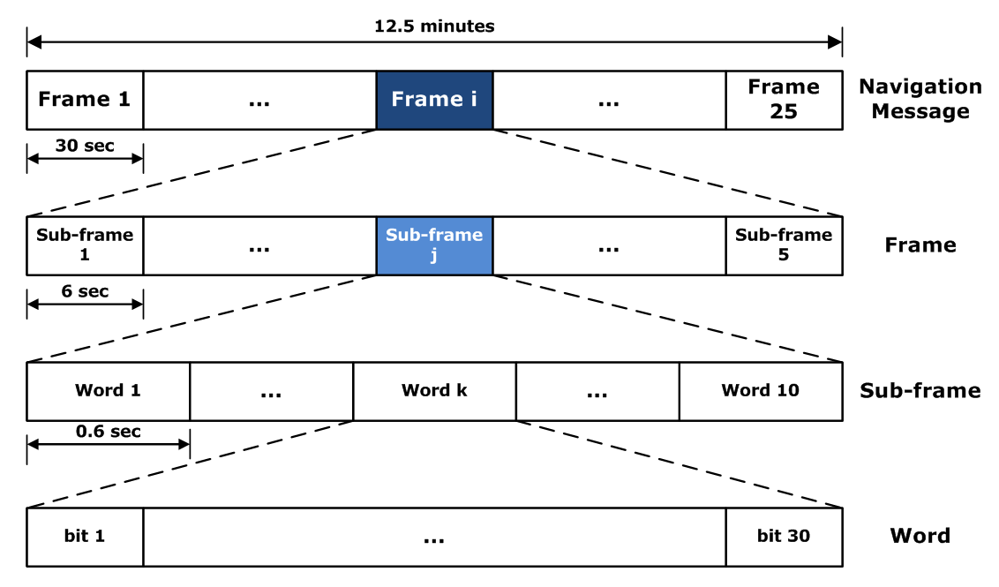

## GPS Articles

### What are the GPS / GNSS signals?

Date created: 2024-02-22

The goal of this article is to give an overview of the GPS / GNSS signals themselves. I believe that a basic understanding of the GNSS signals, acquisition and tracking will provide a solid foundation for later topics, ultimately leading to a better understanding of the available GNSS technologies.

This will potentially be the most technical article within this series, but I will try to avoid unnecessary complexity and omit the finer details. The article will mainly focus on the traditional GPS signal, known as the C/A code (aka "course acquisition" code). All of the other GNSS signals have much in common with the C/A code so an understanding of it will certainly prove useful. The C/A code can be thought of as having 3 components:

- Carrier
- Pseudorandom noise (PRN)
- Navigation data

The C/A code is broadcast in the [L1 band](https://en.wikipedia.org/wiki/L_band) and the carrier has a frequency of 1575.42 MHz. All of the GPS satellites use the same L1 frequency for their signals but the use of a technique called [code-division multiple access](https://en.wikipedia.org/wiki/Code-division_multiple_access) (CDMA) makes it possible for a GPS / GNSS receiver to distinguish between signals from the different satellites. The most important aspect of CDMA is the allocation of a unique [pseudorandom noise](https://en.wikipedia.org/wiki/Pseudorandom_noise) (PRN) code to each satellite. The PRN code essentially consists of 1023 binary digits (referred to as chips) and the entire PRN code repeats every millisecond.

In addition to the carrier and the PRN code there is data being transmitted at 50 bits per second. This data includes information such as satellite health, orbital information, GPS time, etc. The duration of each data bit is 20 milliseconds so the PRN repeats 20 times within each data bit. The diagram below shows how the PRN and data are superimposed onto the carrier using a technique called [binary phase-shift keying](https://en.wikipedia.org/wiki/Phase-shift_keying#Binary_phase-shift_keying_(BPSK)) (BPSK) which essentially switches the phase of the carrier when either the PRN chips or data bits change. The resultant signal is shown at the bottom of the diagram in purple.

To keep this article short, full details of the modulation technique [direct-sequence spread spectrum](https://en.wikipedia.org/wiki/Direct-sequence_spread_spectrum) (DSSS), digital signal processing, and Fourier transformations have been completely omitted. They are vitally important to electronic engineers and developers of software based GNSS receivers but unnecessary in this particular article. The main takeaway should be that the C/A signal contains a unique PRN code (consisting of 1023 chips, repeating every millisecond), plus data bits that are being transmitted at 50 bits per second.

[Navigation messages](https://en.wikipedia.org/wiki/GPS_signals#Navigation_message) convey information such as the GPS date and time, satellite status, [ephemeris](https://en.wikipedia.org/wiki/Ephemeris) (precise orbital information for the transmitting satellite), and almanac (status and low-resolution orbital information for every satellite). A single navigation message consists of 1,500 bits (duration of 30 seconds), divided into 5 subframes (duration of 6 seconds). Every subframe includes the GPS time, thus time is received from the GPS satellites once every 6 seconds. There are 25 navigation messages in total so to receive all of the navigational data from a single satellite will take 12.5 minutes in total.

Turning our attention back to the PRN codes we can consider them as having two main purposes:

- Identification of the signal from a specific satellite
- Determination of the distance between the satellite and the receiver

The application of CDMA and BPSK is what makes GPS work. The GPS signals are incredibly weak by the time they reach the surface of the earth, approximately 1 million times weaker than your home WiFi signal. Despite the satellite signals being so weak and much lower than the levels of background noise, receivers can still retrieve signals from within the noise and use them to determine their position, velocity and time (aka PVT).

The way that the GPS / GNSS signals can be found within the noise is by generating a local replica of the signal for a specific satellite. The idea is to find a strong correlation between the local replica and the received signal, initially through a process called acquisition and then refined through a process called tracking. The local replica will only correlate with the received signal once a suitable code delay and associated Doppler shift have been determined.

The most common example of the [Doppler effect](https://en.wikipedia.org/wiki/Doppler_effect) is the change of pitch heard when a vehicle approaches and recedes from an observer. Compared to the emitted frequency, the received frequency is higher during the approach, identical at the instant of passing by, and lower during the recession. Due to the speed of GPS satellites (approximately 3.9 km/s), rotation of the Earth, and motion of the receiver, GPS signals also exhibit the Doppler effect.

The process of signal acquisition is a matter of finding an appropriate code delay (related to the distance from the satellite) and Doppler shift (related to the motion of the satellite and the receiver). This is a somewhat laborious process and essentially involves trying all possible combinations of delay and Doppler shift until a high correlation is found between the locally generated replica and the received signal. Once the process of acquisition is complete for a specific satellite the receiver can switch to the process of tracking the signal.

It is perhaps worth mentioning [assisted GPS](https://en.wikipedia.org/wiki/Assisted_GNSS) (A-GPS) which is a technique to reduce the initial signal acquisition time. Assisted GPS is the reason that your mobile device (e.g. phone or watch) can often acquire the signals from GPS / GNSS satellites within a matter of seconds. Essentially the almanac data (low-resolution orbital information of the satellites) is downloaded via the internet. This data then makes the acquisition process far less onerous because by knowing an approximate location (and potentially velocity) the "search space" for the code delay and Doppler shift can be reduced greatly.

This article focused specifically on the C/A code of GPS, which is broadcast in the L1 frequency band. The majority of GNSS signals use similar approaches, although the carrier frequencies can vary and so can the modulation techniques (e.g. alternatives to [BPSK](https://en.wikipedia.org/wiki/Phase-shift_keying#Binary_phase-shift_keying_(BPSK)) such as [BOC](https://en.wikipedia.org/wiki/Binary_offset_carrier_modulation) and [MBOC](https://en.wikipedia.org/wiki/Multiplexed_binary_offset_carrier)). Sometimes the PRN codes are longer and sometimes the chipping rates are higher, reducing potential ambiguity and increasing precision. Some GNSS signals also have a pilot channel which doesn't contain any actual data. The older GLONASS satellites also use [frequency-division multiple access](https://en.wikipedia.org/wiki/Frequency-division_multiple_access) (FDMA) instead of [code-division multiple access](https://en.wikipedia.org/wiki/Code-division_multiple_access) (CDMA).

Despite all of the variations mentioned above the general principles are the same regardless of the specific GNSS or signal. Signals are first acquired and then tracked by establishing a correlation between a locally generated replica and the received signal. Both acquisition and tracking establish the delay for the locally generated replica and the Doppler shift due to the relative motions of the satellite and the receiver. Once the signal is being tracked the GNSS receiver can determine the basic [GNSS observables](https://gssc.esa.int/navipedia/index.php/GNSS_Basic_Observables), which then provide a means to determine Position, Velocity and Time solutions (aka PVT).

