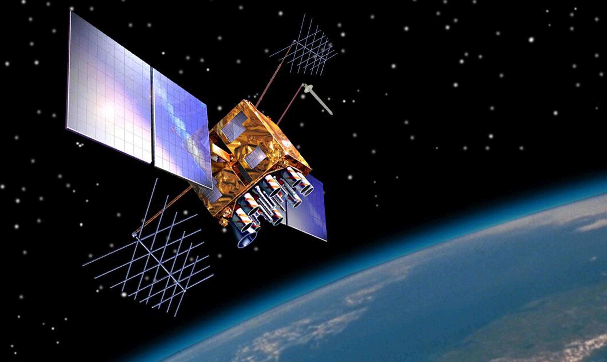

## GPS Articles

### What are the GNSS observables?

Date created: 2024-02-23

The goal of this article is to give an overview of the [GNSS observables](https://gssc.esa.int/navipedia/index.php/GNSS_Basic_Observables). It builds upon the previous article which described the acquisition + tracking of GNSS signals and precedes the next article which will describe position, velocity and time solutions (aka PVT).

This is also one of the more technical articles within the series, but I will try to avoid unnecessary complexity. The article will sometimes focus on the traditional GPS signal, known as the C/A code (aka “course acquisition” code). All of the other GNSS signals have much in common with the C/A code so an understanding of it can be considered pretty universal.

The previous article described how the acquisition and tracking of an individual signal needs to determine the delay for a locally generated replica (related to the distance from the satellite) and Doppler shift (related to the motion of the satellite and the receiver). If you haven't read the previous article it might provide some useful background, but it's not a pre-requisite.

Once a signal is being tracked and the navigation message is being decoded it is possible to produce the GNSS observables:

- Pseudorange
- Doppler shift
- Carrier phase
- Carrier-to-noise-density ratio (C/N₀)

It's these observables that are ultimately used to determine the PVT solution regardless of whether it is a wrist watch providing positional accuracy to within a few meters, or an RTK receiver providing positional accuracy to within a few centimeters (or even millimeters). Some GNSS receivers are capable of outputting the GNSS observables (often referred to as raw observables) so that PVT solutions can be generated via post-processing.

#### Pseudorange

The [pseudorange](https://en.wikipedia.org/wiki/Pseudorange) is derived from the time taken for the signal to travel from the satellite to the receiver. Since the signal travels at the speed of light it is essentially the travelling time multiplied by the speed of light. It is called the pseudorange (instead of the true range) because it includes a variety of different errors, including any delays as the signal passes through the ionosphere and troposphere, multipath errors, etc.

The previous article explained how a local replica of the satellite's PRN code is correlated with the incoming signal, thus establishing a code delay which can potentially be up to 1 millisecond for C/A signal. This delay is closely related to the travelling time of the signal but it does not tell the whole story. Since the PRN repeats every millisecond and the signal travels more than 20,000 km (travel time > 67 ms) it only represents the non-integer portion of the travel time in milliseconds, not the total time. There is therefore an ambiguity to be resolved.

You may recall from the previous article that the navigation message of the C/A signal provides the GPS time every 6 seconds. So what actually happens is the GNSS receiver keeps a count of the frames, subframes, words and bits in the navigation message and then how many times the PRN has repeated within each bit. It's not really necessary to understand exactly how it works but by counting items within the navigation message the receiver can resolve the ambiguity and thus determine the actual travel time.

The pseudorange is ultimately used to determine the position (and time) for the GNSS receiver, via a process called [trilateration](https://en.wikipedia.org/wiki/Trilateration).

#### Doppler Shift

The most common example of the [Doppler effect](https://en.wikipedia.org/wiki/Doppler_effect) is the change of pitch heard when a vehicle approaches and recedes from an observer. Compared to the emitted frequency, the received frequency is higher during the approach, identical at the instant of passing by, and lower during the recession. Due to the speed of GPS satellites (approximately 3.9 km/s), rotation of the Earth, and motion of the receiver, GPS signals also exhibit the Doppler effect.

The previous article described how the acquisition and tracking of GNSS signals must account for the Doppler effect. This is absolutely essential in order for the GNSS signals to be isolated from all of the noise and subsequently decoded, but the Doppler shift provides an additional benefit. The Doppler shift is solely dependent on the relative motion of the satellite and the receiver, and is largely unaffected by the most significant errors present in the pseudorange which are due to the travel time.

The doppler observable can therefore be used to calculate a more accurate / reliable velocity estimate than the pseudorange observable.

#### Carrier Phase

The carrier phase observable is not available in many consumer GNSS chipsets but when available it provides an additional means for measuring the apparent distance between the satellite and receiver. The advantage that the carrier phase measurements have over the code based pseudoranges are that they have much greater precision, roughly by 2 or 3 orders of magnitude.

[Real-time kinematic positioning](https://en.wikipedia.org/wiki/Real-time_kinematic_positioning) (RTK), post-processing kinematics (PPK) and [precise point positioning](https://en.wikipedia.org/wiki/Precise_Point_Positioning) (PPP) all make use of the carrier phase observable to calculate positions that are accurate to within a few centimeters (or even millimeters). The carrier phase observable can also be used to smooth the code based pseudorange to produce more accurate positions in cheaper GNSS chipsets.

#### Carrier-to-noise-density ratio (C/N₀)

The final observable is a measure of the satellite signal quality. The [carrier-to-noise-density ratio](https://en.wikipedia.org/wiki/Carrier-to-noise_ratio#Carrier-to-noise_density_ratio) (C/N₀) is the ratio of the carrier power C to the noise power density N₀, expressed in dB-Hz.

It determines whether a receiver can lock on to the carrier and if the information encoded in the signal can be retrieved, given the amount of noise present in the received signal. The carrier-to-receiver noise density ratio is usually expressed in dB-Hz.

Unlike the first 3 observables. C/N₀ is available from even the most basic of GNSS chipsets via the NMEA sentence [GSV](https://logiqx.github.io/gps-wizard/nmea/messages/gsv.html). 

#### Wrap up...

Although it may seem like unnecessary detail, awareness of the GNSS observables will allow for a better understanding of position, velocity and time (PVT) solutions. It's relatively common to see a GPS / GNSS explainer for position (and time) but it is relatively uncommon to see an explanation for speed and how it is typically calculated from the Doppler observable.

The next article in this series will explain how a GNSS receiver calculates its position, velocity and time (PVT) solutions from the pseudorange and Doppler observables. Later articles may cover topics such RTK, PPK and PPP which all make use of the carrier phase observable, and alternative approaches for calculating velocity from the carrier phase observable.

Mike George - K888