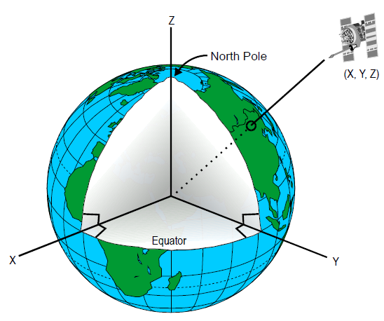
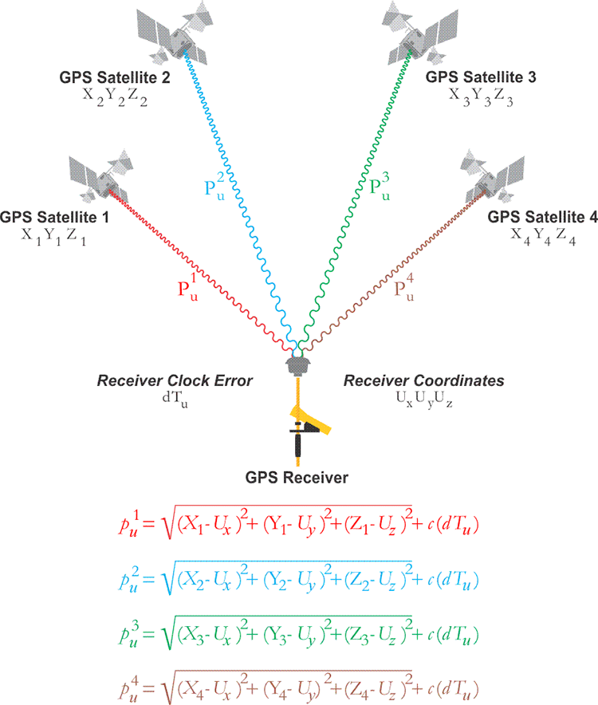
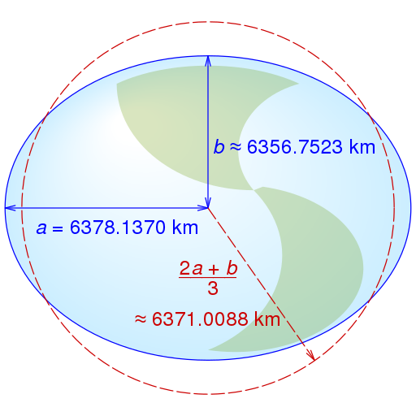
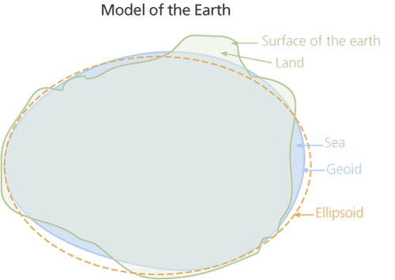
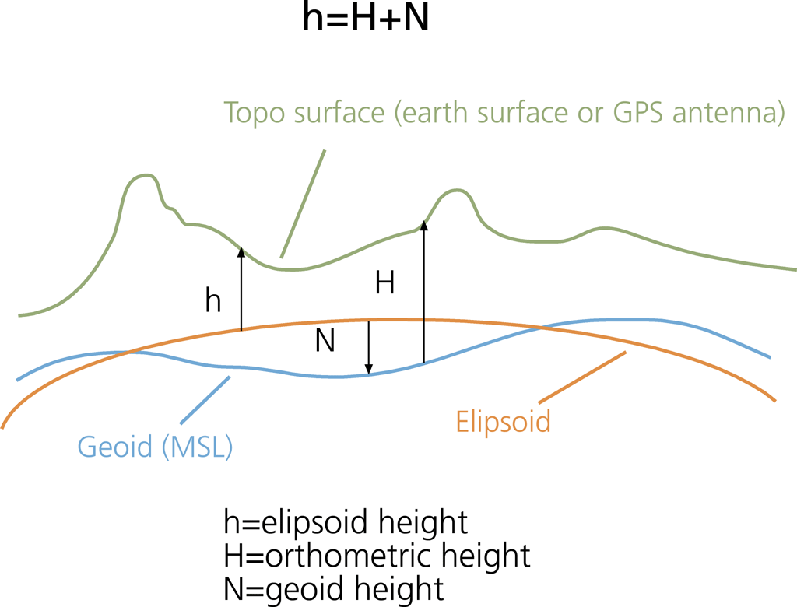

## GPS Articles

### Position, Velocity and Time - PVT

Date created: 2024-02-24

This article provides an overview of GNSS navigation solutions providing position, velocity and time (PVT). It builds upon the previous articles which described the acquisition + tracking of GNSS signals and derivation of the raw observables. Although the earlier articles explain how the raw observables are obtained, understanding this article should still be possible without that background.

It is worth noting that the majority of GNSS calculations are performed using a coordinate system known as [earth-centered, earth-fixed](https://en.wikipedia.org/wiki/Earth-centered,_Earth-fixed_coordinate_system) (ECEF). This is a cartesian spatial reference system that represents locations in the vicinity of the Earth (including its surface, interior, atmosphere, and surrounding outer space) as X, Y, and Z measurements from its center of mass.

Whilst GPS / GNSS receivers will ultimately output their position using latitude and longitude (or local grid system) the navigation solution initially uses the ECEF coordinate system (X, Y, Z) for the satellites and GNSS receiver; positions and velocities.

#### Position and Time

The previous article described the [pseudorange](https://en.wikipedia.org/wiki/Pseudorange) observable which represents the distance between the satellite and the receiver, including any errors such as atmospheric effects, multipath and the receiver clock bias. The clock bias is essentially the difference between the clock in the receiver and the clocks in the satellites.

When 4 or more satellites are being tracked (regardless of the GNSS constellation) it is possible to determine the position of the receiver (X, Y, Z) and the clock bias, thus allowing an accurate time to be determined. The following illustration is from [GPS and GNSS for Geospatial Professionals](https://www.e-education.psu.edu/geog862/node/1724).

The 4 satellites each have a known pseudorange which is related to the journey time of the signal. The square root operators are simply an application of the [Pythagorean theorem](https://en.wikipedia.org/wiki/Pythagorean_theorem) within 3 dimensions, thus denoting the distances between satellites and the receiver.

The above equations say the pseudoranges are equal to the actual distances between the satellites and the receiver, plus an error due to the receiver clock bias. This error is equal to the speed of light (denoted by *c*) multiplied by the time difference of the two clocks (*dTᵤ*).

Solving these equations is not a trivial exercise but the general principle is that with 4 unknowns for the receiver (*Ux*, *Uy*, *Uz* and *dTᵤ*) it is possible to find a solution when 4 (or more) satellites are being tracked and their pseudoranges are known.

There are two main approaches to solving this problem. The first is a method called [least squares](https://en.wikipedia.org/wiki/Least_squares) which simply finds the "best" solution given the available parameters. The second method is the use of a [Kalman filter](https://en.wikipedia.org/wiki/Kalman_filter) which is essentially a process that combines predictions with actual observations.

This article will not go into the details of either method due to their complexity. If you are particularly interested in the difference between these two methods, I can recommend the [article](https://insidegnss.com/wp-content/uploads/2018/01/marapr13-Solutions.pdf) published by InsideGNSS in March/April 2013.

#### Latitude and Longitude

Once the receiver position is known in ECEF coordinates (X, Y, Z) it can be translated into latitude and longitude. Latitude and longitude are based on an [ellipsoid](https://en.wikipedia.org/wiki/Ellipsoid) that has been chosen to closely approximate the shape of the earth. The standard ellipsoid for GPS is defined by [WGS 84](https://en.wikipedia.org/wiki/World_Geodetic_System#WGS_84).

#### Elevation / Altitude

The terms elevation and altitude are sometimes used interchangeably but perhaps worth some clarification. Both are typically relative to [mean sea level](https://en.wikipedia.org/wiki/Sea_level) (MSL), but elevation is used when on the ground, and altitude is used when in the air.

Unfortunately elevation / altitude are somewhat more complicated than latitude and longitude. Whilst they can easily be reported relative to the ellipsoid, it will not correspond to the true height above mean sea level. Instead, the GNSS receiver has to rely upon a model of the [geoid](https://en.wikipedia.org/wiki/Geoid).

In simple terms the geoid is the shape that the ocean surface would take under the influence of the gravity of Earth, including gravitational attraction and Earth's rotation, if other influences such as winds and tides were absent.

GPS / GNSS receivers start by calculating the height above the ellipsoid (aka ellipsoid height), and then orthometric height which represents the height above mean sea level. GPS / GNSS receivers actually use a relatively crude model of the geoid but they will often output the geoid height (difference between the ellipsoid and geoid) or ellipsoid height in addition to the orthometric height, so that corrections can be applied using a more sophisticated model of the geoid.

If interested, further information can be found in [Mean Sea Level, GPS, and the Geoid](https://www.esri.com/news/arcuser/0703/geoid1of3.html) by Witold Fraczek.

#### Velocity

We already know that pseudoranges from 4 or more satellites can be used to determine position and time. One might easily assume that velocity is then calculated from two successive positions over time, but in actual fact that is not usually the case within a GPS / GNSS receiver.

Due to the speed of GPS satellites (approximately 3.9 km/s), rotation of the Earth, and motion of the receiver, GPS signals exhibit the Doppler effect. One can think of this observable Doppler shift is in terms of the rate at which the distance between the satellite and the receiver is changing over time.

Using the image below as a reference you can think of it as the rate at which the lengths of the red lines are changing. In a similar way that position and time can be determined from 4 or more pseudorange observables, velocity and clock drift can be determined using 4 or more Doppler observables.

The actual calculation needs to know the positions of the satellites and the approximate position of the receiver, but the velocity of the receiver is not being directly calculated between two positions. It is primarily using the Doppler observables present for each of the satellite signals.

It turns out that these Doppler observables can produce a far better estimate of velocity because they are essentially immune to the worst errors affecting the pseudorange observables. Thus the vast majority of GPS / GNSS chipsets use the Doppler observable to calculate velocity in ECEF.

Once the ECEF velocity has been determined the ellipsoid is used to determine what is known as speed over ground (SOG), which is also referred to as [ground speed](https://en.wikipedia.org/wiki/Ground_speed) by pilots. In addition the GPS / GNSS receiver might output the vertical component known as [rate of climb](https://en.wikipedia.org/wiki/Rate_of_climb#:~:text=In%20aeronautics%2C%20the%20rate%20of,change%20with%20respect%20to%20time.) (ROC).

In the speedsailing world, speed over ground (SOG) from the Doppler observables is colloquially referred to as the "doppler speed". It has repeatedly been shown to be more accurate and reliable than calculations from latitude and longitude which will be discussed in a future article.

#### Wrap Up

This article has covered the basics of a navigation solution for position, velocity and time (PVT) from the raw GNSS observables. A number of topics have been omitted such as differential GPS techniques, RTK, PPK and PPP.

However, when it comes to the majority of modern day consumer devices it should be a relatively accurate description of what is happening within the GPS / GNSS chipset.

Position and time are derived from the pseudorange observables, whilst velocity is derived from the Doppler observables. Future articles will discuss the significance of Doppler-derived speeds and the consequences of unintentionally discarding that data.

Mike George - K888