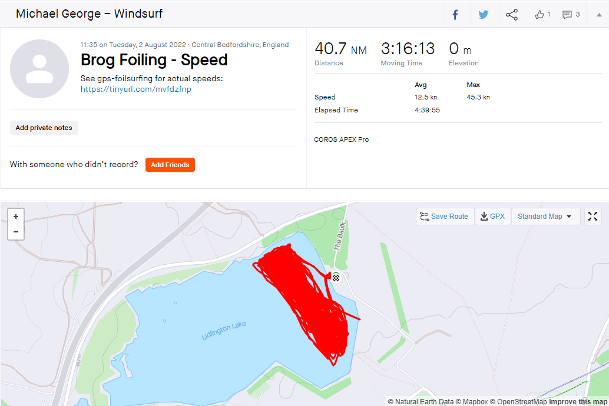
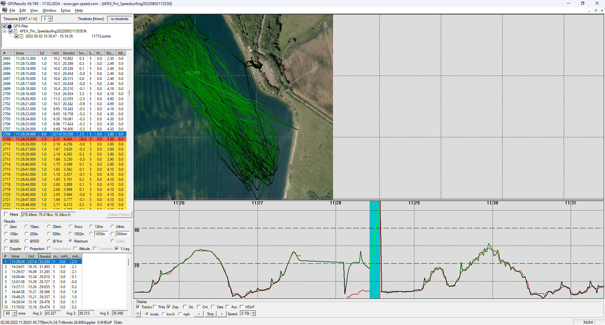
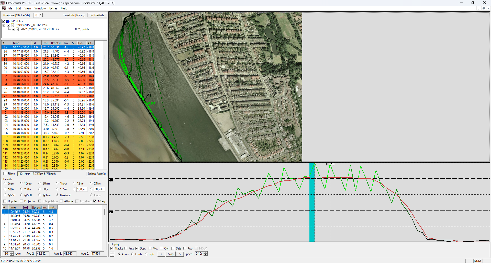
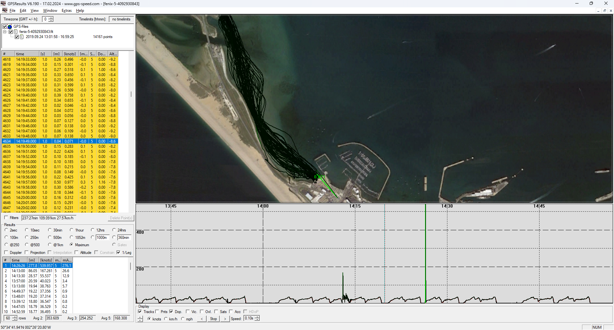
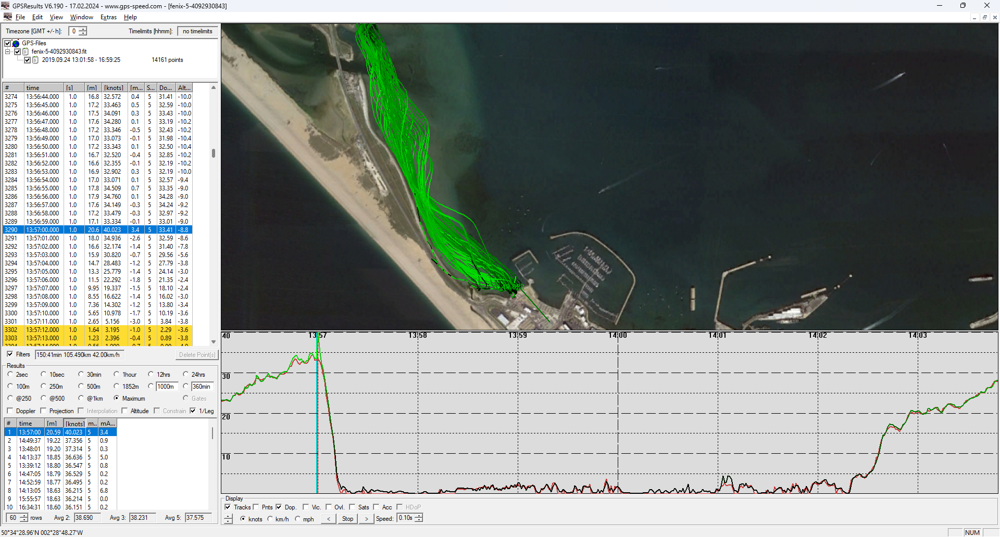
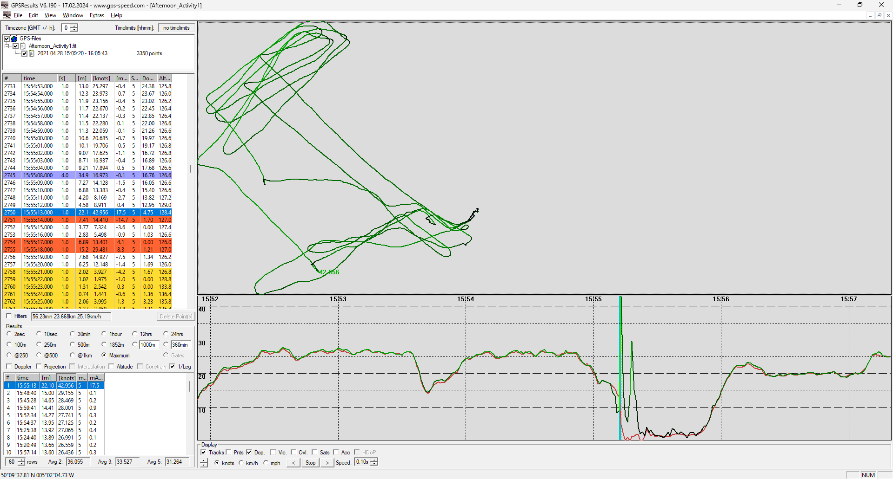
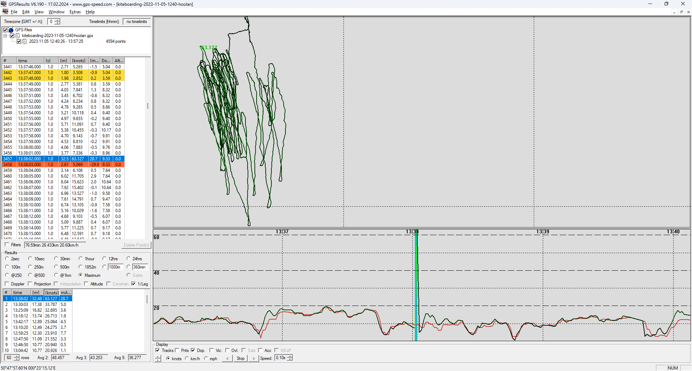
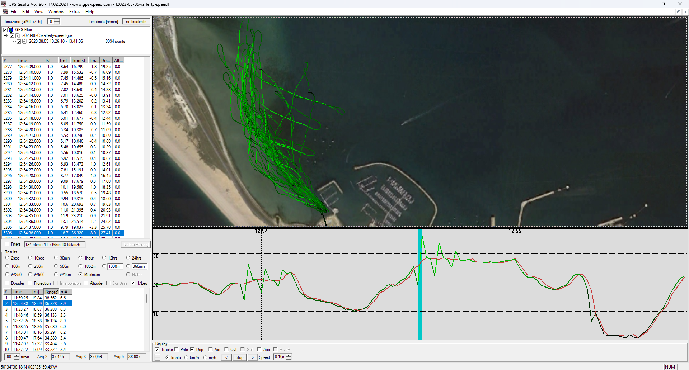

## GPS Articles

### The Importance of Doppler!

Date created: 2024-02-25

An earlier article described [position, velocity and time](https://medium.com/@mikeg888/position-velocity-and-time-pvt-51f4cc738b75) (PVT) and how GPS / GNSS receivers derive speeds using the Doppler observable. The high accuracy of Doppler-derived speeds from GNSS receivers has been known to the [GPS Speedsurfing](https://www.gps-speedsurfing.com/) community for a long time and a couple of papers were written back in 2007, whilst studying the speeds produced by the [Locosys](https://www.locosystech.com/en/product/gps-handheld-data-logger-gt-31.html) GT-11 (SiRF Star II chipset):

- [High accuracy speed measurement using GPS](https://studylib.net/doc/18795194/high-accuracy-speed-measurement-using-gps) by Tom Chalko PhD
- [Handheld-GPS based Speed-Measurements](https://web.archive.org/web/20120531035620/http://www.gps-results.com/GPS_Speed.pdf) by Manfred Fuchs PhD

Official speeds of world record attempts at the annual [Luderitz Speed Challenge](https://luderitz-speed.com/) use video timing. However, speeds from custom GNSS receivers such as the [Motion GPS](https://www.motion-gps.com/) are typically +/- 0.05 knots of the official video-timed results over the 500m course.

The accuracy of Doppler-derived speeds definitely varies between brands / models but without exception the doppler-derived speeds are always far more robust and far more reliable than speeds calculated from the positional data.

This article has been created to provide some examples from a variety of GNSS receivers; different brands and models. Examples for a variety of brands and models have chosen to show how the problems affecting non-Doppler speeds are universal.

#### 1. COROS APEX Pro

This first example starts with a windfoiling session that I posted to Strava. It reports a maximum speed of 45 knots, yet the actual maximum speed was slightly under 30 knots.

Looking at the data within [GPSResults](https://www.gps-speed.com/download_e.html) it is possible to see that I crashed and this resulted in garbage positions being recorded for around 1 minute, including a 55 knot "spike" in the speeds calculated from the positional data (shown in green).

Importantly the doppler-derived speeds (shown in red) were unaffected by the issues affecting the positional data due to the crash. If you are wondering why Strava reported 45 knots when the spike was actually 55 knots, it is because Strava applies some smoothing to the speeds calculated. 

One final note is how the speeds derived from positional data seem to include mini-spikes resembling sharks teeth. The doppler-derived speeds do not exhibit this same behavior and better represent the true speeds.

#### 2. Garmin Fenix 6

This next example was recorded on a Garmin Fenix 6 whilst windsurfing at West Kirby Marine Lake. It is perhaps worth noting that the Garmin Fenix 6 uses the same Sony GNSS chipset as the COROS APEX Pro and COROS VERTIX.

The maximum speed calculated from the positional data (shown in green) is due to a 50 knot spike, whilst the Doppler-derived speed at the time was 40.9 knots (shown in red). The rider was also wearing a Locosys GW-60 which was reporting 40.7 knots at the very same moment.

Uploading this session to Strava results in a maximum speed of 46.2 knots being reported for the session, due to it ignoring the Doppler speed and reporting the spike in the positional data.

#### 3. Garmin Fenix 5

The following session recorded on a Garmin Fenix 5 whilst windsurfing in Portland Harbour.

The image below shows a speed derived from positional data which is 540 knots and a smaller spike of 167 knots! The filters in GPSResults have been turned off to show these anomalies but they are clearly present in the data. These were caused by the watch being submerged whilst coming ashore.

Strava filters out these especially large spikes but there is still plenty of bogus data in the track. Enabling the filters in GPSResults hides the largest spikes but there is still an issue with a maximum speed of 40 knots being reported. The Doppler-derived speed at the time was 33.4 knots and the sailor was also wearing a GW-60 which corroborated the speed as being just over 33 knots.

Uploading this session to Strava results in a maximum speed of 38.8 knots being reported, slightly less than the 40 knots mentioned above due to the fact that Strava applies some smoothing. So in this instance Strava reports 5 knots higher than the true speed and not due to a crash.

#### 4. Garmin vívoactive 3

The following session was recorded on a Garmin vívoactive 3 whilst windfoiling. The vívoactive 3 uses the same MediaTek GNSS chipset as the Fenix 5.

In this example we see a 43 knot spike in the speeds calculated from positional data, whereas the doppler-derived speed is unaffected and slowly dropping to near zero. It's worth noting that in this example Strava does filter out the spike, but it still over-reports the maximum speed for the session.

#### 5. Apple Watch SE

The example below is from a kiteboarding session and was recorded on an Apple Watch SE.

The speeds calculated from positional data results show a spike of 63 knots, during a turn and presumably due to the watch being submerged. The doppler-derived speed at the time was around 9 knots, which looks quite plausible.

When uploaded to Strava the max speed is reported as 28.9 knots, reduced somewhat from the 63 knots due to smoothing being applied. This is still very different to the 9 knots that was actually occurring at the time

#### 6. Sailmon Max

The final example is from a wingfoiler using the Sailmon Max.

As with many other brands and devices it is clearly inappropriate to calculate speeds from the positional data (shown in green). A spike of 36.3 knots is apparent when the doppler-derived speed was reporting 27.4 knots.

This particular spike is not due to a crash and simply due to issues affecting the positional data being recorded by the device.

#### Wrap up...

Hopefully the above examples make it very clear why it is so important to have a GPS / GNSS device that records the Doppler-derived speeds. The examples not only show the issues that can be caused by calculating speeds from the positional data, but also how the Doppler-derived speeds are far more robust and reliable.

The good news is that the majority of modern GPS / GNSS receivers do provide Doppler-derived speeds, but the different brands and devices are not equally accurate. There are multiple factors that affect accuracy including the antenna design and the GNSS chipset, but I will save that discussion for a future article.

For now, I'll give just two tips:

1. When downloading or exporting sessions from a sports watch, be sure to choose a file format that includes the doppler-derived speeds. Dedicated speedsailing devices use proprietary file formats such as SBN, SBP, OAO, UBX, GPY which all include the Doppler-derived speeds. Sports watches from the like of COROS, Garmin, and Suunto offer formats such as FIT, GPX, and TCX. At this point in time be sure to export FIT files, but DO NOT export GPX files. FIT files will include the Doppler-derived speeds, whereas GPX files rarely include the Doppler-derived speeds (e.g. COROS and Garmin).
2. Ensure you review your sessions using an application that uses the Doppler-derived speeds. There are plenty of applications that ignore the Doppler-derived speeds and calculate speeds from the positional data. It should be clear from this article that Strava is one such application, and therefore has a tendency to report maximum speeds that are completely bogus. One of the easiest ways to properly analyse your watersports sessions is with an application such as [GPSResults](https://www.gps-speed.com/download_e.html), [GpsarPro](http://gpsactionreplay.free.fr/), [GPS Speedreader](https://ecwindfest.org/GPS/GPSSpeedreader.html) or by uploading to [gps-speedsurfing.com](https://www.gps-speedsurfing.com/), [gps-foilsurfing.com](https://www.gps-foilsurfing.com/), [gps-kitesurfing.com](https://www.gps-kitesurfing.com/), or [gps-wingfoiling.com](https://www.gps-wingfoiling.com/) but use FIT, not GPX.

Mike George - K888
