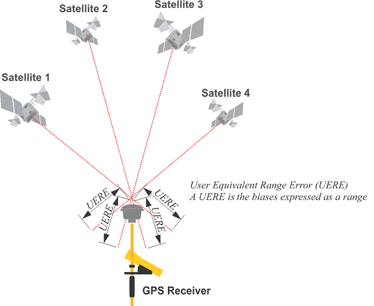
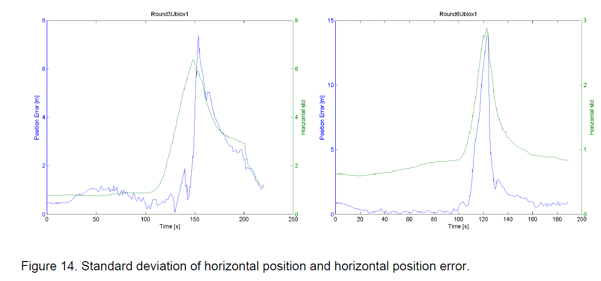

## GPS Articles

### GNSS Accuracy Estimates

#### Background

GPS / GNSS chipsets can often generate accuracy estimates as part of their [position / velocity / time](https://medium.com/@mikeg888/position-velocity-and-time-pvt-51f4cc738b75) (PVT) solutions. These provide a good indication as to whether the position and speed being reported by the GPS / GNSS receiver are likely to be accurate, or not.

Popular devices amongst the speedsailing community include the Locosys [GT-31](https://www.locosystech.com/en/product/gps-handheld-data-logger-gt-31.html), [GW-52](https://www.locosystech.com/en/product/gps-handheld-data-logger-gw-52.html), and [GW-60](https://www.locosystech.com/en/product/gps-watch-gw-60.html) which all use SiRF chipsets and provide speed accuracy estimates. The u-blox based devices such the [Motion](https://www.motion-gps.com/motion/index.html) and [ESP-GPS](https://docs.google.com/document/d/1j86kj3bNMID3sHCRT7QTYyrL7IHeQnGPec1LajsDfB4) are also excellent devices and capable of logging the accuracy estimates.

PVT accuracy estimates are also available from many other GNSS chipsets nowadays, and have been available to application developers via the location APIs of Android and Apple devices since around 2016 / 2017.

#### PVT Solution

The GPS / GNSS chipset will typically use either [least squares](https://en.wikipedia.org/wiki/Least_squares) (LSQ) or a [Kalman filter](https://en.wikipedia.org/wiki/Kalman_filter) to determine the PVT solution.

The PVT solution will always involve a level of uncertainty, primarily because the raw [observables](https://medium.com/@mikeg888/what-are-the-gnss-observables-15016f636c17) cannot provide an exact solution.

This can be illustrated visually with a diagram which shows the [UERE](https://www.e-education.psu.edu/geog862/node/1713) (user equivalent range error) for a receiver:

A simple way to think of the positional error estimate is as the UERE multiplied by the [dilution of precision](https://en.wikipedia.org/wiki/Dilution_of_precision_(navigation)) (DOP). In practice the positional accuracy estimates will usually be determined using the covariance matrix of the LSQ or Kalman filter. The differences between the two approaches are nicely explained in an [article](https://insidegnss.com/wp-content/uploads/2018/01/marapr13-Solutions.pdf) written for InsideGNSS in 2013.

The image above is helpful when discussing horizontal and vertical positional accuracy. Speed accuracy can also be derived using a similar principle, but is related to the UERRE (user equivalent range rate error) and the method used to determine velocity. This will typically be dependent on the stability of the doppler observable that is used when estimating the velocity of the receiver.

#### Interpretation

The accuracy estimates will typically be derived from the covariance matrix of the LSQ / Kalman filter but they do have their limitations:

- Firstly, they can be unaware of systemic biases which may not be easily identified
  - Such biases may not be apparent within the residuals of the LSQ / Kalman filter
- The accuracy estimates are typically produced using the covariance matrix of the LSQ / Kalman filter
  - They therefore represent the amount of confidence in the final solution, usually as 1-sigma (i.e. 68% confidence)
- The accuracy estimates must not be used to infer the precise accuracy of the PVT solution
  - They will however indicate when something abnormal has occurred and are thus extremely useful to software filters
- The accuracy estimates must not be used to compare the accuracy of different receivers, due to different implementations
  - They are however useful within the context of single / multiple sessions from a single receiver

#### Effectiveness

A [study](https://www.foi.se/rest-api/report/FOI-R--3840--SE) in 2014 was conducted using two u-blox 6 receivers and the content of the [GST](https://gpsd.gitlab.io/gpsd/NMEA.html#_gst_gps_pseudorange_noise_statistics) (GNSS Pseudorange Noise Statistics) message to determine the horizontal accuracy estimate (hAcc) as 1-sigma.

Blue shows the actual horizontal position error, and green shows the estimated horizontal error. These graphs have been included to illustrate the usefulness of estimated accuracy / errors, without going into lengthy details, study or analysis.

The most important thing that accuracy estimates do is to highlight any abnormalities and when the quality of the PVT solution is compromised.

### Availability of Estimates

The availability of accuracy estimates can be categorised in the following ways:

- GPS / GNSS chipsets
- NMEA sentences
- Binary outputs
- Location services provided by operating systems - e.g. Android, iOS, iWatch, etc.

#### GPS / GNSS Chipsets

Accuracy estimates are typically available from NMEA sentences and / or binary messages being output by the GPS / GNSS chip:

The following is a list of popular chipset manufacturers who are known to produce accuracy estimates:

- Broadcom (e.g. Android smart phones and Apple watches)
- MediaTek (e.g. popular sports watches and some older Android smart phones)
- Qualcomm (e.g. Snapdragon SoCs used in Android and Apple smart phones)
- Rockwell
- Samsung (e.g. Exynos SoCs used in smart phones and watches)
- Swift
- SiRF (e.g. sports watches and GNSS trackers)
- u-blox (e.g. proprietary GNSS tracking devices)

#### NMEA Sentences

A couple of standard [NMEA](https://gpsd.gitlab.io/gpsd/NMEA.html) sentences provide horizontal and vertical (position) accuracy estimates:

- [**GBS**](https://gpsd.gitlab.io/gpsd/NMEA.html#_gbs_gps_satellite_fault_detection) - GNSS Satellite Fault Detection
  - Includes latitude, longitude, altitude errors (1-sigma)
  - This message outputs the results of the "Receiver Autonomous Integrity Monitoring" algorithm (RAIM)
- [**GST**](https://gpsd.gitlab.io/gpsd/NMEA.html#_gst_gps_pseudorange_noise_statistics) - GNSS Pseudorange Noise Statistics
  - Includes UERE, latitude, longitude, altitude errors (1-sigma)

Note: latitude / longitude accuracy can be converted to horizontal accuracy using hAcc = √ (latAcc² + lonAcc²)

Proprietary NMEA sentences including horizontal and vertical (position) accuracy estimates:

- [**EPE**](http://ozzmaker.com/wp-content/uploads/2016/08/M10478-M10578-NMEA_Sentence_Output.pdf) (MediaTek) - Estimated Position Errors
  - Horizontal and vertical accuracy estimates (probably 1-sigma)
- [**PGRME**](https://gpsd.gitlab.io/gpsd/NMEA.html#_pgrme_garmin_estimated_error) (Garmin) - Estimated Error Information
  - Includes estimated horizontal position error (HPE) + vertical position error (VPE)
- **PUBX,0** (x-box) - Position
  - Includes Horizontal and vertical accuracy estimates (1-sigma)

Proprietary NMEA sentences also including speed accuracy estimates:

- **PSRFEPE** (SiRF) - Estimated Position Errors
  - Includes EHPE, EVPE, EHVE, EHE
- [PGLOR](https://gpsd.gitlab.io/gpsd/NMEA.html#_pglor_quectel) (Broadcom) - LSQ (least squares)
  - PGLOR originates from the Broadcom GNSS chips within Quectel GNSS modules
  - Includes HErr, AltErr, HSpdErr, VSpdErr, and TrkAngErr (stated as RMS in the Quectel documentation, rather than 1-sigma)
  - RMS stated in the Quectel documentation but is comparable to 1-sigma; 68% of 1-dimension, 63% for 2-dimensions
- [**PJLTS**](https://gpsd.gitlab.io/gpsd/NMEA.html#_pjlts_jackson_labs_time_and_3d_velocity) (Jackson Labs) - Time and speed
  - Includes speed accuracy estimate (1-sigma)

#### Binary Outputs

Various manufacturers are also known to provide position and speed accuracy estimates in their binary outputs:

- Rockwell - EHPE, EVPE, EHVE (1-sigma)
- Swift Navigation - hAcc, vAcc, sAcc, rAcc, cAcc (1-sigma)
- SiRF - EHPE, EVPE, EHVE
  - Locosys also provide SDOS (standard deviation of speed) and VSDOS (vertical equivalent) from SiRF chipsets (1-sigma)
- u-blox - hAcc, vAcc, sAcc, cAcc (1-sigma)

It is also likely that SoCs from the likes of Qualcomm and Samsung provide accuracy estimates via binary protocols.

#### Location Services

Since around 2016 or 2017, accuracy estimates (including speed accuracy) have been readily available on Android and Apple devices via their [location services](https://logiqx.github.io/gps-wizard/apis/location.html). The table below shows when the various accuracy estimates were added to the Android and Apple operating systems.

A quick summary:

- Horizontal accuracy estimates have been available from Apple and Android since 2008
- Speed accuracy estimates have been available from Apple and Android since around 2016 or 2017
- Course accuracy estimates have been available from Apple since 2020

|         | hAcc                        | vAcc                        | sAcc                        | cAcc                        |
| ------- | --------------------------- | --------------------------- | --------------------------- | --------------------------- |
| Android | Android 1.0 (Sep 2008) | Android 8.0 (Aug 2017) | Android 8.0 (Aug 2017) | Android 8.0 (Aug 2017) |
| iOS     | iOS 2.0 (Jul 2008)     | iOS 2.0 (Jul 2008)     | iOS 10.0 (Sep 2016)    | iOS 13.4 (Mar 2020)    |
| watchOS | watchOS 2.0 (Sep 2015) | watchOS 2.0 (Sep 2015) | watchOS 3.0 (Sep 2016) | watchOS 6.2 (Mar 2020) |

### Summary

This document provides some basic information about the accuracy estimates provided by GPS / GNSS chipsets:

- Horizontal / vertical position accuracy (m)
- Horizontal / vertical speed accuracy (m/s)
- Course accuracy (degrees)

These accuracy estimates are typically available via NMEA sentences and / or binary protocols. Around 2016 or 2017, speed accuracy estimates were added to the location services of Apple and Android devices, which probably account for the majority of GPS / GNSS receivers in use today.

The vast majority of the available documentation refers to accuracy estimates being 1-sigma. A 68% confidence level is mentioned in the Android documentation and is also mentioned in the Apple documentation (see [vertical accuracy](https://developer.apple.com/documentation/corelocation/cllocation/1423550-verticalaccuracy)).

There is a separate page listing the accuracy estimates available from the Android and Apple [location services](https://logiqx.github.io/gps-wizard/apis/location.html).

The accuracy estimates are highly desirable in GNSS receivers for sports interested in GNSS accuracy, especially when speed is the focus. Basic filtering and calculations based on the speed accuracy estimates from Locosys and u-blox devices are already utilised by the speedsailing community and there is scope for further developments.

It is unfortunate that sports watches from the likes of Garmin, Suunto and COROS use GNSS chipsets that do not produce accuracy estimates. Without these estimates the GNSS receiver is basically providing a PVT solution without any supporting data to assess the accuracy. This is why devices such as the [GT-31](https://www.locosystech.com/en/product/gps-handheld-data-logger-gt-31.html), [GW-52](https://www.locosystech.com/en/product/gps-handheld-data-logger-gw-52.html), [GW-60](https://www.locosystech.com/en/product/gps-watch-gw-60.html), [Motion](https://www.motion-gps.com/motion/index.html) and [ESP-GPS](https://docs.google.com/document/d/1j86kj3bNMID3sHCRT7QTYyrL7IHeQnGPec1LajsDfB4) are recomended for speedsailing.

Mike George - K888

