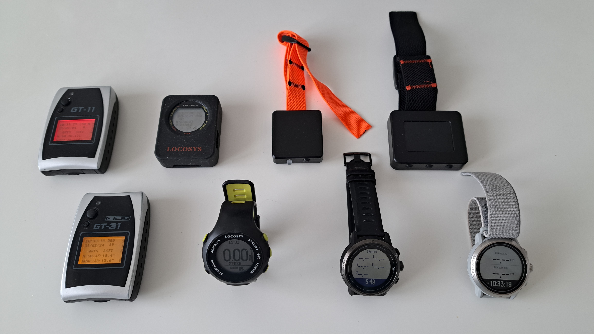
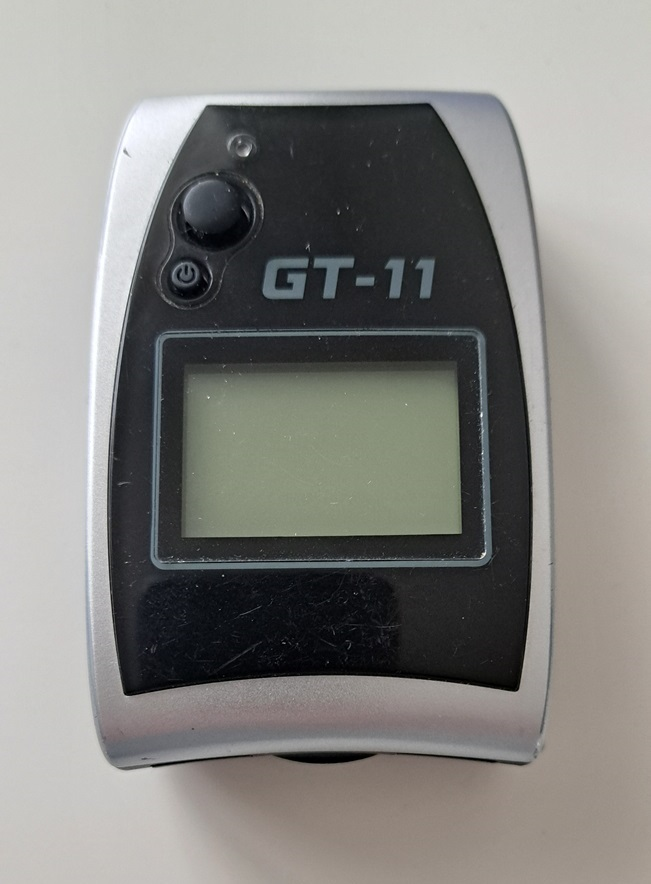
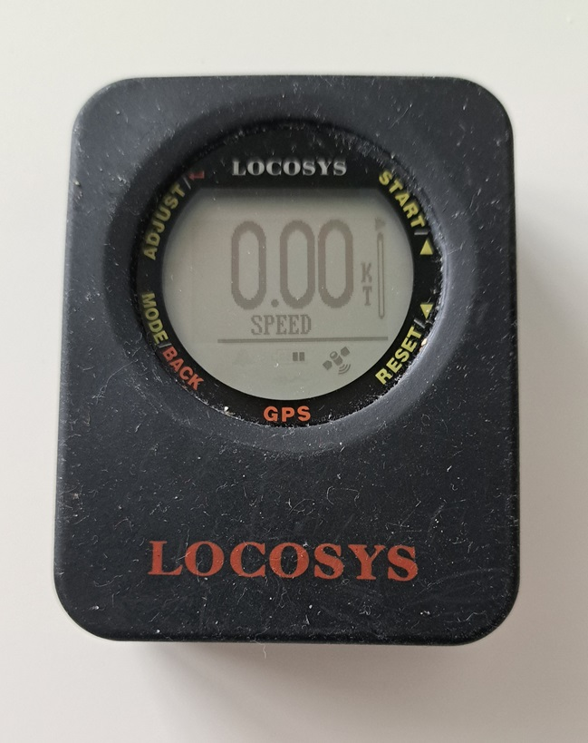
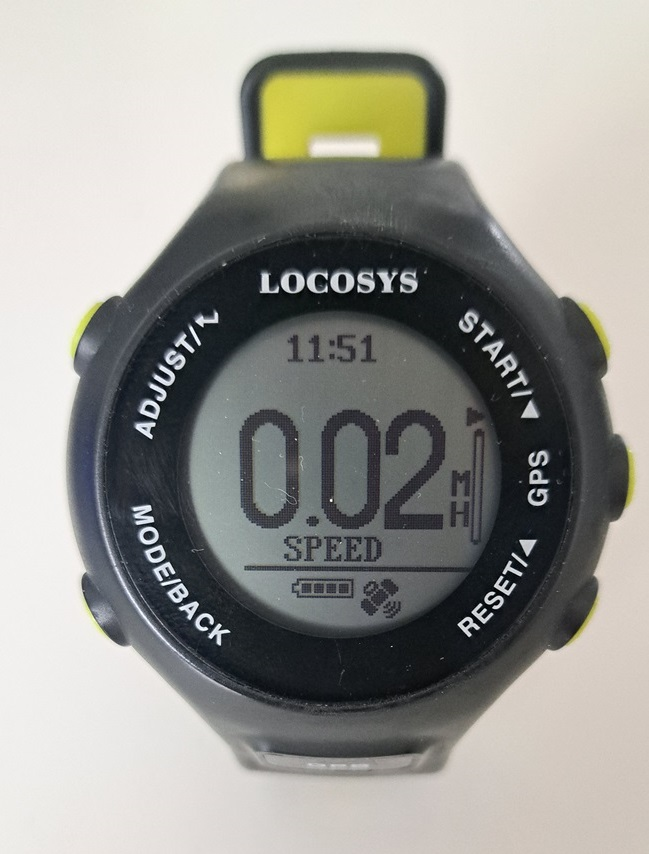
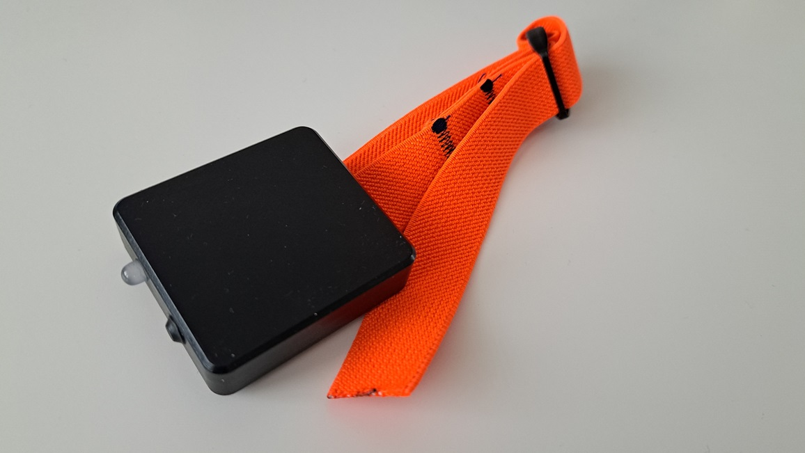
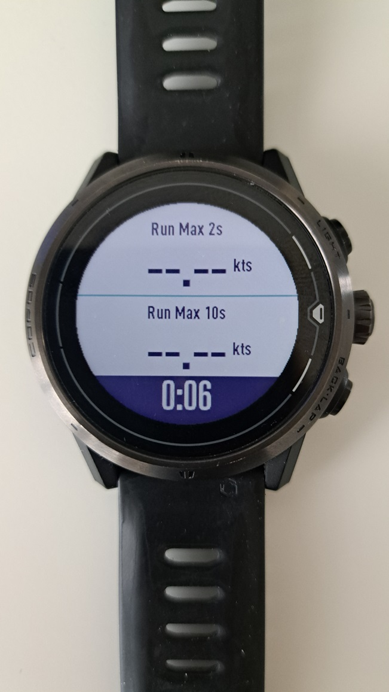
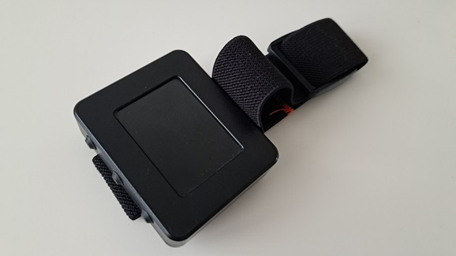
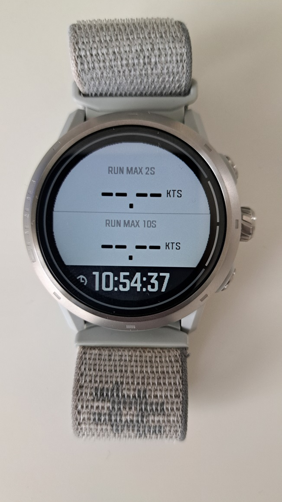

## GPS Articles

### Speedsurfing GPS Devices

Since buying myself a Locosys GT-11 in 2007, [gps-speedsurfing,com](https://www.gps-speedsurfing.com/default.aspx?mnu=item&item=GPSInfo) and the [GPS Team Challenge](https://www.gpsteamchallenge.com.au/pages/rules) have approved a variety of GPS / GNSS devices. I’ve owned many of them myself and this article is a quick summary of their features and capabilities.

I've arranged my collection in chronological order (left to right); Locosys [GT-11](https://logiqx.github.io/gps-guides/devices/locosys/gt-11/), Locosys [GT-31](https://logiqx.github.io/gps-guides/devices/locosys/gt-31/), Locosys [GW-52](https://logiqx.github.io/gps-guides/devices/locosys/gw-52/), Locosys [GW-60](https://logiqx.github.io/gps-guides/devices/locosys/gw-60/), [Motion Mini](https://logiqx.github.io/gps-guides/devices/motion/mini/), COROS [Apex Pro](https://logiqx.github.io/gps-guides/devices/coros/apex-pro/), [Motion LCD](https://logiqx.github.io/gps-guides/devices/motion/lcd/), CORO APEX 2 Pro. I'll write a brief summary of each device within this article, starting with the Locosys GT-11.

#### Locosys GT-11

The [GT-11](https://logiqx.github.io/gps-guides/devices/locosys/gt-11/) was quite a revolution for the speed sailing community in 2006/07, setting the benchmark for quality 1 Hz logging at an affordable price.

In addition to the positional data (latitude and longitude) the GT-11 recorded the [Doppler speed](https://medium.com/@mikeg888/the-importance-of-doppler-b886b14bb65d), [HDOP](https://en.wikipedia.org/wiki/Dilution_of_precision_(navigation)) and number of satellites. These aspects made it far batter than the Garmin handhelds of the time which only recorded latitude, longitude, elevation and time.

The GT-11 always had the ability to log the [NMEA](https://gpsd.gitlab.io/gpsd/NMEA.html) sentences output by the GPS chipset, but Locosys added proprietary formats referred to as SBN and SBP. The SBN and SBP formats were very much based on the SiRF Star II chipset being used in the GT-11.

The GT-11 was also sold as the NAVI GPS by NAVMAN, and also sold as the [Amaryllo Trip Tracker](https://www.amaryllo.com/almooj/sports-products/amaryllo-trip-tracker-gps-sports-device-7.html).

#### Locosys GT-31

The [GT-31](https://logiqx.github.io/gps-guides/devices/locosys/gt-31/) was a significant improvement to the [GT-11](https://logiqx.github.io/gps-guides/devices/locosys/gt-11/), thanks to adoption of the SiRF Star III chipset.

The GT-31 provided faster satellite acquisition, increased positional accuracy, was less prone to spikes in the Doppler speeds and had a longer battery life. The [SDOP](https://nujournal.net/estimating-accuracy-of-gps-doppler-speed-measurement-using-speed-dilution-of-precision-sdop-parameter/) was also recorded (subsequently renamed to SDOS), allowing the [accuracy](https://medium.com/@mikeg888/gnss-accuracy-estimates-74a04ce20608) of Doppler speeds to be evaluated.

The GT-31 was incredibly reliable and was used by many speed sailing competitions, including [Weymouth Speed Week](https://weymouthspeedweek.com/) until 2022. In terms of features and accuracy the GT-31 still outperforms the latest sports watches from likes of COROS, Garmin, and Suunto.

The GT-31 was eventually superseded by the [GW-52](https://logiqx.github.io/gps-guides/devices/locosys/gw-52/) in 2015, and the [GW-60](https://logiqx.github.io/gps-guides/devices/locosys/gw-60/) in 2017.

####  

#### Locosys GW-52

The [GW-52](https://logiqx.github.io/gps-guides/devices/locosys/gw-52/) was the next step in the evolution of Locosys devices, thanks to adoption of the SiRF Star IV or V chipset.

You can find my [first impressions](https://logiqx.github.io/gps-guides/devices/locosys/gw-52/first-impressions.html) of GW-52, written in Nov 2015. A significant feature of the GW-52 was the introduction of 5 Hz logging, providing more insight into what the SiRF chipset was actually calculating from the GPS signals.

Ultimately the GW-52 was not available for long and was superseded by the [GW-60](https://logiqx.github.io/gps-guides/devices/locosys/gw-60/) in early 2017. The GW-60 can almost be regarded to be an early prototype of the GW-60,  with very similar features and a great deal of similarity within the firmware code.

In December 2022, I tried to determine the chipset likely to be inside the GW-52 and GW-60, eventually coming to the conclusion that it was almost certainly the SiRF Star IV or V. There is a full [write up](https://logiqx.github.io/gps-details/devices/locosys/detective.html) for anybody wishing to look at the evidence that led me to my conclusion.

#### Locosys GW-60

The [GW-60](https://logiqx.github.io/gps-guides/devices/locosys/gw-60/) was much akin to a [GW-52](https://logiqx.github.io/gps-guides/devices/locosys/gw-52/) in terms of features but it had the convenience of being a wrist watch.

The wrist watch design was convenient, but the GW-60 was prone to water ingress. Pressing the buttons of the GW-60 during a session ultimately lead to its timely demise. I think I owned two or three GW-60 devices in total, each one eventually dying due to water ingress.

Just like the GW-52 the GW-60 also supported 5 Hz logging, although the effects of a smaller antenna were clearly evident in the data being recorded. The addition of 100 / 250 / 500 meters and alpha 500 made it an excellent device during speed sailing sessions.

Despite the susceptibility to water ingress the GW-60 was regarded as the best device for quite a few years, until some time in 2021 when it was discontinued and became unavailable for purchase.

#### Motion Mini

The [Motion Mini](https://logiqx.github.io/gps-guides/devices/motion/mini/) provides even better data quality than the popular [Locosys](https://logiqx.github.io/gps-guides/devices/locosys/) devices (GT-31, GW-52 and GW-60) and modern sports watches from the likes of COROS, Garmin, and Suunto.

The Motion Mini has no screen and is designed purely as a high-accuracy logging device. It is very reasonably priced and is perfect for anyone who cares about the accuracy of the data being recorded and the ability to verify it afterwards.

I wrote up my [first impressions](https://logiqx.github.io/gps-guides/devices/motion/mini/first-impressions.html) of the Motion Mini and after somewhat extensive testing and evaluation it was adopted by [Weymouth Speed Week](https://weymouthspeedweek.com/) for its accuracy, convenience of WiFi connectivity, and general simplicity for the competition.

Regardless of what other GPS / GNSS devices you happen to be wearing during your sessions, it is always good to have a Motion Mini on your arm.

 

#### COROS APEX Pro

The COROS [APEX Pro](https://logiqx.github.io/gps-guides/devices/coros/apex-pro/) became popular after [gps-speedsurfing.com](https://www.gps-speedsurfing.com/) and COROS worked together to develop a tailor made workout mode.

I shared  my [first impressions](https://logiqx.github.io/gps-guides/devices/coros/apex-pro/first-impressions.html) when I bought an APEX Pro in June 2021, seeking a replacement for my GW-60. The best features by far are the impressive battery life and the convenience of sessions being automatically uploaded to gps-speedsurfing.com.

The FIT exports include some additional data for run verification and automatic uploading to GP3S. However, the more closely I examined the data, the more it became apparent that the Sony GNSS chipset has several issues, making it susceptible to inaccuracies and spikes.

The Sony chip appears to focus on low power usage at the expense of accuracy. That being said the APEX Pro and VERTIX were a reasonable option at the time, given the discontinuation of Locosys devices and limited availability of u-blox devices such as the [Motion](https://logiqx.github.io/gps-guides/devices/motion/).

I plan to write an article (or two) about the issues affecting the Sony GNSS chipset. The APEX Pro and VERTIX are both approved for use by [gps-speedsurfing.com](https://www.gps-speedsurfing.com/default.aspx?mnu=item&item=GPSInfo), but not the [GPS Team Challenge](https://www.gpsteamchallenge.com.au/pages/rules) because they do not record any [speed accuracy](https://medium.com/@mikeg888/gnss-accuracy-estimates-74a04ce20608) estimates.

#### Motion LCD

The [Motion LCD](https://logiqx.github.io/gps-guides/devices/motion/lcd/) is the big brother of the [Motion Mini](https://logiqx.github.io/gps-guides/devices/motion/mini/), providing better data quality than the popular [Locosys](https://logiqx.github.io/gps-guides/devices/locosys/) devices (GT-31, GW-52 and GW-60) and modern sports watches from the likes of COROS, Garmin, and Suunto.

Unlike the Motion Mini the Motion LCD has an actual screen for on-the-water feedback. The Motion LCD is without a doubt the best GPS / GNSS receiver that I have owned personally, primarily due to the accuracy of the data but also the user interface / general usability.

Unfortunately the Motion LCD has now been discontinued, due to ongoing issues with the screen. Fortunately the Motion Mini is still in production and makes an awesome GNSS logger when speed sailing, making it the perfect companion for your less capable GNSS receiver, sports watch, etc.

#### COROS APEX 2 Pro

The COROS APEX 2 Pro is the successor to the APEX Pro and uses an Airoha GNSS chipset. It is more accurate than the APEX Pro and VERTIX which both use a Sony GNSS chipset, but not as good as the GT-31, GW-52, GW-60.

Due to an issue with the dial on my APEX Pro, I received the APEX 2 Pro as my warranty replacement. Whilst examining data from my sessions it quickly became evident that the Airoha chipset is an improvement on the Sony chipset of the APEX Pro and VERTIX.

This watch is by no means the perfect device and there are a number of known [bugs](https://github.com/Logiqx/gp3s-coros/issues) in the firmware / mobile app. I consider the APEX 2 Pro as a reasonable device to use for on-the-water feedback, alongside something like a Motion Mini to record data that can actually be verified.

I will write some detailed articles about COROS watches, including the APEX 2, APEX 2 Pro and VERTIX 2. These three watches are all approved for use by [gps-speedsurfing.com](https://www.gps-speedsurfing.com/default.aspx?mnu=item&item=GPSInfo), but not [gpsteamchallenge.com.au](https://www.gpsteamchallenge.com.au/pages/rules) because they do not record [speed accuracy](https://medium.com/@mikeg888/gnss-accuracy-estimates-74a04ce20608) estimates.

### Summary

That’s a quick summary of the GPS / GNSS devices that I have used over the years. Sadly the screen of my Motion LCD is now dead, so I use my Motion Mini and APEX 2 Pro. I use the Motion Mini as my primary logging device and the APEX 2 Pro for on-the-water feedback.

I plan to write a number of articles looking more closely at a number of modern sports watches, but this article should serve as quick summary of the most popular GPS / GNSS devices used by the speed sailing community.

Mike George - K888

