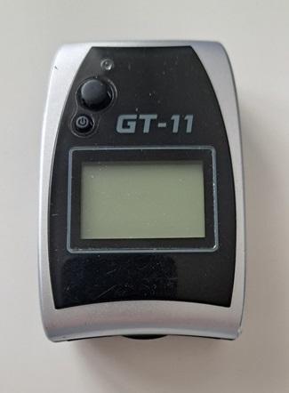
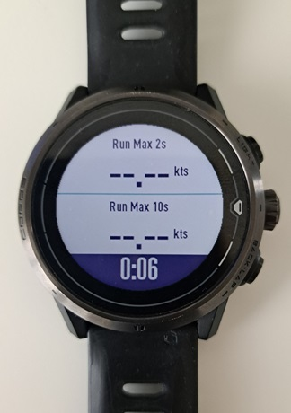
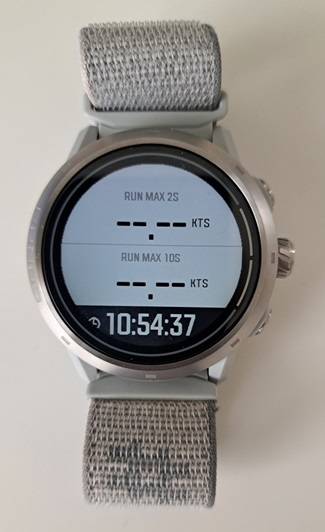

## GPS Articles

### Speedsurfing GPS Devices

Since buying myself a Locosys GT-11 in 2007, [gps-speedsurfing,com](https://www.gps-speedsurfing.com/default.aspx?mnu=item&item=GPSInfo) and the [GPS Team Challenge](https://www.gpsteamchallenge.com.au/pages/rules) have endorsed a variety of different GPS / GNSS devices. I've owned many of them myself and this article is a quick summary of their features and capabilities.

I've arranged this collection in chronological order (left to right); Locosys [GT-11](https://logiqx.github.io/gps-guides/devices/locosys/gt-11/), Locosys [GT-31](https://logiqx.github.io/gps-guides/devices/locosys/gt-31/), Locosys [GW-52](https://logiqx.github.io/gps-guides/devices/locosys/gw-52/), Locosys [GW-60](https://logiqx.github.io/gps-guides/devices/locosys/gw-60/), [Motion Mini](https://logiqx.github.io/gps-guides/devices/motion/mini/), COROS [Apex Pro](https://logiqx.github.io/gps-guides/devices/coros/apex-pro/), [Motion LCD](https://logiqx.github.io/gps-guides/devices/motion/lcd/), CORO APEX 2 Pro. I'll each one individually within this article, starting with the Locosys GT-11.

#### Locosys GT-11

The [GT-11](https://logiqx.github.io/gps-guides/devices/locosys/gt-11/) was quite a revolution for the speedsailing community and was the original benchmark for quality 1 Hz logging at an affordable price!

In addition to the positional data (latitude and longitude) it recorded [Doppler speed](https://medium.com/@mikeg888/the-importance-of-doppler-b886b14bb65d), [HDOP](https://en.wikipedia.org/wiki/Dilution_of_precision_(navigation)) and satellite counts. These aspects made it far more useful than the Garmin handhelds that were also available at the same time which only recorded latitude, longitude, elevation and time.

The GT-11 had the ability to log all of the [NMEA](https://gpsd.gitlab.io/gpsd/NMEA.html) sentences output by the GPS chipset, but Locosys soon added proprietary formats referred to as SBN and SBP. The SBN and SBP formats were based on the SiRF Star II chipset that was being used at the time.

The GT-11 was also sold as the NAVI GPS by NAVMAN and the [Amaryllo Trip Tracker](https://www.amaryllo.com/almooj/sports-products/amaryllo-trip-tracker-gps-sports-device-7.html), and it was the device to have at the time!

#### Locosys GT-31

The [GT-31](https://logiqx.github.io/gps-guides/devices/locosys/gt-31/) was a significant improvement to the [GT-11](https://logiqx.github.io/gps-guides/devices/locosys/gt-11/), thanks to adoption of the SiRF Star III chipset.

The GT-31 provided a faster satellite acquisition; time to first fix (TTFF), increased positional accuracy, was less prone to spikes in Doppler speeds and had a longer battery life. [SDOP](https://nujournal.net/estimating-accuracy-of-gps-doppler-speed-measurement-using-speed-dilution-of-precision-sdop-parameter/) became available for the first time (subsequently renamed to SDOS), allowing the Doppler speed [accuracy](https://medium.com/@mikeg888/gnss-accuracy-estimates-74a04ce20608) to be estimated with 99% certainty.

The GT-31 proved to be incredibly reliable and was even used by large speed competitions such as [Weymouth Speed Week](https://weymouthspeedweek.com/) for around 100 competitors, up to 2022. In terms of features and accuracy, it still outperforms the best sports watches on the market from companies like Garmin, Suunto and COROS.

For the typical speed sailor, the GT-31 was eventually superseded by the [GW-52](https://logiqx.github.io/gps-guides/devices/locosys/gw-52/) in 2015, when Locosys stopped producing the GT-31.

#### Locosys GW-52

The [GW-52](https://logiqx.github.io/gps-guides/devices/locosys/gw-52/) was the next step in evolution from the [GT-31](https://logiqx.github.io/gps-guides/devices/locosys/gt-31/), thanks to adoption of the SiRF Star IV or SiRF Star V chipset.

The GW-52 superseded the [GT-31](https://logiqx.github.io/gps-guides/devices/locosys/gt-31/) in 2015, when Locosys stopped producing the earlier model. You can also find details about the device in my [first impressions](https://logiqx.github.io/gps-guides/devices/locosys/gw-52/first-impressions.html), written in Nov 2015.

The significant change in this device was the introduction of 5 Hz logging, providing more insight into what the SiRF chipset was actually calculating from the GPS signals. Ultimately the GW-52 was not available for long and was superseded by the [GW-60](https://logiqx.github.io/gps-guides/devices/locosys/gw-60/) in early 2017.

In December 2022, I decided to look into what chipset it was likely to have been using and eventually came to the conclusion it was most likely the SiRF Star IV or V. The full [investigation](https://logiqx.github.io/gps-details/devices/locosys/detective.html) is online for anybody wishing to look at the evidence available.

#### Locosys GW-60

The [GW-60](https://logiqx.github.io/gps-guides/devices/locosys/gw-60/) was much akin to a [GW-52](https://logiqx.github.io/gps-guides/devices/locosys/gw-52/) but had the convenience of being a wrist watch. It also has slightly better functionality for reviewing speed results during and after the session.

Convenient as it was to have a wrist watch, the GW-60 was prone to water ingress and operating it via the buttons during a session ultimately lead to its demise! I think I owned two or three GW-60 watches in total, each one eventually dying due to water ingress.

Like the GW-52 it also 5 Hz logging, although the effects of a smaller antenna were clearly evident in the data being recorded. Despite the susceptibility to water ingress this was regarded as the device to have until some time in 2021 when it was discontinued and became impossible to purchase. 

#### Motion Mini

The [Motion Mini](https://logiqx.github.io/gps-guides/devices/motion/mini/) provides superior data quality compared to the popular [Locosys](https://logiqx.github.io/gps-guides/devices/locosys/) devices and modern smart / sports watches from the likes of COROS, Garmin, and Suunto.

The device has no screen as it is purely designed to be a high-accuracy logging device. It is very reasonably priced and is perfect for anyone who cares about the accuracy of their personal data.

I wrote up my first impressions of the Motion Mini in a short [article](https://logiqx.github.io/gps-guides/devices/motion/mini/first-impressions.html) and after extensive testing and evaluation it was adopted by [Weymouth Speed Week](https://weymouthspeedweek.com/) due to its accuracy, convenience of WiFi connectivity, and to improve the general running of the competition.

#### COROS APEX Pro

The COROS [APEX Pro](https://logiqx.github.io/gps-guides/devices/coros/apex-pro/) became popular after [gps-speedsurfing.com](https://www.gps-speedsurfing.com/) (GP3S) and COROS worked together to develop a tailor made workout mode.

I made notes about my [first impressions](https://logiqx.github.io/gps-guides/devices/coros/apex-pro/first-impressions.html) of the APEX Pro when I first received the watch in June 2021. The best features by far are the impressive battery life and the convenience of sessions being automatically uploaded to gps-speedsurfing.com.

The FIT exports include additional data for run verification and automatic uploading to GP3S. However, the more I used my APEX Pro and examined the data more closely, the more it became apparent that the Sony GNSS chipset has a number of issues, making it susceptible to reporting bogus speeds.

I would consider the data quality from the Sony chip as "meh", falling some way short of what I'd expected in 2021. Despite support multi-GNSS the accuracy of the APEX Pro falls somewhere between the GT-11 (released 2006/07) and GT-31 (released 2008/09).

The Sony chip appears to focus on low power usage, not high accuracy. That being said the COROS watches (APEX Pro and VERTIX) were a reasonably good option at the time, given discontinuation of Locosys devices and limited availability of u-blox based [Motion](https://logiqx.github.io/gps-guides/devices/motion/) devices.

I plan to write one or two more articles about this era of the COROS range which included the APEX Pro and VERTIX. These 2 watches are both approved for use by [gps-speedsurfing.com](https://www.gps-speedsurfing.com/default.aspx?mnu=item&item=GPSInfo), but not [gpsteamchallenge.com.au](https://www.gpsteamchallenge.com.au/pages/rules) because they do not record [speed accuracy](https://medium.com/@mikeg888/gnss-accuracy-estimates-74a04ce20608) estimates.

#### Motion LCD

The [Motion LCD](https://logiqx.github.io/gps-guides/devices/motion/lcd/) provides superior data quality compared to the popular [Locosys](https://logiqx.github.io/gps-guides/devices/locosys/) devices and modern smart / sports watches from the likes of COROS, Garmin, and Suunto.

Unlike the Motion Mini the Motion LCD has a screen for on-the-water feedback. This is without a doubt the best GPS / GNSS receiver that I have owned, due to the accuracy of the data and the user interface / general usability.

Unfortunately the maker of the Motion LCD has now discontinued this product due to ongoing issues with the screen. Fortunately he still continues to produce the Motion Mini which makes is an awesome logger and the perfect companion for your favorite sports watch.

#### COROS APEX 2 Pro

The COROS APEX 2 Pro is the successor to the APEX Pro and uses an Airoha GNSS chipset. It has much better performance than the Sony chipset.

Due to an issue with the dial on my APEX Pro, I received the APEX 2 Pro as my warranty replacement. Examining the data it was clear that it is definitely an improvement on the data from the Sony chip of the APEX Pro and VERTIX.

The watch is by no means the perfect device for speedsailing and there are a number of known [bugs](https://github.com/Logiqx/gp3s-coros/issues) present in the watch firmware or mobile app. It is however a reasonable device to use for on-the-water feedback alongside a logger such as the Motion Mini.

I will write one or two more detailed articles about the COROS range which includes the APEX 2, APEX 2 Pro and VERTIX 2. These 3 watches are all approved for use by [gps-speedsurfing.com](https://www.gps-speedsurfing.com/default.aspx?mnu=item&item=GPSInfo), but not [gpsteamchallenge.com.au](https://www.gpsteamchallenge.com.au/pages/rules) because they do not record [speed accuracy](https://medium.com/@mikeg888/gnss-accuracy-estimates-74a04ce20608) estimates.

Mike George - K888

