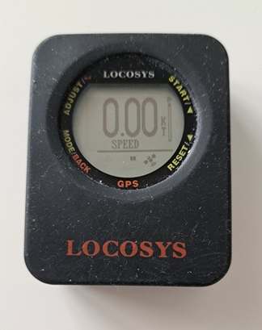

## GPS Articles

### Speedsurfing GPS Devices

Since buying myself a Locosys GT-11 in 2007, [gps-speedsurfing,com](https://www.gps-speedsurfing.com/default.aspx?mnu=item&item=GPSInfo) and the [GPS Team Challenge](https://www.gpsteamchallenge.com.au/pages/rules) have endorsed a variety of different GPS / GNSS devices. I've owned many of them myself and this article is a quick summary of their features and capabilities.

I've arranged this collection in chronological order (left to right); Locosys [GT-11](https://logiqx.github.io/gps-guides/devices/locosys/gt-11/), Locosys [GT-31](https://logiqx.github.io/gps-guides/devices/locosys/gt-31/), Locosys [GW-52](https://logiqx.github.io/gps-guides/devices/locosys/gw-52/), Locosys [GW-60](https://logiqx.github.io/gps-guides/devices/locosys/gw-60/), [Motion Mini](https://logiqx.github.io/gps-guides/devices/motion/mini/), COROS [Apex Pro](https://logiqx.github.io/gps-guides/devices/coros/apex-pro/), [Motion LCD](https://logiqx.github.io/gps-guides/devices/motion/lcd/), CORO APEX 2 Pro. I'll write a summary of each device within this article, starting with the Locosys GT-11.

#### Locosys GT-11

The [GT-11](https://logiqx.github.io/gps-guides/devices/locosys/gt-11/) was quite a revolution for the speed sailing community in 2006/07, setting the benchmark for quality 1 Hz logging at an affordable price.

In addition to the positional data (latitude and longitude) the GT-11 recorded the [Doppler speed](https://medium.com/@mikeg888/the-importance-of-doppler-b886b14bb65d), [HDOP](https://en.wikipedia.org/wiki/Dilution_of_precision_(navigation)) and satellite counts. These aspects made it far more suitable than the Garmin handhelds of the time which only recorded latitude, longitude, elevation and time.

The GT-11 always had the ability to log the various [NMEA](https://gpsd.gitlab.io/gpsd/NMEA.html) sentences output by the GPS chipset, but Locosys added proprietary formats referred to as SBN and SBP. The SBN and SBP formats were very much based on the SiRF Star II chipset being used in the GT-11.

The data was saved to an SD card as well as an internal memory. This means there were essentially two types of log file for each session and at the time, use of the SD card felt a lot more convenient than a serial cable and proprietary software for downloads.

The GT-11 was also sold as the NAVI GPS by NAVMAN, and it was also sold as the [Amaryllo Trip Tracker](https://www.amaryllo.com/almooj/sports-products/amaryllo-trip-tracker-gps-sports-device-7.html).

#### Locosys GT-31

The [GT-31](https://logiqx.github.io/gps-guides/devices/locosys/gt-31/) was a significant improvement to the [GT-11](https://logiqx.github.io/gps-guides/devices/locosys/gt-11/), thanks to adoption of the SiRF Star III chipset.

The GT-31 provided a faster satellite acquisition; time to first fix (TTFF), increased positional accuracy, was less prone to spikes in Doppler speeds and had a longer battery life. [SDOP](https://nujournal.net/estimating-accuracy-of-gps-doppler-speed-measurement-using-speed-dilution-of-precision-sdop-parameter/) became available for the first time (subsequently renamed to SDOS), allowing the Doppler speed [accuracy](https://medium.com/@mikeg888/gnss-accuracy-estimates-74a04ce20608) to be assessed.

The GT-31 proved to be incredibly reliable and was even used by large speed competitions such as [Weymouth Speed Week](https://weymouthspeedweek.com/) with 100 competitors, up to 2022. In terms of features and accuracy the GT-31 still outperforms the best sports watches on the market from likes of COROS, Garmin, and Suunto.

The GT-31 was eventually superseded by the [GW-52](https://logiqx.github.io/gps-guides/devices/locosys/gw-52/) in 2015 when Locosys stopped producing the GT-31, and subsequently the [GW-60](https://logiqx.github.io/gps-guides/devices/locosys/gw-60/) in 2017.

#### Locosys GW-52

The [GW-52](https://logiqx.github.io/gps-guides/devices/locosys/gw-52/) was the next step in the evolution from the [GT-31](https://logiqx.github.io/gps-guides/devices/locosys/gt-31/), thanks to adoption of the SiRF Star IV or SiRF Star V chipset.

The GW-52 was released in 2015, when Locosys stopped producing the GT-31.

You can also find details about the GW-60 in my [first impressions](https://logiqx.github.io/gps-guides/devices/locosys/gw-52/first-impressions.html), written in Nov 2015. A significant feature of this device was the introduction of 5 Hz logging, providing more insight into what the SiRF chipset was actually calculating from the GPS signals. I didn't have a clear appreciation of 5 Hz data at the time, but I plan to write a future article on the topic.

Ultimately the GW-52 was not available for long and was superseded by the [GW-60](https://logiqx.github.io/gps-guides/devices/locosys/gw-60/) in early 2017. It would appear that the GW-60 was almost an early prototype of the GW-60 which is evidenced by its features and the similarity of the code in the firmwares.

In December 2022, I looked into what chipset was likely to have been inside the GW-52 and GW-60, eventually coming to the conclusion that it was most likely the SiRF Star IV or V. There is a full [writeup](https://logiqx.github.io/gps-details/devices/locosys/detective.html) for anybody wishing to look at the evidence that led me to this conclusion.

#### Locosys GW-60

The [GW-60](https://logiqx.github.io/gps-guides/devices/locosys/gw-60/) was much akin to a [GW-52](https://logiqx.github.io/gps-guides/devices/locosys/gw-52/) in terms of features but it had the convenience of being a wrist watch. It had slightly better functionality for reviewing speed results during and after the session; including 100 / 250 / 500 meters and alpha 500.

The wrist watch design was convenient, but the GW-60 was prone to water ingress. Operating the GW-60 via its buttons during a session ultimately lead to its certain demise! I think I owned two or three GW-60 devices in total, each one eventually dying due to water ingress.

Just like the GW-52 the GW-60 also supported 5 Hz logging, although the effects of a smaller antenna were clearly evident in the data being recorded. The addition of 100 / 250 / 500 meters and alpha 500 made it an excellent device during speed sailing sessions.

Despite the susceptibility to water ingress the GW-60 was regarded as the best device to have, until some time in 2021 when it was discontinued and became unavailable for purchase.

#### Motion Mini

The [Motion Mini](https://logiqx.github.io/gps-guides/devices/motion/mini/) provides even better data quality than the popular [Locosys](https://logiqx.github.io/gps-guides/devices/locosys/) devices (GT-11, GW-52 and GW-60) and modern sports watches from the likes of COROS, Garmin, and Suunto.

The Motion Mini has no screen as it is designed purely to be a high-accuracy logging device. It is very reasonably priced and is perfect for anyone who cares about the accuracy of the data being recorded and the ability to verify them afterwards.

I wrote up my first impressions of the Motion Mini in a short [article](https://logiqx.github.io/gps-guides/devices/motion/mini/first-impressions.html) and after extensive testing and evaluation it was adopted by [Weymouth Speed Week](https://weymouthspeedweek.com/) due to its accuracy, convenience of WiFi connectivity, and to improve the general running of the competition.

Regardless of what other device you happen to be wearing during your sessions, it is always good to have a Motion Mini on your arm, whether it be your primary or secondary source of reliable session data.

#### COROS APEX Pro

The COROS [APEX Pro](https://logiqx.github.io/gps-guides/devices/coros/apex-pro/) became popular after [gps-speedsurfing.com](https://www.gps-speedsurfing.com/) (GP3S) and COROS worked together to develop a tailor made workout mode.

I made notes about my [first impressions](https://logiqx.github.io/gps-guides/devices/coros/apex-pro/first-impressions.html) of the APEX Pro when I first received the watch in June 2021. The best features by far are the impressive battery life and the convenience of sessions being automatically uploaded to gps-speedsurfing.com.

The FIT exports include additional data for run verification and automatic uploading to GP3S. However, the more I used my APEX Pro and closely examined the data, the more it became apparent that the Sony GNSS chipset has a number of issues, making it susceptible to inaccuracies and spikes.

I personally regard the data quality from the Sony chip as kinda "meh", falling some way short of what I expected to see in 2021. Despite support multi-GNSS the accuracy of the APEX Pro falls somewhere between the GT-11 (released 2006/07) and GT-31 (released 2008/09).

The Sony chip appears to focus on low power usage at the expense of accuracy. That being said the COROS watches (APEX Pro and VERTIX) were a reasonable option at the time, given the discontinuation of Locosys devices and limited availability of u-blox devices such as the [Motion](https://logiqx.github.io/gps-guides/devices/motion/).

I plan to write an article (or two) about this era of the COROS range; i.e. APEX Pro and VERTIX. These 2 watches are both approved for use by [gps-speedsurfing.com](https://www.gps-speedsurfing.com/default.aspx?mnu=item&item=GPSInfo), but not [gpsteamchallenge.com.au](https://www.gpsteamchallenge.com.au/pages/rules) because they do not record any [speed accuracy](https://medium.com/@mikeg888/gnss-accuracy-estimates-74a04ce20608) estimates.

#### Motion LCD

The [Motion LCD](https://logiqx.github.io/gps-guides/devices/motion/lcd/) is the big brother of the [Motion Mini](https://logiqx.github.io/gps-guides/devices/motion/mini/). Like the Motion Mini it also provides superior data quality, compared to the historically popular [Locosys](https://logiqx.github.io/gps-guides/devices/locosys/) devices and modern sports watches from the likes of COROS, Garmin, and Suunto.

Unlike the Motion Mini the Motion LCD has an actual screen for on-the-water feedback. The Motion LCD is without a doubt the best GPS / GNSS receiver that I have owned personally, due to the accuracy of the data and the user interface / general usability.

Unfortunately the Motion LCD has now discontinued, due to ongoing issues with the screen. Fortunately the Motion Mini is still in production and makes an awesome GNSS logger when speed sailing, making it the perfect companion for your less capable GPS, sports watch, etc.

#### COROS APEX 2 Pro

The COROS APEX 2 Pro is the successor to the APEX Pro and uses an Airoha GNSS chipset. It is quite a bit more accurate than the APEX Pro (and VERTIX) which both use a Sony GNSS chipset, but still not as good as the Locosys GT-31, GW-52, GW-60.

Due to an issue with the dial on my APEX Pro, I received the APEX 2 Pro as my warranty replacement. Examining the data it was immediately clear that the Airoha chipset is an improvement on the Sony chipset of the APEX Pro and VERTIX.

The watch is by no means the perfect device for speedsailing and there are a number of known [bugs](https://github.com/Logiqx/gp3s-coros/issues) in the firmware / mobile app. I consider the APEX 2 Pro as a reasonable device to use for on-the-water feedback, alongside something like a Motion Mini which records data that can actually be verified.

I will write some detailed articles about COROS watches, including the APEX 2, APEX 2 Pro and VERTIX 2. These three watches are all approved for use by [gps-speedsurfing.com](https://www.gps-speedsurfing.com/default.aspx?mnu=item&item=GPSInfo), but not [gpsteamchallenge.com.au](https://www.gpsteamchallenge.com.au/pages/rules) because they do not record [speed accuracy](https://medium.com/@mikeg888/gnss-accuracy-estimates-74a04ce20608) estimates.

### Summary

That's a quick summary of the GPS / GNSS devices that I have used over the years. Sadly the screen died on my Motion LCD last summer so I am now using the Motion Mini and APEX 2 Pro. I use the Motion Mini as my primary logging device and an APEX 2 Pro for on-the-water feedback.

I'll write some additional articles which look more closely at the available options, but this should serve as a a quick summary of the most popular devices within the speed sailing community.

Mike George - K888

