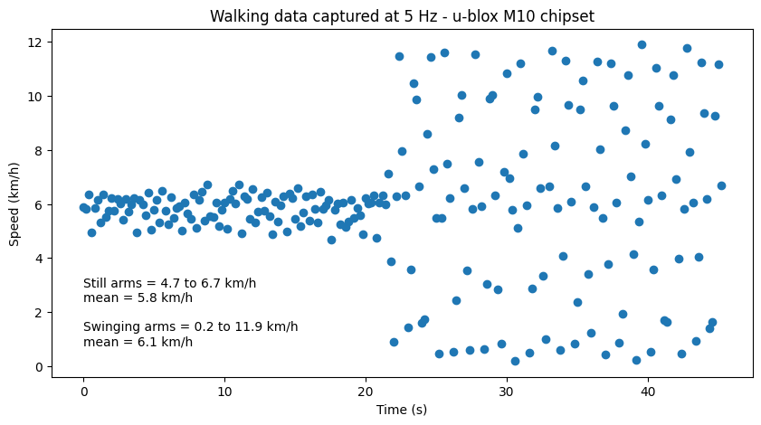
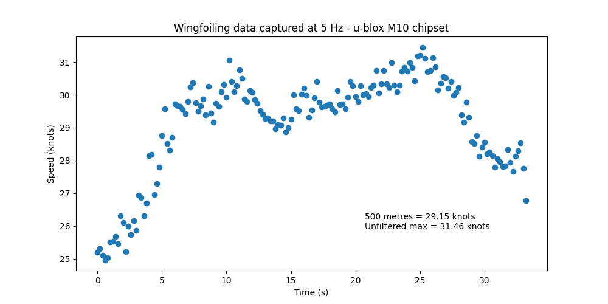
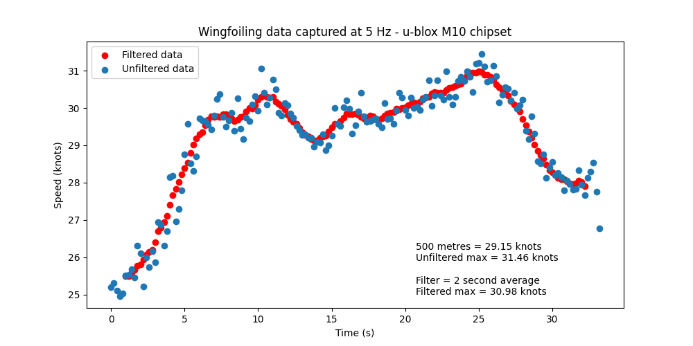
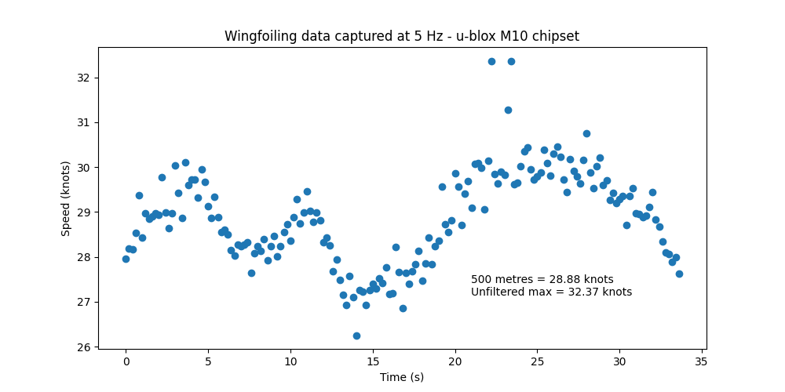
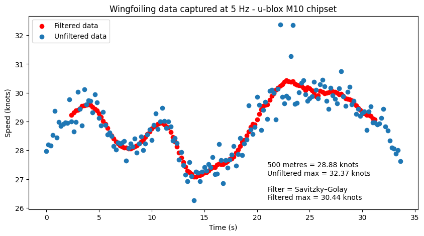

## GPS Articles

### What to make of max speeds?

This article is primarily aimed at windsurfers, kitesurfers and wingfoilers but it will apply to some other sports as well.

The most natural instinct when sailing with a GPS is to look at the highest number being reported and take it at face value. Sure, most people will be aware that errors can occur after a crash and that some devices are more accurate than others. However, I think far fewer people are truly aware of what the "max speed" really represents when devices are working correctly and why it should probably be ignored.

Speed sailing is one of my favorite disciplines on the water, constantly striving to achieve the highest speeds possible. However, I stopped paying any attention to max speeds from my GPS many, many years ago. It's even more relevant nowadays with prevalence of high frequency loggers such as the [Motion](https://www.motion-gps.com/motion/index.html) and [ESP-GPS](https://github.com/RP6conrad/ESP-GPS-Logger), but also true of the 5 Hz devices from Locosys and even some 1 Hz devices on the market.

Hopefully this article will help to illustrate why we should really ignore "max speed" and focus on other metrics instead. The "max 2 seconds" is usually a decent estimate of your actual top speed if that's what you want to know, but "max speed" itself can be very misleading. There is an example in this article,  showing how the reported "max speed" can be a couple of knots higher than reality, even when the GPS is operating perfectly.

TLDR - we should try to ignore "max speed" because it is essentially noise, but if you would like some further details then read on!

#### Dynamics of Walking

The graph below is data captured from a Motion Mini GPS worn on my wrist, during a brisk walk. I actually had one on each wrist and a third on my cap when this was recorded, but for simplicity I've only shown one device. Whilst the dynamics of walking don't resemble speed sailing per-se, it does show how sensitive GPS devices can be to things like arm movements.

During the first 20 seconds my hands were held in front of me and kept as still as possible. My average speed during these 20 seconds was 5.8 km/h but the reported speed varied between 4.7 and 6.7 km/h. Whether this range of speeds is truly accurate is not so important right now, but they can be considered a baseline for my walking speed.

The remainder of the data shows the effect of swinging my arms, naturally. The average speed of 6.1 km/h was a slight increase but it's more important to observe the speeds ranging from 0.2 km/h to 11.9 km/h. Further analysis suggests that the range of speeds is probably quite accurate for the receiver, but it clearly doesn't make sense to claim a "max speed" of 12 km/h whilst walking.

High frequency GPS / GNSS loggers are essentially calculating speeds over short periods of time (typically 10s of milliseconds) which means they can be very sensitive to movement. These individual readings which pertain to very short periods of time represent the GPS receiver, and do not represent the walking speed. Later in this article it should be clear how these considerations also apply to wind sports.

#### Wingfoiling

We will now look at some real wingfoiling data, recorded during Weymouth Speed Week 2023. The graph below shows the best 500 metre run of one of the faster riders, recorded at 5 Hz on a Motion Mini. The y-axis has been chosen to emphasize the noise and poses the question of the actual top speed, which will undoubtedly have been lower than the raw value of 31.46 knots.

The [Savitzky–Golay](https://en.wikipedia.org/wiki/Savitzky%E2%80%93Golay_filter) filter (see below) is quite popular amongst data scientists and provides a reasonably good estimate of the top speed during this particular run. The top speed according to the Savitzky–Golay filter is 30.97 knots, which is half a knot lower than the max of 31.46 knots. That's not a huge difference but differences of half a knot are fairly typical when looking at data from the Motion; e.g. "max speed" vs "max 2 seconds".

Calculating a 2 second moving average is probably the simplest way of handling this type of data. Despite the simplicity of a moving average (see below) the results are very similar to the Savitzky–Golay filter and the "max 2 seconds" is reported as 30.98 knots. The speed sailing world have been using the "max 2 seconds" as a proxy for top speed since the early 2000s, although it was originally for reasons relating to the devices of the era.

#### Noise vs Outliers

The previous run was chosen to illustrate how noise is always present in GPS data. The noise is not necessarily random and in many instances it will be due to genuine movements of the GPS receiver, but they don't necessarily represent changes in board speed. The graph below shows the second fastest run of the same rider during speed week but this time the run includes clear outliers; appearing roughly 22 seconds into the run.

It's impossible to know for sure, but these outliers could easily have been due to sudden arm movements whilst maintaining control of the wing. The rider certainly wasn't yoyo-ing between 30 knots and 32 knots at 0.2 second intervals. Such big changes in speed are totally implausible, so sudden arm movements are probably the most likely explanation. The "max speed" in the unfiltered data is 32.37 knots but it is clearly not the board speed.

The Savitzky–Golay filter calculates a top speed of 30.44 knots, which is 2 knots slower than the unfiltered "max speed" of 32.37 knots. Such large outliers are not uncommon from GPS loggers, yet few people seem to question their validity and happy to use them as personal records. It's also worth noting that these outliers can still have an effect on the filtered speeds, so the top speed during this run may be as low as 30.1 knots.

The simpler approach of using a 2 second moving average is also effective for this run. The results (see below) are not as smooth as the Savitzky–Golay filter, but still quite similar and produce a near-identical max of 30.46 knots. It would obviously be wrong to claim a top speed of 32.37 knots when the likely truth is 2 knots slower. Whilst the "max 2 seconds" of 30.46 may also be too high, it is going to be closer to the truth.

#### Affected Devices

So far this article has focused on the Motion GPS which is particularly popular amongst pro riders. It is an excellent device for speed sailing, but the [ESP-GPS](https://github.com/RP6conrad/ESP-GPS-Logger) is also excellent if you fancy a DIY project. The main takeaway should be to ignore the "max speed" and regard the "max 2 seconds" as your top speed. The same applies to the Locosys GW-52 and GW-60, which both exhibit a fair amount of noise when logging at 5 Hz.

Numerous devices perform calculations at 10 Hz (or more) internally, but only log at 1 Hz. These devices have the potential to output excessively high speeds (e.g. 12 km/h when walking) so their "max speed" should always be ignored. Unfortunately, due to logging at 1 Hz even the "max 2 seconds" can be too high. The unfiltered data from my Garmin is nice in many respects, but can also report 12 km/h when walking.

The Locosys GT-31 has some built in filtering but is not infallible, and I've seen a speed of 54 knots recorded for what was really 50 knots. The latest COROS watches seem slightly less likely than other brands when it comes to reporting speeds that are several knots too high, due to the nature of their filtering. In some ways the filtering is undesirable, but it does have benefits in this one specific respect.

#### Takeaways

The best measure of your top speed is "max 2 seconds", regardless of the device. However, I've not even discussed the potential for speeds to be wrong due to reception issues (e.g. due to a crash, immersion, under arm, etc), or how some devices seem prone to excessively high readings. Checking whether "max 2 seconds" is within a knot of the best 100 metres (equivalent of 5 seconds at 40 knots) can be an effective sanity check.

Here are a few closing thoughts:

- When it comes to personal records, or competing against your mates then "max 2 seconds" is the best measure of top speed. Focusing on maintaining your speed (e.g. 10 seconds, 250 metres or 500 metres) is generally the best measure of skill.

- If you run a simple GPS ladder at your local club then you should try to avoid using "max speed" and instead consider 10s (150 metres at 30 knots) or 250m. The Locosys devices (GT-31, GW-52, GW-60) all support 10 seconds, and so do many watches; including COROS and Garmin.

- If you are telling someone how fast you were sailing during a session (or during a race) then you should try to ignore what your device calls "max speed" and simply report the "max 2 seconds", "max 10 seconds", 250 metres, or 500 metres.

I hope this has provided enough insight as to why "max speed" is best ignored. If you want to compare top speeds then "max 2 seconds" will be much more reliable. When "max 2 seconds" is calculated from 5 Hz or 10 Hz data it will usually be pretty close to the actual top speed.

Mike George - K888

