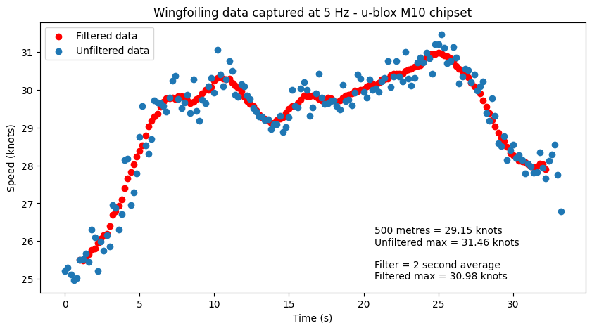

## GPS Articles

### What to make of max speeds?

This article is primarily aimed at windsurfers, kitesurfers and wingfoilers but it will apply to some other sports as well.

The most natural instinct when sailing with a GPS is to look at the highest number being reported and take it at face value. Sure, most people will be aware that errors can occur after a crash and that some devices are more accurate than others. However, I think far fewer people are truly aware of what the max speed really represents when devices are working correctly and why it should probably be ignored.

Speed sailing is one of my favorite disciplines on the water, constantly striving to achieve the highest speeds possible. However, I stopped paying any attention to max speeds from my GPS many, many years ago. It's even more relevant nowadays with prevalence of high frequency loggers such as the [Motion](https://www.motion-gps.com/motion/index.html) and [ESP-GPS](https://github.com/RP6conrad/ESP-GPS-Logger), but also true of the 5 Hz devices from Locosys and even some 1 Hz devices on the market.

Hopefully this article will help to illustrate why we should all ignore "max speed" and focus on other metrics instead. The "max 2 seconds" is usually a decent estimate of your actual max speed if that's what you want to know, but "max speed" itself can be very misleading. There is an example in this article,  showing how the reported "max speed" can be a couple of knots higher than reality, even when the GPS is operating perfectly.

TLDR - we should all ignore "max speed" because it is simply noise, but if you would like some further details then read on!

#### Dynamics of Walking

The graph below is data captured from a Motion Mini GPS worn on my wrist. I actually had one on each wrist and a third on my cap when this was recorded, but for simplicity I've only shown one device. Whilst the action of walking doesn't resemble speed sailing, it does show just how sensitive these devices can be to things like arm movements.

During the first 20 seconds my arms were held in front of me and kept as still as possible. My average speed during these 20 seconds was 5.8 km/h but the reported speed varied between 4.7 and 6.7 km/h. Whether this range of speeds are truly accurate is not so important right now, but they do provide a baseline for my walking speed.

The remainder of the data shows the effect of swinging my arms in a way that was natural at that walking pace. The average speed of 6.1 km/h was a little faster but it's important to note that the speeds being recorded were in the range 0.2 km/h to 11.9 km/h. Further analysis suggests that these high + low speeds are probably realistic, but it clearly wouldn't make sense to claim that my max walking speed is 12 km/h.

High frequency GPS / GNSS loggers are essentially calculating speeds over short periods of time (essentially 10s of milliseconds) which means they are very sensitive to movement. These individual readings which pertain to very short periods of time are therefore not representative of my overall walking speed. Later on in this article, we'll also see how this sensitivity applies to wind sports.

#### Noisy Data

Sensor data is inherently noisy and GPS / GNSS receivers are no exception. Fortunately it's relatively straightforward to implement a filter which turns the noisy data when walking into something that resembles the actual speed and pace. Sports watches implement filters for activities such as walking and running to deal with arm movements, but I'll not go into those details right now and may write about it in a future article.

Things can become rather more complicated once we see regular changes in speed, acceleration and jerk. The real speeds of interest are buried within the noise and the max speed can only be discovered through analysis. Individual readings have little significance and the example below tries to illustrate this point for a sine wave with a maximum value of 1, but with [Gaussian noise](https://en.wikipedia.org/wiki/Gaussian_noise) applied.

Digital filtering techniques can smooth noisy data to derive a better signal, hopefully closer to the reality. A popular approach is the [Savitzky–Golay filter](https://en.wikipedia.org/wiki/Savitzky%E2%80%93Golay_filter) (illustrated below) which has done a reasonably good job of restoring the sine wave and has determined the max value of 1. This is a huge improvement on the 1.47 in the raw / noisy data, although the data is obviously synthetic and created to demonstrate the basic concept.

#### Wingfoiling

It's probably a good time to move onto some real wingfoiling data, recorded during Weymouth Speed Week 2023. The graph below shows the fastest 500 metre run of one of the faster riders and was recorded on a Motion Mini. The y-axis has been chosen to emphasize the noise and pose the question of the actual max speed, which must have been lower than the raw value of 31.46 knots.

Applying a Savitzky–Golay filter provides a reasonably good estimate of the likely max speed during this particular run. The max speed according to the Savitzky–Golay filter is 30.97 knots, which is half a knot lower than the max of 31.46 knots. That's not a huge difference, but differences of half a knot are fairly typical when looking at data from the Motion.

Calculating a 2 second moving average is probably the simplest filter for smoothing this type of data. The graph below shows that despite its simplicity the results are very similar to the Savitzky–Golay filter and the max 2 seconds is reported as 30.98 knots. The speed sailing world have been using the "max 2 seconds" as a proxy for max speed since the early 2000s, although that was originally for reasons relating to the devices of the time.

#### Noise vs Outliers

The previous example was chosen to illustrate the noise present in typical GPS data. Such noise is not necessarily random and in many instances the fluctuations will be due to genuine movements, but it should be clear that individual values are not a measure of genuine speed. The graph below shows the second fastest run for the same rider but this time the data includes clear outliers; appearing roughly 22 seconds into the run.

It's impossible to know for sure, but these outliers seem likely to have been due to sudden arm movements whilst maintaining control of the wing. The rider definitely wasn't yoyo-ing between 30 knots and 32 knots at 0.2 second intervals. Such jerky changes are highly implausible, but sudden arm movements are a plausible explanation. The raw data reports a max speed of 32.37 knots but that's clearly just an outlier and not relevant.

The Savitzky–Golay filter produces what seems to be a decent estimate of the max speed at 30.44 knots, which is 2 knots slower than the max unfiltered speed of 32.37 knots. Such large outliers are not uncommon, yet people don't seem to question their validity. It's also worth noting that these outliers can still have an effect on the calculated max speed, and the actual max speed may be around 30.1 knots.

The simpler approach of using a 2 second moving average is also pretty effective. The results below are not quite as smooth as the Savitzky–Golay filter, but they are very similar and produce a near identical max of 30.46 knots. Hopefully it's clear from this example that it would be wrong to refer to the outlier of 32.37 knots as "max speed" when the likely truth is 2 knots slower. The "max 2 seconds" of 30.46 seems to be a pretty estimate.

#### Affected Devices

So far this article has focused on the Motion GPS which is particularly popular amongst pro riders. It is the best device you can have for speed sailing, but the [ESP-GPS](https://github.com/RP6conrad/ESP-GPS-Logger) can is also excellent if you fancy a DIY project. The main takeaway should be to ignore the "max speed" and regard the "max 2 seconds" as your maximum speed. The same applies to the Locosys GW-52 and GW-60 which both exhibit a fair bit of noise when logging at 5 Hz.

Numerous 1 Hz devices actually do calculations at 10 Hz (or more) internally, but only log at 1 Hz. These devices can also have the potential to output high individual speeds (e.g. 12 km/h when walking) so their "max speed" should be ignored. Unfortunately, due to logging at 1 Hz the "max 2 seconds" can also be too high. The latest COROS watches are perhaps less likely to output speeds that are significantly too high, due to their built in filtering.

#### Takeaways

The best measure of your top speed is "max 2 seconds", regardless of the device. However, I've not even discussed the potential for this to be wrong due to reception issues (e.g. due to a crash, or immersion), or how some devices are prone to excessively high readings. One thing I do use as a sanity check is to see if the 100 metres (5 seconds at 40 knots) is within a knot of the 2 seconds.

Here are a few closing thoughts:

- When it comes to personal records, and competing against your mates then "max 2 seconds" is the best measure of top speed. Focusing on maintaining speed; 10 seconds, 250 metres and 500 metres may be a better measure of skill though?

- If you run a simple GPS ladder at your club then you might consider using 10s (250 metres at 50 knots, 100 metres at 20 knots) or 250m. The Locosys devices (GT-31, GW-52, GW-60) all support 10 seconds, and so do many watches; including COROS and Garmin.

- If you are telling someone how fast you were sailing with mates, or racing professionally then ignore what your device calls "max speed" and choose between "max 2 seconds", "max 10 seconds", 250 metres, or 500 metres.

I hope this has been useful and wish you good luck in your speed sailing!

Mike George - K888

