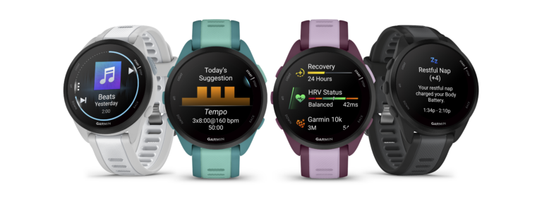
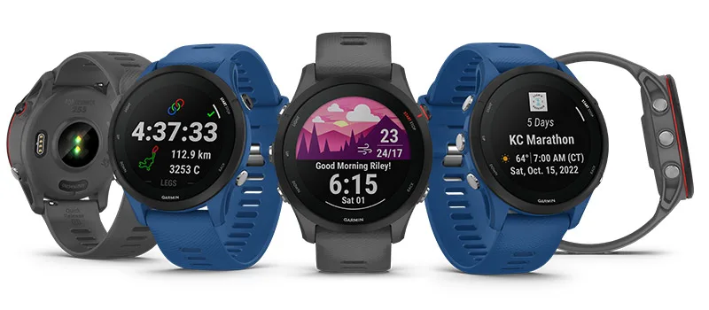
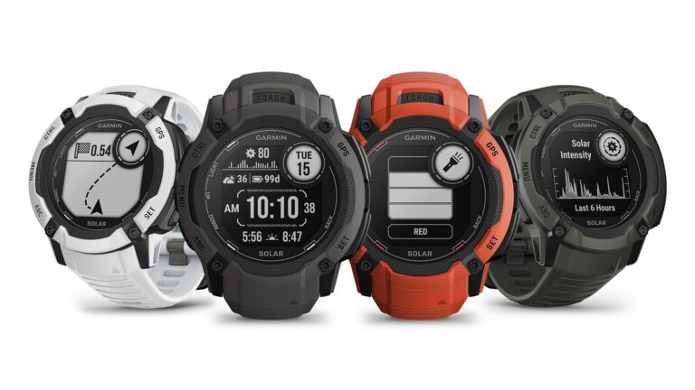
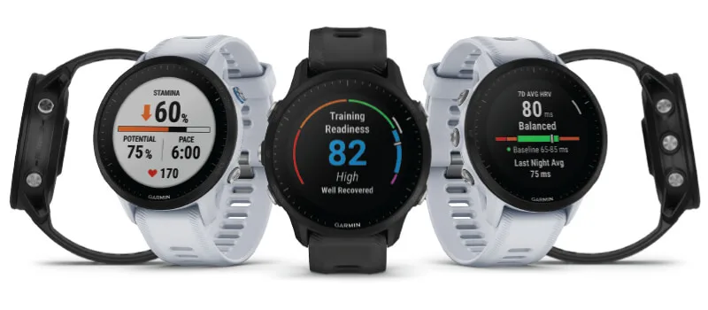
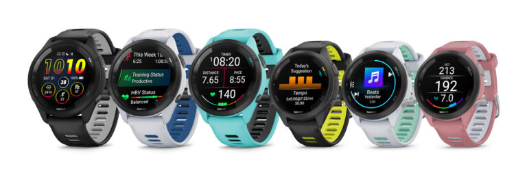
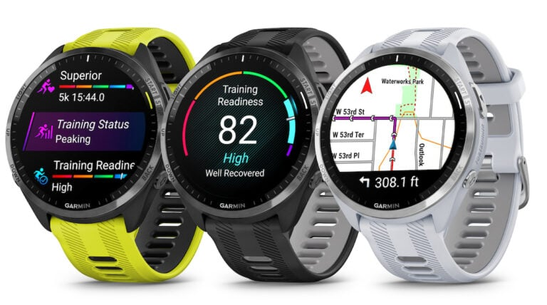
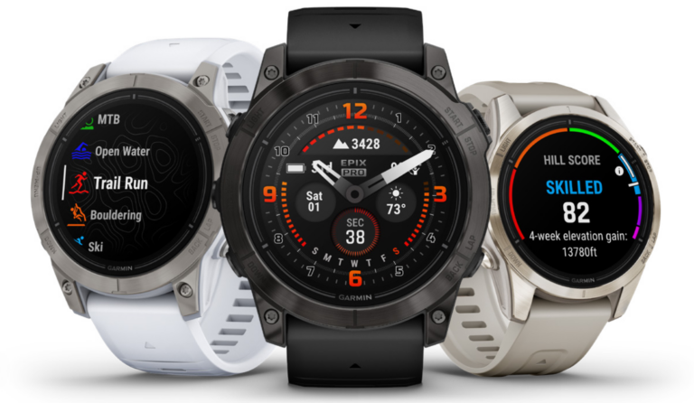

## Choosing a Garmin for Watersports

### Introduction

Chipset - Airoha and needs to be multi-band if plan on posting to GP3S

Ruggedness - running watches are cheaper, but less robust and lower water resistence

Screen type - MIP or AMOLED

Watch size - bigger watches suit bigger wrists, but have larger screens and longer battery life

Note about SatIQ

### Quick Comparison

This table should help you to identify Garmin watches that suit your budget, prior to reading any detailed information.

|                   |   Deals    |   RRP   | Multi-band | Screen | Water resistence |
| ----------------- | :--------: | :-----: | :--------: | :----: | :--------------: |
| Forerunner 165    |  £200-ish  | £249.99 |     -      | AMOLED |      5 ATM       |
| Forerunner 255    |  £200-ish  | £229.99 |     Y      |  MIP   |      5 ATM       |
| Instinct 2X       | under £300 | £339.99 |     Y      |  MIP   |      10 ATM      |
| Forerunner 955    |  £300-ish  | £439.99 |     Y      |  MIP   |      5 ATM       |
| Forerunner 265    |    n/a     | £379.99 |     Y      | AMOLED |      5 ATM       |
| Instinct 3 AMOLED |    n/a     | £429.99 |     Y      | AMOLED |      10 ATM      |
| Forerunner 965    |    n/a     | £499.99 |     Y      | AMOLED |      5 ATM       |
| fēnix 7 Pro       |  £500-ish  | £579.99 |     Y      |  MIP   |      10 ATM      |
| epix Pro          |  £500-ish  | £739.99 |     Y      | AMOLED |      10 ATM      |

### Detailed Information

#### Forerunner 165

The Forerunner 165 is the cheapest option worth considering with an AMOLED display.

It is the only watch in this lineup that does not support multi-band GNSS, making it unsuitable for GPS-Speedsurfing.com.

Price

- £249.99 RRP, widely available for £200-ish

Size

- 43 x 43 x 11.6 mm
- 30.4 mm (1.2") AMOLED display, 390 x 390 pixels

Battery

- 11 days (5 days display always-on)
- All-Systems GNSS mode: Up to 17 hours

Links

- [Press release](https://www.garmin.com/en-US/newsroom/press-release/sports-fitness/light-up-your-run-with-the-garmin-forerunner-165-series-easy-to-use-gps-running-smartwatches-with-vibrant-amoled-displays/)
- [Product page](https://www.garmin.com/en-GB/p/1055469)

#### Forerunner 255

This watch supersedes the Forerunner 245 which had a much less capable Sony GNSS chipset. It is the cheapest Garmin with support for multi-band GNSS.

There are two sizes (255 and 255S), with or without music. These are the specifications for the standard Forerunner 255.

Price

- £229.99 RRP, £188.69 at John Lewis

Size

- 45.6 x 45.6 x 12.9 mm
- 33 mm (1.3″) MIP display, 260 x 260 pixels

Battery

- Smartwatch mode: up to 14 days
- All-Systems GNSS mode: Up to 25 hours
- All-Systems GNSS mode plus Multi-Band: Up to 16 hours

Links

- [Press release](https://www.garmin.com/en-US/newsroom/press-release/sports-fitness/garmin-celebrates-global-running-day-with-the-introduction-of-the-forerunner-255-series/)
- [Product page](https://www.garmin.com/en-GB/p/780139)

#### Instinct 2X

The Instinct 2X is a great value rugged watch with multi-band GNSS. It is not to be confused with the Instinct 2 which used a much less capable Sony GNSS chipset.

Price

- £339.99 RRP, £285 on Amazon

Size

- 50 x 50 x 14.5 mm
- custom, two-window design; 27 x 27 mm (1.1″ x 1.1″) MIP display, 176 x 176 pixels

Battery

- Smartwatch: 40 days unlimited with solar
- All Satellite Systems: 40 hours; 65 hours with solar
- All Satellite Systems + Multi-Band: 27 hours; 36 hours with solar

Links

- [Press release](https://www.garmin.com/en-US/newsroom/press-release/outdoor/be-bold-with-the-rugged-new-instinct-2x-solar-from-garmin/)
- [Product page](https://www.garmin.com/en-GB/p/884585)

#### Forerunner 955

Supersedes the 945 which uses a much less capable Sony GNSS chipset.

Slightly better battery than 255 and more sports / activities, music included. There is also a solar option.

The Forerunner 955 can be compared against the Forerunner 255 using this [link](https://www.garmin.com/en-GB/compare/?compareProduct=780139&compareProduct=777655).

Price

- £439.99 RRP, £300 on Google

Size

- 46.5 x 46.5 x 14.4 mm
- 33 mm (1.3″) MIP display, 260 x 260 pixels

Battery

- Smartwatch mode: Up to 15 days/20 days with solar
- All Systems GNSS mode plus Multi-Band: Up to 20 hours / 22 hours with solar

Links

- [Press release](https://www.garmin.com/en-US/newsroom/press-release/wearables-health/harness-the-power-of-the-sun-with-the-forerunner-955-solar-from-garmin/)
- [Product page](https://www.garmin.com/en-GB/p/777655)

#### Forerunner 265

This is the successor to the Forerunner 255, adding an AMOLED display.

There are two sizes (46 mm and 42 mm). These are the specifications for the 46 mm.

Price

- £379.99 RRP, but discounts are likely when the 275 is released (soon)

Size

- 46.1 x 46.1 x 12.9 mm
- 32.5 mm (1.3") AMOLED display, 416 x 416 pixels

Battery

- Smartwatch mode: Up to 13 days
- All-Systems GNSS mode + Multi-Band: Up to 14 hours

Links

- [Press release](https://www.garmin.com/en-US/newsroom/press-release/sports-fitness/garmin-adds-amoled-displays-to-its-next-gen-forerunner-265-and-forerunner-965-gps-running-watches/)
- [Product page](https://www.garmin.com/en-GB/p/886785/)

#### Instinct 3 AMOLED

The cheapest rugged watch with AMOLED display. There is a MIP version, but the display is a lot nicer on the AMOLED model (imho).

There are two sizes (50 mm and 45 mm). These are the specifications for the 50 mm.

Price

- £429.99 RRP

Size

- 50 x 50 x 14.4 mm
- 33 mm (1.3″) AMOLED display, 416 x 416 pixels

Battery

- Smartwatch: Up to 24 days (9 days always-on)
- All Satellite Systems: Up to 32 hours
- All Satellite Systems + Multi-Band: Up to 30 hours with SatIQ

Links

- [Press release](https://www.garmin.com/en-US/newsroom/press-release/outdoor/introducing-the-instinct-3-series-from-garmin-rugged-smartwatches-now-with-amoled-displays/)
- [Product page](https://www.garmin.com/en-GB/p/1316397)

#### Forerunner 965

This is the successor to the Forerunner 955, adding an AMOLED display.

Battery not as good as the Instinct 3 AMOLED and not as rugged.

Price

- £499.99 RRP, but discounts are likely when the 975 is released (soon)

Size

- 47.1 x 47.1 x 13.2 mm
- 35.4 mm (1.4") AMOLED display, 454 x 454 pixels

Battery

- Smartwatch mode: Up to 23 days
- All-Systems GNSS mode + Multi-Band: Up to 19 hours

Links

- [Press release](https://www.garmin.com/en-US/newsroom/press-release/sports-fitness/garmin-adds-amoled-displays-to-its-next-gen-forerunner-265-and-forerunner-965-gps-running-watches/)
- [Product page](https://www.garmin.com/en-GB/p/886725)

#### fēnix 7 Pro

There is a standard edition with Power Glass™ screen and stainless steel bezel, or sapphire edition with Sapphire crystal screen and titanium bezel.

There are three sizes - fēnix 7S Pro (42 mm), 7 Pro (47 mm) and 7X Pro (51 mm), but these are the specifications for the fēnix 7 Pro (47 mm).

Price

- £579.99 RRP, £525 at John Lewis

Size

- 47 x 47 x 14.5 mm
- 33 mm (1.3″) MIP display, 260 x 260 pixels

Battery

- Smartwatch: Up to 18 days / 22 days with solar
- All Satellite Systems: Up to 40 hours / 48 hours with solar
- All Satellite Systems + Multi-band: Up to 23 hours / 26 hours with solar

Links

- [Press release](https://www.garmin.com/en-US/newsroom/press-release/outdoor/garmin-unveils-next-gen-fenix-7-pro-series/)
- [Product page](https://www.garmin.com/en-GB/p/865822)

#### epix Pro

This is essentially a fēnix 7 Pro with an AMOLED display.

There is a standard edition with Corning® Gorilla® Glass screen and stainless steel bezel, or sapphire edition with Sapphire crystal screen and titanium bezel.

There are three different sizes; 42, 47, and 51 mm. These are the specifications for the epix Pro (Gen 2) - 47 mm.

Price

- £739.99 RRP, £509 at John Lewis

Size

- 47 x 47 x 14.5 mm
- 33 mm (1.3″) AMOLED display, 416 x 416 pixels

Battery

- Smartwatch: Up to 16 days (6 days always-on)
- All Satellite Systems: Up to 32 hours (24 hours always-on)
- Satellite Systems + Multi-band: Up to 20 hours (15 hours always-on)

Links

- [Press release](https://www.garmin.com/en-US/newsroom/press-release/outdoor/conquer-every-day-and-every-adventure-with-epix-pro-series-from-garmin/)
- [Product page](https://www.garmin.com/en-GB/p/884292)

### Related Watches

The quatix 7 (Solar and Pro) and tactix 7 (AMOLED) are essentially the same as the fēnix 7 Pro and epix Pro, but they have not been discounted in the same way.

The fēnix 8 is more suitable for scuba diving, adds voice command and a new interface but carries a hefty price tag. Likewise for the tactix 8 and maybe the (yet to be released) quatix 8.

The Enduro 2 and Enduro 3 are akin to the fēnix 7X - Sapphire Solar but with longer battery life. The Enduro 3 also has the newer software interface like the fēnix 8.

The Forerunner 275 and 975 is expected to be released in the near future (maybe in May 2025), which will no doubt mean the Forerunner 265 and 965 being discounted.

### Summary

The Forerunner watches are lightweight and have a water rating of 5 ATM, whilst the Instinct and fenix / epix are rugged watches with a water rating of 10 ATM. There is no sane reason to buy a fenix 8 for £800+ (instead of £500 for a fenix 7 Pro / epix Pro), unless it is for scuba diving.
