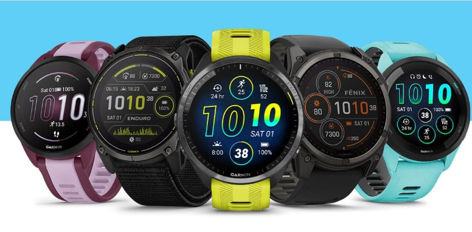
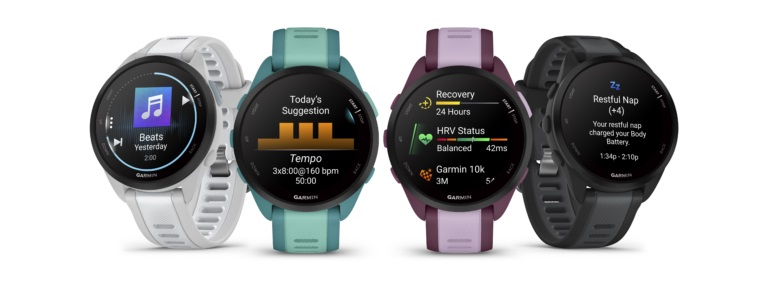
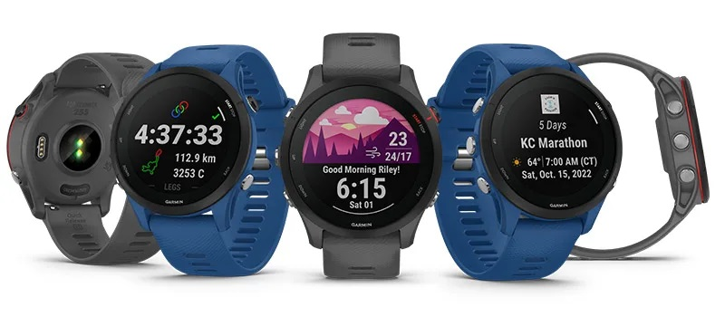
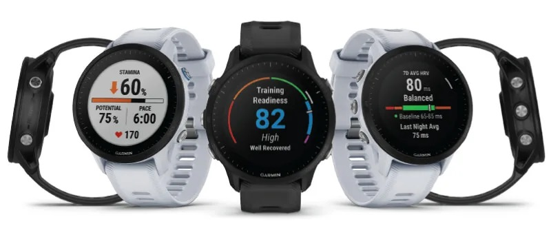
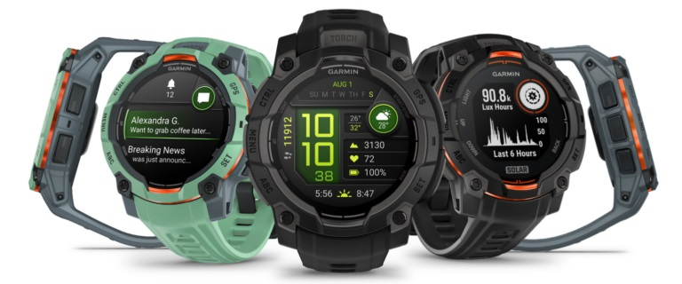
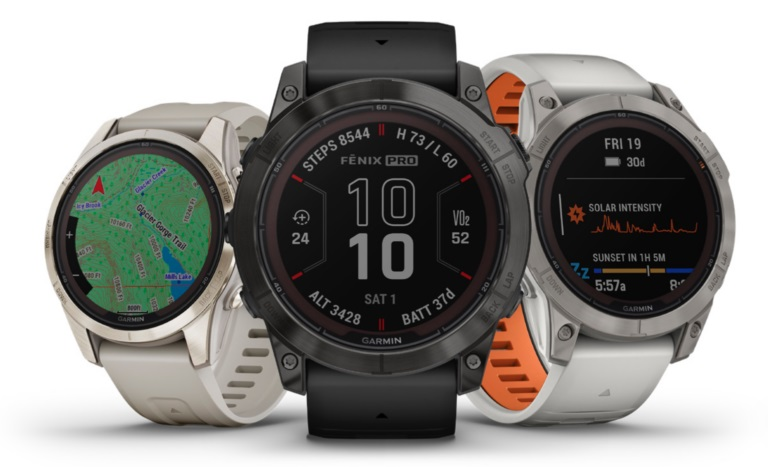

## Which Garmin for Watersports?

Author: Michael George

Created: 7 Apr 2025

### Introduction

I'm often asked for GPS watch recommendations, so I've decided to create a resource focusing on Garmin products. It's a great time to be buying a GPS watch for watersports because there are some really great choices, whatever your budget.

Prior to early 2023, reliable GPS / GNSS performance was only available from dedicated loggers, and smart watches were somewhat unreliable for measuring speeds. It's only since mid-2023 that this situation began to change, primarily due to latest GNSS chipsets and firmware.

This guide will not discuss any of the technicalities relating to GPS / GNSS accuracy. It will simply focus on watches that provide decent performance and good value for money. Budget will typically dictate suitable choices, but there are several factors to consider.

- **GNSS chipset** - dictates accuracy and must be multi-band if posting to [GPS-Speedsurfing](https://www.gps-speedsurfing.com/) or [GPS Team Challenge](https://www.gpsteamchallenge.com.au/)
- **Ruggedness** - running watches are typically cheaper and lighter, but less robust and with lower water resistance
- **Screen type** - decide whether you prefer [MIP or AMOLED](https://lifehacker.com/health/which-is-better-smart-watch-display-mip-vs-amoled)
- **Watch size** - bigger watches suit bigger wrists, but have larger screens and longer battery life
- **Flashlight** - amazing feature that you never knew you needed, until you had it…

This page includes a quick comparison, summaries for individual watches, and links to further information.

- **Forerunner** - lightweight running watches, resistent to 5 ATM, without flashlight
- **Instinct, fēnix and epix** - rugged watches, resistent to 10 ATM, with flashlight

Whilst choosing a watch, you may also benefit from my [Garmin advice](https://logiqx.github.io/gps-guides/guidance/garmin/) and list of [Garmin models](https://logiqx.github.io/gps-details/devices/garmin/watches/).

### Quick Comparison

This table should help you to identify suitable Garmin watches within your budget. The prices are for the UK because that is easiest for me to Google!

|                   |  Deals   |   RRP   | Multi-band | Screen | Water resistence |
| ----------------- | :------: | :-----: | :--------: | :----: | :--------------: |
| Forerunner 165    | £200-ish | £249.99 |     -      | AMOLED |      5 ATM       |
| Forerunner 255    | £200-ish | £229.99 |     Y      |  MIP   |      5 ATM       |
| Instinct 2X Solar | £300-ish | £339.99 |     Y      |  MIP   |      10 ATM      |
| Forerunner 955    | £300-ish | £439.99 |     Y      |  MIP   |      5 ATM       |
| Forerunner 265    |   n/a    | £379.99 |     Y      | AMOLED |      5 ATM       |
| Instinct 3 AMOLED |   n/a    | £429.99 |     Y      | AMOLED |      10 ATM      |
| Forerunner 965    |   n/a    | £499.99 |     Y      | AMOLED |      5 ATM       |
| fēnix 7 Pro       | £500-ish | £579.99 |     Y      |  MIP   |      10 ATM      |
| epix Pro          | £500-ish | £739.99 |     Y      | AMOLED |      10 ATM      |

### Forerunner 165

The Forerunner 165 is the cheapest Garmin with an Airoha GNSS chipset and has an AMOLED display.

It is the only watch in this lineup without multi-band GNSS, making it unsuitable for GPS-Speedsurfing.com and GPS Team Challenge.

**Price**

- £249.99 RRP, widely available for £200-ish

**Size**

- 43 x 43 x 11.6 mm
- 30.4 mm (1.2") display, 390 x 390 pixels

**Battery**

- Smartwatch mode: 11 days (5 days display always-on)
- All systems GNSS mode: Up to 17 hours

**Links**

- [Press release](https://www.garmin.com/en-US/newsroom/press-release/sports-fitness/light-up-your-run-with-the-garmin-forerunner-165-series-easy-to-use-gps-running-smartwatches-with-vibrant-amoled-displays/) and [product page](https://www.garmin.com/en-GB/p/1055469)

### Forerunner 255

The Forerunner 255 is the cheapest Garmin with support for multi-band GNSS. It supersedes the Forerunner 245, which used the much less capable Sony GNSS chipset.

There are two sizes; 255 (46 mm) and 255S (41 mm), with or without music storage. These are the specifications for the 46 mm.

**Price**

- £229.99 RRP, widely available for £200-ish

**Size**

- 45.6 x 45.6 x 12.9 mm
- 33 mm (1.3″) display, 260 x 260 pixels

**Battery**

- Smartwatch mode: up to 14 days
- All systems GNSS mode: Up to 25 hours
- All systems GNSS mode + multi-band: Up to 16 hours

**Links**

- [Press release](https://www.garmin.com/en-US/newsroom/press-release/sports-fitness/garmin-celebrates-global-running-day-with-the-introduction-of-the-forerunner-255-series/) and [product page](https://www.garmin.com/en-GB/p/780139)

### Instinct 2X Solar

The Instinct 2X Solar is a rugged watch with multi-band GNSS. The Instinct 2X should not be confused with the Instinct 2, which used the much less capable Sony GNSS chipset. The two main downsides of this watch are the screen resolution and somewhat limited app availability.

**Price**

- £339.99 RRP, but discounts are available

**Size**

- 50 x 50 x 14.5 mm
- custom, two-window design; 27 mm (1.1″) display, 176 x 176 pixels

**Battery**

- Smartwatch mode: 40 days; unlimited with solar
- All systems GNSS mode: 40 hours; 65 hours with solar
- All systems GNSS mode + multi-band: 27 hours; 36 hours with solar

**Links**

- [Press release](https://www.garmin.com/en-US/newsroom/press-release/outdoor/be-bold-with-the-rugged-new-instinct-2x-solar-from-garmin/) and [product page](https://www.garmin.com/en-GB/p/884585)

### Forerunner 955

The Forerunner 955 supersedes the 945, which used the much less capable Sony GNSS chipset.

The 955 has slightly better battery life than the 255, includes more sports / activities, and has music storage as standard. There is also a solar option which increases the battery time.

The Forerunner 955 can be compared against the Forerunner 255 using this [link](https://www.garmin.com/en-GB/compare/?compareProduct=780139&compareProduct=777655).

**Price**

- £439.99 RRP, widely available for £300-ish

**Size**

- 46.5 x 46.5 x 14.4 mm
- 33 mm (1.3″) display, 260 x 260 pixels

**Battery**

- Smartwatch mode: Up to 15 days / 20 days with solar
- All systems GNSS mode: TBC
- All systems GNSS mode + multi-band: Up to 20 hours / 22 hours with solar

**Links**

- [Press release](https://www.garmin.com/en-US/newsroom/press-release/wearables-health/harness-the-power-of-the-sun-with-the-forerunner-955-solar-from-garmin/) and [product page](https://www.garmin.com/en-GB/p/777655)

### Forerunner 265

The Forerunner 265 supersedes the  the Forerunner 255 and has an AMOLED display.

There are two sizes; 46 mm and 42 mm. These are the specifications for the 46 mm.

**Price**

- £379.99 RRP, but will be discounted when the Forerunner 275 is released

**Size**

- 46.1 x 46.1 x 12.9 mm
- 32.5 mm (1.3") display, 416 x 416 pixels

**Battery**

- Smartwatch mode: Up to 13 days
- All systems GNSS mode: Up to 20 hours
- All systems GNSS mode + multi-band: Up to 14 hours

**Links**

- [Press release](https://www.garmin.com/en-US/newsroom/press-release/sports-fitness/garmin-adds-amoled-displays-to-its-next-gen-forerunner-265-and-forerunner-965-gps-running-watches/) and [product page](https://www.garmin.com/en-GB/p/886785/)

### Instinct 3 AMOLED

This is the cheapest rugged watch from Garmin with an AMOLED display. There is a MIP version, but the AMOLED display is a lot nicer.

There are two sizes; 50 mm and 45 mm. These are the specifications for the 50 mm.

**Price**

- £429.99 RRP

**Size**

- 50 x 50 x 14.4 mm
- 33 mm (1.3″) display, 416 x 416 pixels

**Battery**

- Smartwatch mode: Up to 24 days (9 days always-on)
- All systems GNSS mode: Up to 32 hours
- All systems GNSS mode + multi-band: TBC without SatIQ

**Links**

- [Press release](https://www.garmin.com/en-US/newsroom/press-release/outdoor/introducing-the-instinct-3-series-from-garmin-rugged-smartwatches-now-with-amoled-displays/) and [product page](https://www.garmin.com/en-GB/p/1316397)

### Forerunner 965

The Forerunner 965 supersedes the Forerunner 955 and has an AMOLED display.

It's not rugged like the Instinct 3 AMOLED, but it is sleeker and has a slightly larger display.

**Price**

- £499.99 RRP, but will be discounted when the Forerunner 975 is released

**Size**

- 47.1 x 47.1 x 13.2 mm
- 35.4 mm (1.4") display, 454 x 454 pixels

**Battery**

- Smartwatch mode: Up to 23 days
- All systems GNSS mode: TBC
- All systems GNSS mode + multi-band: Up to 19 hours

**Links**

- [Press release](https://www.garmin.com/en-US/newsroom/press-release/sports-fitness/garmin-adds-amoled-displays-to-its-next-gen-forerunner-265-and-forerunner-965-gps-running-watches/) and [product page](https://www.garmin.com/en-GB/p/886725)

### fēnix 7 Pro

The fēnix 7 Pro has been superseded by the fēnix 8, but discounted prices make it excellent value for money.

There is a standard edition with Power Glass™ screen and stainless steel bezel, or sapphire edition with Sapphire crystal screen and titanium bezel. The non-Pro versions of fēnix 7 do not support multi-band GNSS, so the Instinct 3 AMOLED may be a better choice.

There are three sizes of the fēnix Pro; 7S (42 mm), 7 (47 mm) and 7X (51 mm). These are the specifications for 47 mm.

**Price**

- £579.99 RRP, currently £525 at John Lewis

**Size**

- 47 x 47 x 14.5 mm
- 33 mm (1.3″) display, 260 x 260 pixels

**Battery**

- Smartwatch mode: Up to 18 days / 22 days with solar
- All systems GNSS mode: Up to 40 hours / 48 hours with solar
- All systems GNSS mode + multi-band: Up to 23 hours / 26 hours with solar

**Links**

- [Press release](https://www.garmin.com/en-US/newsroom/press-release/outdoor/garmin-unveils-next-gen-fenix-7-pro-series/) and [product page](https://www.garmin.com/en-GB/p/865822)

### epix Pro (Gen 2)

The epix Pro (Gen 2) is essentially a fēnix 7 Pro with an AMOLED display.

There is a standard edition with Corning® Gorilla® Glass screen and stainless steel bezel, or sapphire edition with Sapphire crystal screen and titanium bezel. The non-pro versions of epix (Gen 2) do not support multi-band GNSS, so the Instinct 3 AMOLED may be a better choice.

There are three sizes of the epix Pro (Gen 2); 42 / 47 / 51 mm. These are the specifications for 47 mm.

**Price**

- £739.99 RRP, currently £509 at John Lewis

**Size**

- 47 x 47 x 14.5 mm
- 33 mm (1.3″) display, 416 x 416 pixels

**Battery**

- Smartwatch mode: Up to 16 days (6 days always-on)
- All systems GNSS mode: Up to 32 hours (24 hours always-on)
- All systems GNSS mode + multi-band: Up to 20 hours (15 hours always-on)

**Links**

- [Press release](https://www.garmin.com/en-US/newsroom/press-release/outdoor/conquer-every-day-and-every-adventure-with-epix-pro-series-from-garmin/) and [product page](https://www.garmin.com/en-GB/p/884292)

### Related Models

The quatix 7 (Solar and Pro) and tactix 7 (AMOLED) are almost identical to the fēnix 7 Pro and epix Pro, but they have not seen such big discounts as the various fēnix 7 Pro and epix Pro models.

If your budget stretches to the fēnix 8, it will be more suitable for scuba diving. It also adds voice commands and new software / user interface, but carries a hefty price tag at over £850. Likewise for the tactix 8 and probably the forthcoming quatix 8.

The Enduro 2 and Enduro 3 are essentially a modified fēnix 7X - Sapphire, but aimed at ultra-runners due to the impressive battery life. The Enduro 3 also has the newer software / user interface of the fēnix 8.

The Forerunner 275 and 975 are expected to be released in the near future, perhaps in May 2025. The Forerunner 265 and 965 are likely to be heavily discounted once they have been superseded, so look out for some bargains!

### Summary

The watches described on this page all use an Airoha GNSS chipset, which makes their performance superior to earlier models. This is why the guide does not discuss models such as the Forerunner 245 / 945 and Instinct 2 (not to be confused with 2X) which used a Sony GNSS chipset.

The Forerunner watches are lightweight and have a water rating of 5 ATM, whilst the Instinct + fēnix + epix are rugged watches with a water rating of 10 ATM. The rugged watches also have a built-in flashlight which nobody expects to need, but everyone loves!

Ultimately your budget and personal preferences will guide you to one or two possible Garmin watches. There may then be multiple sizes / colors / materials, music storage, and solar options to consider. Hopefully this guide has helped to point you in the right direction?

Whilst making your final decision, you may also benefit from my [Garmin advice](https://logiqx.github.io/gps-guides/guidance/garmin/) and list of [Garmin models](https://logiqx.github.io/gps-details/devices/garmin/watches/).

