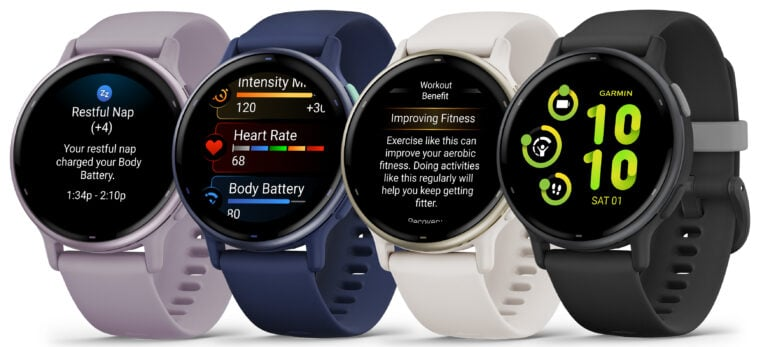

### vívoactive 5

The vívoactive 5 is the cheapest option worth considering and has an AMOLED display.

It has two buttons and is operated via the touchscreen. It does not support multi-band GNSS.

Price

- £229.99 RRP, £188.69 at John Lewis

Size

- 42.2 x 42.2 x 11.1 mm
- 30.4 mm (1.2") AMOLED display, 390 x 390 pixels

Battery

- Smartwatch mode: Up to 11 days (5 days display always-on)
- All-Systems GNSS mode: Up to 17 hours

Links

- [Press release](https://www.garmin.com/en-US/newsroom/press-release/sports-fitness/introducing-the-vivoactive-5-gps-smartwatch-from-garmin/)
- [Product page](https://www.garmin.com/en-GB/p/1057989)

