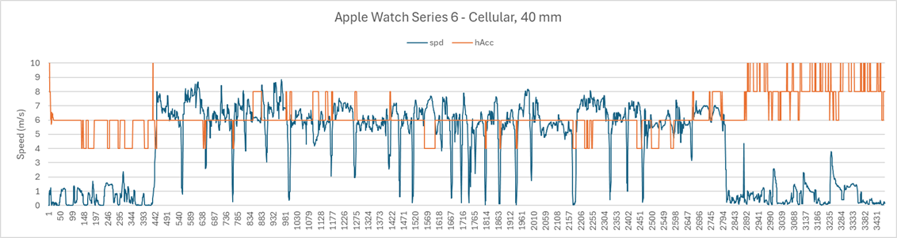
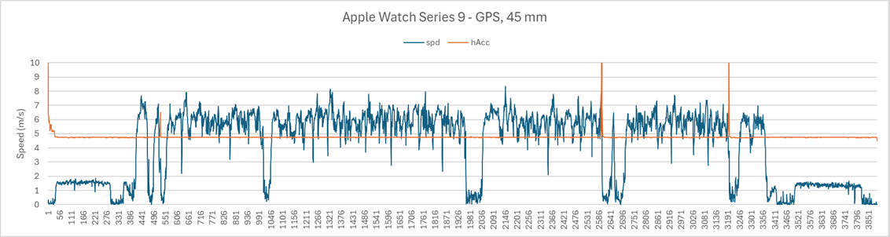
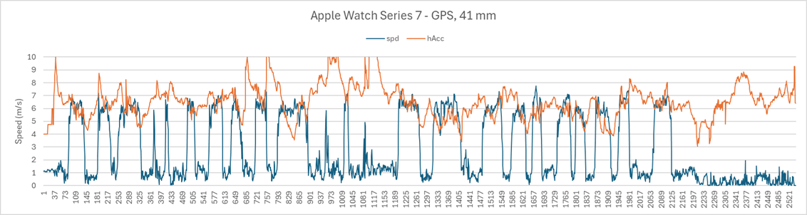

## Apple Watches - Accuracy Estimates

Author: Michael George

Created: 11 Dec 2025

### Introduction

Apple provide horizontal accuracy estimates via their [CLLocation](https://developer.apple.com/documentation/corelocation/cllocation) class. These provide an indication of the horizontal positional accuracy, but can also provide some insights relating to the GNSS chipset. Thanks to the team at [Hoolan](https://www.hoolan.app/) it has been possible to do a quick study of these metrics.

A number of unique traits have been observed in the horizontal accuracy estimates of the Apple Watches. Some watches have also changed their behaviour over time, such as the Apple Watch Series 7 + Series 8 + Series 9 changing between watchOS 10.x and watchOS 11.x.

Changes may be due to a newer GNSS chipset (e.g. BCM47764 introduced in the Series 7), Broadcom firmware, or Apple watchOS. The Series 7 saw behavioural changes with watchOS 11.x but it is not clear if that is due to Broadcom firmware, or Apple watchOS.

#### Multiples of 2.0 

The Apple Watch Series 4 to Series 6 consistently see horizontal accuracy estimates that are multiples of 2.0 meters, even in watchOS 26.1.

#### Pinned to 4.7x

Apple watches since the Series 7 have seen horizontal accuracy estimates pinned to 4.7x with watchOS 10.x. The image below shows the Series 9 but Series 8 also exhibited the same behaviour in Jul 2023 (likely watchOS 10.x). This behaviour largely disappeared in watchOS 11.x.

**TBC** - The expectation is that Series 7 data from watchOS 10.x will also be pinned to 4.7x for the majority of the time. The behaviour of watchOS 8.x + watchOS 9.x + watchOS 10.x for the Apple Watch Series 7 is yet to be determined.

#### Continuous Values

The Apple Watch Series 7 (and newer) sees continuous values for the horizontal accuracy estimates in watchOS 11.x (and newer). It should be noted that at the start of this example there are also values of 4.0 + 6.0 (multiples of 2.0 meters) and 4.7x suggesting the legacy traits can still be present.

### Summary

There are strong similarities between the Apple Watch Series 4 + Series 5 + Series 6. The Apple Watch Series 6 contains the Broadcom BCM47754 and it is quite likely that the same GNSS chipset is also in the Series 4 and Series 5. The Apple Watch Series 4 + Series 5 see horizontal accuracy estimates that are multiples of 2.0 meters, even with watchOS 10.x. The Series 6 also sees multiples of 2.0 meters, even with watchOS 26.1.

There are strong similarities between the Apple Watch Series 7 (BCM47764) + Series 8 + Series 9. Prior to watchOS 11.x the Apple Watch Series 7 + Series 8 + Series 9 saw horizontal accuracy estimates pinned to 4.7x for the majority of the time. Since watchOS 11.x the Apple Watch Series 7 + Series 8 + Series 9 have all seen continuous values for horizontal accuracy estimates. The reason for the change is unclear at this time.

The Apple Watch Series 10 was released with watchOS 11.x, which introduced continuous values for the horizontal accuracy estimates. The horizontal accuracy estimates for the Series 7 + Series 8 + Series 9 also changed at the same time, but the reasons are unclear. Possibilities include changes in the Broadcom firmware, or Apple watchOS. The behaviour of the Apple Watch 6 (BCM47754) remained unchanged in watchOS 11.x and 26.x.

The Apple Watch Series 4 + Series 5 + Series 6 also have an abundance of repeated speeds in the data, regardless of watchOS. This may be a deficiency of the BCM47754, or it could be related to code in the Apple watchOS. Repeated speeds have been observed on other models of Apple Watch and when that occurs the nature of the accuracy estimates also changes.

### Next Steps

It would be worth doing analysis of the Apple Watch Series 7 with watchOS 8.x + watchOS 9.x + watchOS 10.x. This will determine whether it ever had horizontal accuracy estimates that were multiples of 2.0 meters, and the introduction of horizontal accuracy estimates pinned to 4.7x.

## Reference Data

### Horizontal Accuracy

The tables in this section record the observations made on data for the Apple Watch Series 4 to Series 11.

- Y and N indicate dominant traits
- (Y) indicates intermittent observations
- ? cannot be determined using the available data
- Blanks indicate a lack of data, or yet to analyse it

#### 9.6.x

watchOS 9.x was the first release for the Apple Watch Series 8 + Ultra + SE.

| Watch    | Multiples of 2.0 | Pinned to 4.7x | Continuous Values |
| -------- | :---: | :---: | :---: |
| Series 4 | Y | N | N |
| Series 5 |  |  |  |
| Series 6 |  |  |  |
| Series 7 |  |  |  |
| Series 8 |  |  |  |

#### 10.6.x

watchOS 10.x was the first release for the Apple Watch Series 9 + Ultra 2 and the last release for the Series 5.

| Watch    | Multiples of 2.0 | Pinned to 4.7x | Continuous Values |
| -------- | :--------------: | :------------: | :---------------: |
| Series 4 |        Y         |       N        |         N         |
| Series 5 |        Y         |       N        |        (Y)        |
| Series 6 |                  |                |                   |
| Series 7 |                  |                |                   |
| Series 8 |                  |                |                   |
| Series 9 |        ?         |       Y        |        (Y)        |

#### 11.6.x

watchOS 11.x was the first release for the Apple Watch Series 10. It introduced continuous values for the Apple Watch Series 7 onwards.

| Watch     | Multiples of 2.0 | Pinned to 4.7x | Continuous Values |
| --------- | :--------------: | :------------: | :---------------: |
| Series 6  |        Y         |       N        |        (Y)        |
| Series 7  |       (Y)        |      (Y)       |         Y         |
| Series 8  |        ?         |      (Y)       |         Y         |
| Series 9  |        ?         |       ?        |         Y         |
| Series 10 |                  |                |                   |
| Series 11 |                  |                |                   |

#### 26.1

watchOS 26.x was the first release for the Apple Watch Series 11 + Ultra 3 + SE 3.

| Watch     | Multiples of 2.0 | Pinned to 4.7x | Continuous Values |
| --------- | :--------------: | :------------: | :---------------: |
| Series 6  |        Y         |       N        |         ?         |
| Series 7  |       (Y)        |       ?        |         Y         |
| Series 8  |        ?         |       ?        |         Y         |
| Series 9  |        ?         |      (Y)       |         Y         |
| Series 10 |                  |                |                   |
| Series 11 |                  |                |                   |

### Repeated Speeds

The table below shows the watches where an abundance of repeated speeds are present in every session. Some watches always have an abundance of repeated speeds, essentially the Apple Watch Series 6 (BCM47754) and earlier. The Apple Watch Series 7 (BCM47764) and later do not exhibit this behaviour for every session, although the issue may affect some sessions.

| Watch     | 9.6.x | 10.6.x | 11.6.x | 26.1 |
| --------- | :---: | :----: | :----: | :--: |
| Series 4  |   Y   |   Y    |        |      |
| Series 5  |       |   Y    |        |      |
| Series 6  |       |        |   Y    |  Y   |
| Series 7  |       |        |   N    |  N   |
| Series 8  |       |        |   N    |  N   |
| Series 9  |       |        |   N    |  N   |
| Series 10 |       |        |        |      |
| Series 11 |       |        |        |      |

