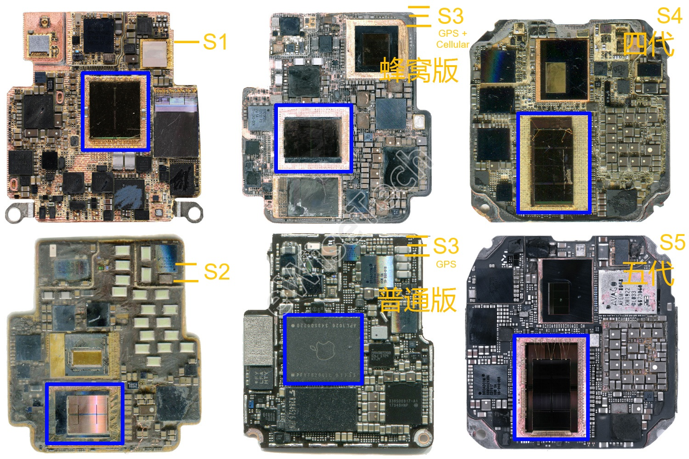

## Apple Watches - GNSS Chipsets

Author: Michael George

Created: 4 Feb 2025

Updated: 8 Dec 2025

### Background

The GNSS chipset is probably the most significant factor when it comes to the accuracy and reliability of GPS watches. Additional factors include antenna design, front-end filters, GNSS firmware, watch firmware, and user settings. The activity profile and / or app choice are also really important.

The GNSS chipsets in Apple watches have changed over time and to a large extent they can be used to categorise their performance / accuracy. The entirety of this investigation has been very time consuming, so this page has been created to collate all of the sources and findings. 

Towards the end of this document is a list of different watch models and the GNSS chipsets. A distinction has been made between GNSS chipsets being confirmed (e.g. photographic evidence) or where it is speculated. Speculations are often based on unique characteristics in the data. 

### Teardowns

Apple watches make use of a  [System-in-Package](https://en.wikipedia.org/wiki/Apple_silicon#S-series_SiPs) (SiP) which essentially a complete computer in a single package. The SiP includes the CPU together with memory, flash storage and support processors for things like wireless connectivity, sensors, and I/O. There are some Apple SiP specifications at [hubweb.cn](https://hubweb.cn/apple-silicon/chip-s/) but bear in mind the details are not 100% correct.

The GNSS chipset often cannot be determined by simply disassembling an Apple Watch. The components on the SiP are typically encased inside resin which is a process known as [potting](https://en.wikipedia.org/wiki/Potting_(electronics)). Companies such as [TechInsights](https://www.techinsights.com/) are capable of [decapping](https://en.wikipedia.org/wiki/Decapping) the SiP and revealing the individual components, but they charge around 8000 EUR for a detailed report about a specific watch.

The GNSS chipset inside Apple watches are always mounted on the SiP. Sometimes the GNSS chipset is on the the outside of the SiP module, but it is often inside the SiP and encased in resin. If the GNSS chipset is on the inside of the SiP it will often have the original part number printed on it, but when on the outside of the SiP it typically has an anonymous [data matrix code](https://en.wikipedia.org/wiki/Data_Matrix).

Different watch models will sometimes share the same CPU name but have a different SiP. For example, the Apple Watch SE and Apple Watch Series 5 both have an S5 CPU in their specifications but the SiP designs are slightly different. Likewise for the Apple Watch Series 8, SE Gen 2 and Ultra. Whether they contain identical GNSS chipsets is unclear, especially when the Ultra models support multi-band.

### Cellular vs Non-Cellular

The Apple Watch Series 3 introduced cellular capabilities and so there were essentially two models; Apple Watch Series 3 GPS + Cellular and Apple Watch Series 3 GPS. These pages will simply refer to the different models as cellular and non-cellular.

Cellular and non-cellular models have a different SiP (and different antennas) which is very apparent in teardowns; e.g. Apple Watch [Series 3](series-3.md) and [Series 6](series-6.md). The motherboard designs are always different, largely because of the additional cellular components.

The following image from [eWisetech](https://www.sohu.com/a/437646820_120062023) shows the SiP of the Series 1, Series 2, Series 3 (cellular), S3 (non-cellular), Series 4 (cellular), Series 5 (cellular).

### Apple Specific Chips

Several of the Apple Watch teardowns have revealed a dedicated GNSS chip which has a BCM477x4 part number. These chipsets may be specific to Apple products, because BCM477x4 chipsets don't typically appear on the Broadcom website.

- BCM47734 - Series 2
  - BCM47734IUBG was used inside the iPhone 7 as well as the Apple Watch Series 2
- BCM47754 - Series 5 and Series 6
  - BCM47754KUBG was mentioned in a [product brief](https://docs.broadcom.com/doc/12379501) but without any further details
- BCM47764 - Series 7
  - BCM47764KUBG is listed on websites such as [integrated-ic.com](https://www.integrated-ic.com/sale-36831695-iphone-ic-chip-bcm47764kubg-gnss-receiver-bga-package-apple-watch-7-ic-chip.html), [chinax.com](https://www.chinax.com/integrated-ic/pz681d537-iphone-ic-chip-bcm47764kubg-gnss-receiver-bga-package-apple-watch-7-ic-chip.html), and [hkmjd.com](http://en.hkmjd.com/goods/show-935.html)

It is worth mentioning that Synaptics acquired the rights to several Broadcom GNSS chipsets but marketed as the SYN477X2, SYN477X5, and SYN477X8. These are available from sites such as [EDOM Technology](https://www.edomtech.com/en/product-detail/synaptics-gps-gnss-solutions/), [Macnica](https://www.macnica.co.jp/en/business/semiconductor/manufacturers/synaptics/products/143404/), and [Marubun](https://www.marubun.co.jp/products/20290/) but there is no SYN47754 or SYN47764.

It seems quite likely the Broadcom BCM477x4 chipsets are Apple specific, and primarily used in Apple watches.

### GNSS Chipsets

GPS capabilities were first introduced in the Apple Watch Series 2, and cellular capabilities were first introduced in the Series 3.

Click the links for detailed information about the individual watch models, GNSS chipsets, investigations, teardowns, etc.

#### Apple Watch

Quite a nice comparison of the different Apple Watches is available at [hubweb.cn](https://hubweb.cn/apple-device/watch/watch-series/).

| Model     | Announced | CPU      | GNSS                                   | Confirmed | Speculated |
| :----------: | :------: | :---------: | ----- | :----------: | :----------: |
| 1st Gen   | Apr 2015 | S1 | N/A                                   | - | - |
| Series 1  | Sep 2016 | S1P | N/A                                   | - | - |
| [Series 2](series-2.md) | Sep 2016 | S2 | GPS, GLONASS                      | [BCM47734](../../../chipsets/broadcom/bcm-4773.md) | - |
| [Series 3](series-3.md) | Sep 2017 | S3 | GPS, GLONASS, Galileo, QZSS       | - | BCM4774X |
| [Series 4](series-4.md) | Sep 2018 | S4 | GPS, GLONASS, Galileo, QZSS       | - | BCM4775X |
| [Series 5](series-5.md) | Sep 2019 | S5 | GPS, GLONASS, Galileo, QZSS       | [BCM4775X](../../../chipsets/broadcom/bcm-4775.md) | - |
| [Series 6](series-6.md) | Sep 2020 | S6 | GPS, GLONASS, Galileo , QZSS       | [BCM47754](../../../chipsets/broadcom/bcm-4775.md) | - |
| [Series 7](series-7.md) | Sep 2021 | S7 | GPS, GLONASS, Galileo, QZSS, BeiDou | [BCM47764](../../../chipsets/broadcom/bcm-4776.md) | - |
| [Series 8](series-8.md) | Sep 2022 | S8 | GPS, GLONASS, Galileo, QZSS, BeiDou | - | [BCM47764](../../../chipsets/broadcom/bcm-4776.md) |
| [Series 9](series-9.md) | Sep 2023 | S9 | GPS, GLONASS, Galileo, QZSS, BeiDou | - |                         ?                          |
| Series 10 | Sep 2024 | S10 | GPS, GLONASS, Galileo, QZSS, BeiDou | - | ? |
| Series 11 | Sep 2025 | S10 | GPS, GLONASS, Galileo, QZSS, BeiDou | - |                         ?                          |

#### Apple Watch SE

Quite a nice comparison of the Apple Watch SE models is available at [hubweb.cn](https://hubweb.cn/apple-device/watch/watch-se/).

| Model           | Announced | CPU  | GNSS                                |                     Confirmed                      |                     Speculated                     |
| --------------- | :-------: | :--: | ----------------------------------- | :------------------------------------------------: | :------------------------------------------------: |
| [SE](se-1.md)   | Sep 2020  |  S5  | GPS, GLONASS, Galileo, QZSS         | [BCM47754](../../../chipsets/broadcom/bcm-4775.md) |                         -                          |
| [SE 2](se-2.md) | Sep 2022  |  S8  | GPS, GLONASS, Galileo, QZSS         |                         -                          | [BCM47764](../../../chipsets/broadcom/bcm-4776.md) |
| SE 3            | Sep 2025  | S10  | GPS, GLONASS, Galileo, QZSS, BeiDou |                         -                          |                         ?                          |

#### Apple Watch Ultra

Quite a nice comparison of the Apple Watch Ultra models is available at [hubweb.cn](https://hubweb.cn/apple-device/watch/watch-ultra/).

| Model   | Announced | CPU      | GNSS                                             | Confirmed | Speculated |
| ------------ | :------: | :---------: | ---------------------------- | :-----: | :-----: |
| [Ultra](ultra-1.md) | Sep 2022 | S8 | L1 and L5 - GPS, GLONASS, Galileo, QZSS, BeiDou | - | [BCM4776X](../../../chipsets/broadcom/bcm-4776.md) |
| Ultra 2 | Sep 2023 | S9 | L1 and L5 - GPS, GLONASS, Galileo, QZSS, BeiDou | - | ? |
| Ultra 3 | Sep 2025 | S10 | L1 and L5 - GPS, GLONASS, Galileo, QZSS, BeiDou | - | ?                                                  |

### Links

- Apple watch comparisons
  - [Comparison of watches](https://www.apple.com/uk/watch/compare/) on Apple.com
  - [Comparison of models](https://en.wikipedia.org/wiki/Apple_Watch#Comparison_of_models) on Wikipedia
  - [watchOS](https://en.wikipedia.org/wiki/WatchOS) history on Wikipedia
- [Broadcom](../../../chipsets/broadcom/README.md) GNSS chipsets
