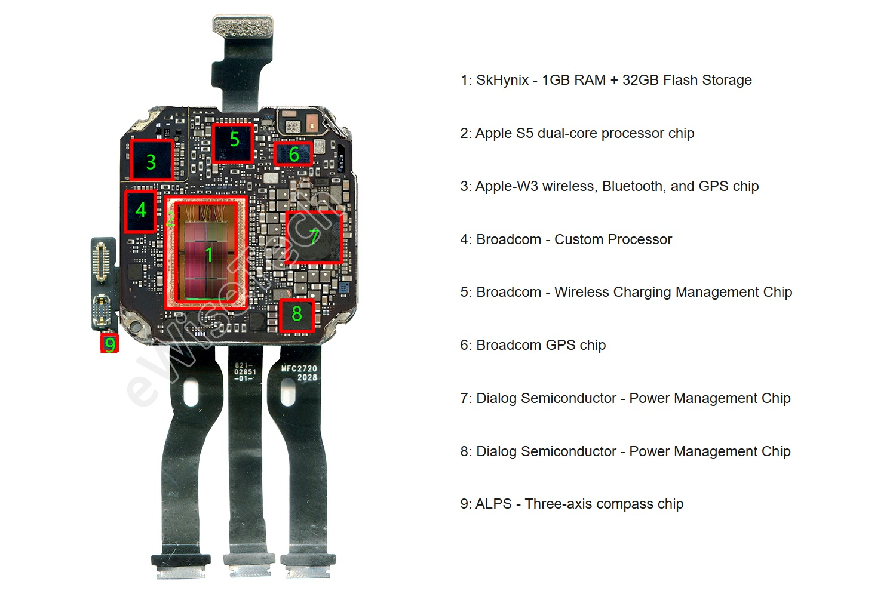
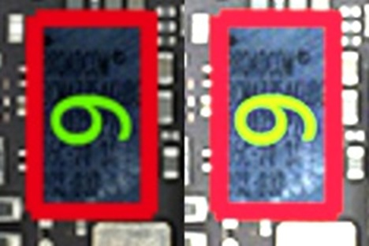
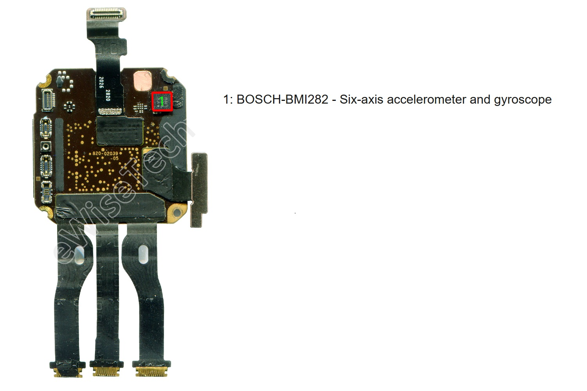
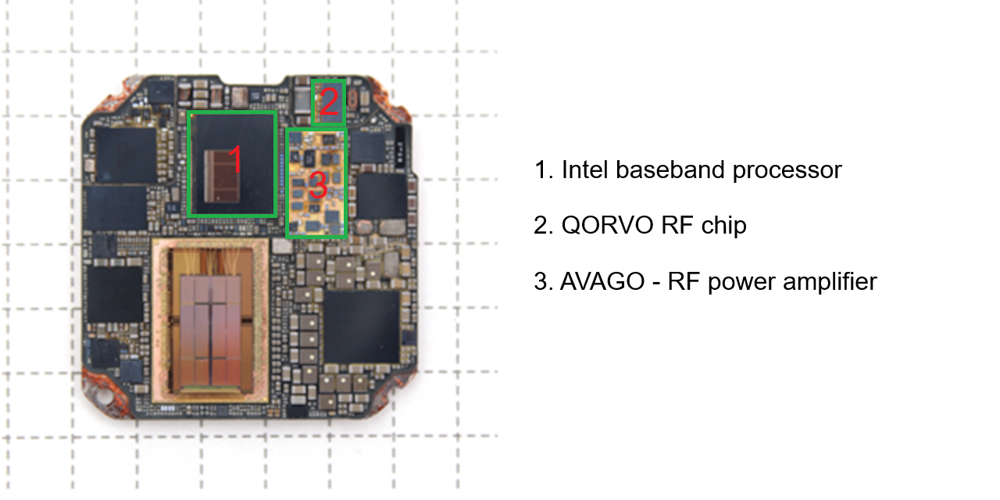
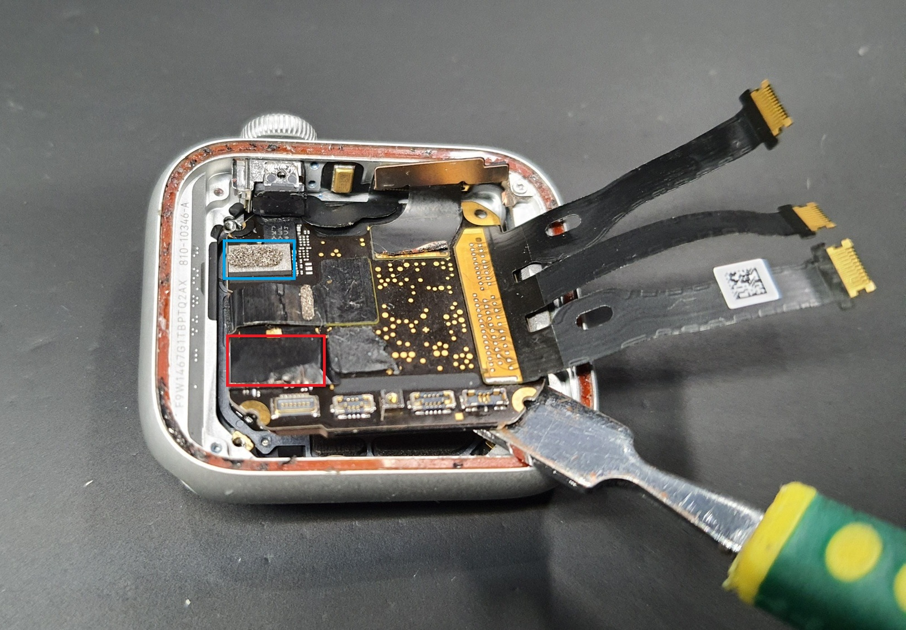

## Apple Watch SE (Gen 1)

### Overview

The Apple Watch Series SE was released at the same time as the Apple Watch Series 6, but the specification is almost identical to the Apple Watch Series 5. The Apple Watch SE essentially lacks the always-on display and ECG functionality of the Apple Watch Series 5. 

Just like the Apple Watch Series 5 (and Series 6) the Apple Watch SE supports GPS, GLONASS, Galileo, and QZSS. The Apple [product comparison](https://www.apple.com/uk/watch/compare/?modelList=watch-se-gen1,watch-se-gen2,watch-se-3) incorrectly shows the SE only supporting GPS + GLONASS, but the [specifications](https://support.apple.com/en-gb/111862) also include Galileo and QZSS.

There are two different versions of the S5 SiP for the Apple Watch SE, corresponding to the cellular and non-cellular models.

- The decapsulated SiP (non-cellular) from [eWisetech](https://zhuanlan.zhihu.com/p/338499518) clearly shows the Broadcom [BCM47754](../../../chipsets/broadcom/bcm-4775.md) on the back of the SiP
- The back of the SiP (cellular) is shown in a [CSS Insight](https://www.ccsinsight.com/blog/what-makes-a-smartwatch-tick/) blog article, and the front of the SiP is visible in an [iFixit](https://www.ifixit.com/Guide/Apple+Watch+SE+Mother+Board+Removal/149245) article

The two different SiP designs in the Apple Watch SE are similar to the octagonal S4 and S5 designs of the Apple Watch [Series 4](series-4.md) and [Series 5](series-5.md).

It has been confirmed the Apple Watch SE uses the Broadcom [BCM47754](../../../chipsets/broadcom/bcm-4775.md).

### Teardown

#### Apple Watch SE (non-cellular)

Thanks to the teardown of the non-cellular Apple Watch SE 40 mm by [eWisetech](https://www.sohu.com/a/439573305_120062023), we can see the rectangular Broadcom [BCM47754](../../../chipsets/broadcom/bcm-4775.md).

Immediately above the BCM47754 is the Skyworks GPS LNA / filter, but both components have been relocated on SiP of the cellular SE.

The image above describes the Apple W3 wireless chip (3) as supporting GPS, but this appears to be a recurrent error. The same description is also present in eWisetech teardowns for the [Series 4](series-4.md), [Series 6](series-6.md), and [Ultra](ultra-1.md). There is no evidence that the Apple W3 Wireless chip supports GPS.

Zooming in and adjusting the brightness + contrast allows the GNSS chip to be confirmed as the Broadcom BCM47754.

It should also be noted there is very little on the front of the SiP, aside from connectors and the Bosch accelerometer / gyroscope.

#### Apple Watch SE (cellular)

The [CSS Insight](https://www.ccsinsight.com/blog/what-makes-a-smartwatch-tick/) blog shows the back of the cellular SiP, which is quite different from the circuit board of the non-cellular SiP.

Several large components from Intel + Qorvo + Avago have been incorporated, displacing the GNSS components.

The [iFixit](https://www.ifixit.com/Guide/Apple+Watch+SE+Mother+Board+Removal/149245) article demonstrating motherboard removal shows the front of the cellular SiP:

- The BCM47754 (highlighted in blue) is located right next to the Bosch accelerometer / gyroscope
- RF components from Skyworks and Avago (highlighted in red) are covered up in the adjacent corner

The various components on the front of the SiP look near-identical to the cellular version of the Apple Watch [Series 5](series-5.md).

### Summary

Thanks to the decapsulation of the Apple S5 (non-cellular) by [eWisetech](https://zhuanlan.zhihu.com/p/338499518), we know that the non-cellular Apple Watch SE definitely contains the Broadcom [BCM47754](../../../chipsets/broadcom/bcm-4775.md). The [iFixit](https://www.ifixit.com/Guide/Apple+Watch+SE+Mother+Board+Removal/149245) article demonstrating motherboard removal shows the BCM47754 next to the Bosch accelerometer / gyroscope.

Whilst the Apple Watch SE uses an S5 SiP it is slightly a different design to the Apple Watch Series 5. Despite the differences it is still possible to install an Apple Watch Series 5 motherboard in the Apple Watch SE as demonstrated on [YouTube](https://youtu.be/SLanIrFd6H0?t=25).

### Links

- [Teardown](https://www.sohu.com/a/439573305_120062023) of the non-cellular Apple Watch SE 40 mm - eWisetech, 20 Oct 2020
  - The BCM47754 is located at the top-right of the non-cellular S5 SiP
- [What Makes a Smartwatch Tick](https://www.ccsinsight.com/blog/what-makes-a-smartwatch-tick/) includes the cellular Apple Watch S - CCS Insight, 21 May 2021
  - This shows the back of the cellular S5 SiP
- [Apple Watch SE Mother Board Removal](https://www.ifixit.com/Guide/Apple+Watch+SE+Mother+Board+Removal/149245) - iFixit, 15 Apr 2022
  - This shows the front of the cellular S5 SiP

- [Install the Apple Watch Series 5 Motherboard to Apple Watch SE](https://www.youtube.com/watch?v=SLanIrFd6H0&t=25s) - How-FixIT, 20 Jul 2022
  - DIY instructions how to convert Apple Watch SE to Apple Watch 5 replacing motherboard

