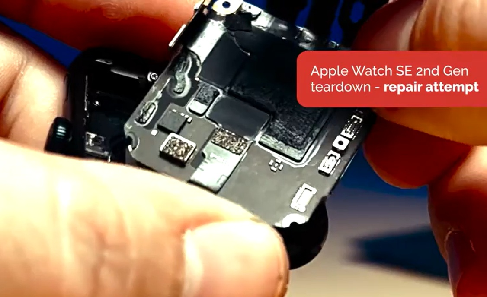
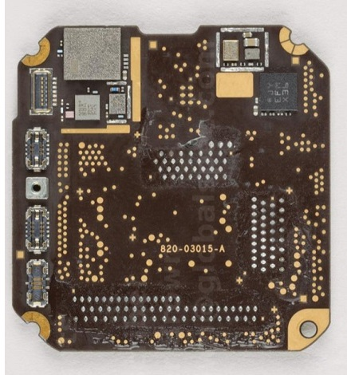

## Apple Watch SE 2

### Overview

The Apple Watch SE 2 was released at the same time as the Apple Watch Series 8 and Apple Watch Ultra. All three watches contain the S8 processor, but the SiP in the Apple Watch SE 2 is nothing like the Apple Watch Series 8 or Apple Watch Ultra.

Just like the Apple Watch SE the Apple Watch SE 2 supports GPS, GLONASS, Galileo, and QZSS. The absence of BeiDou support is curious, given it is supported by the Apple Watch Series 8 and Apple Watch Ultra.

There are two different versions of the S8 SiP for the Apple Watch SE, corresponding to the cellular and non-cellular models. The GNSS chip appears to be inside the SiP on both versions, so would need to be decapped in order to confirm the exact model.

The GNSS chipset is unconfirmed but is likely to be the [BCM47764](../../../chipsets/broadcom/bcm-4776.md) like the [Apple Watch Series 8](series-8.md) and [Apple Watch Ultra](ultra-1.md).

### Teardown

#### Apple Watch SE 2 (non-cellular)

The outside of the SiP looks similar to the [Apple Watch SE](se-1.md) and there are only a couple of components visible.

- The square black component may well be the accelerometer / gyroscope, just like the Apple Watch SE
- The silver component is unidentified, but seems unlikely to be a GNSS chip as it is so small

There is no Ultra-Wideband (UWB) capability in the Apple Watch SE 2, so that is one less component to be packed into the SiP.

#### Apple Watch SE 2 (cellular)

The teardown by [TechInsights](https://electronics360.globalspec.com/article/19799/techinsights-teardown-apple-watch-second-generation) shows the outside of the SiP with several components visible:

- Cellular / RF components (e.g. power amplifier) appear to be at the top-left
- Possible accelerometer / gyroscope IMU chip at the top-right
- Skyworks GPS LNA / filter and LB front-end module, above the possible IMU chip

The presence of the Skyworks components on the outside of the SiP differs from earlier cellular models, including the [Apple Watch SE](se-1.md). The cellular watch models have typically seen the Broadcom GNSS chip on the outside of the SiP and Skyworks LNA / filter on the inside.

A photo showing the other side of the SiP is not provided on the Electronics 360 website. This means that the contents of the SiP currently remain a mystery.

### Summary

The GNSS chipset is unconfirmed but is likely to be the [BCM47764](../../../chipsets/broadcom/bcm-4776.md) like the [Apple Watch Series 8](series-8.md) and [Apple Watch Ultra](ultra-1.md). This is based on analysis of data generated by the Apple Watch SE, specifically the accuracy estimates.

The absence of BeiDou support in the product specification is curious, given BeiDou is supported by the Apple Watch Series 8 and Apple Watch Ultra. This could well be a mistake on the Apple website. 

### Links

- [Teardown](https://electronics360.globalspec.com/article/19799/techinsights-teardown-apple-watch-second-generation) of the cellular Apple Watch SE Gen 2 (40 mm) - TechInsights, 21 Jul 2023
  - Components can be seen on the outside of the SiP
- [Repair attempt (Tips and Tricks #92)](https://youtu.be/Jjp9jIPFTic?t=306) - MobileSentrix Official, 15 Apr 2024
  - Teardown of the non-cellular Apple Watch SE 2
- [Can this even be Fixed?!](https://youtu.be/HJO-1MF59mE?t=288) - FIXD | Repair, 12 Apr 2024
  - The same teardown of the non-cellular Apple Watch SE 2
