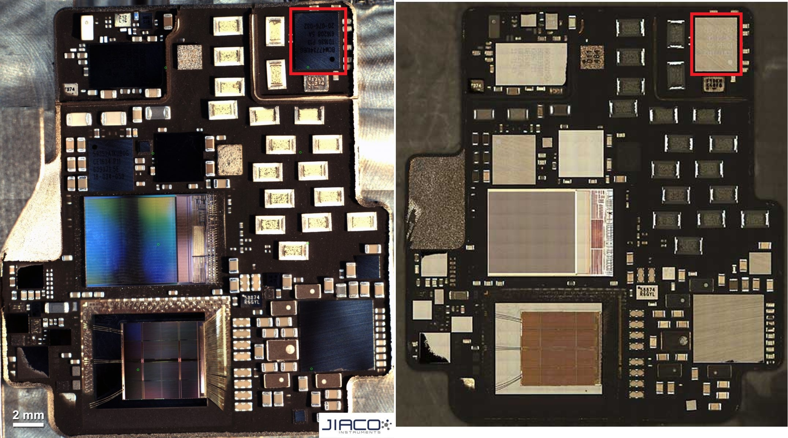
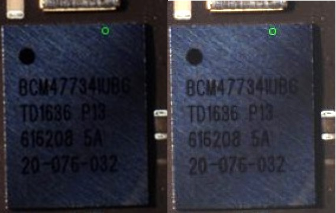

## Apple Watch Series 2

### Overview

The Apple Watch Series 2 introduced a GNSS receiver supporting GPS + GLONASS, but there was no cellular / LTE functionality.

[JIACO Instruments](https://jiaco-instruments.com/decapsulation-technology/) decapsulated the Apple [S2](https://en.wikipedia.org/wiki/Apple_S2) SiP of the Apple Watch Series 2 in collaboration with [TechInsights]((https://www.techinsights.com/blog/apple-watch-series-2-teardown)). The S2 SiP also appears in a [YouTube](https://youtu.be/3zYMVcaplZo?t=32) video by JIACO Instruments, which describes Microwaved Induced Plasma (MIP) decapsulation. The MIP decapsulation process is also described in more detail within a journal paper which was published in Oct 2018, available on [ResearchGate](https://www.researchgate.net/publication/331000749_Halogen-Free_Microwave_Induced_Plasma_Decapsulation_of_System_in_Package_Modules).

The decapsulation by JIACO Instruments shows the Broadcom [BCM47734](../../../chipsets/broadcom/bcm-4773.md) on the circuit board, so this can be regarded as 100% confirmed. The BCM47734 was also used in the [iPhone 7](https://www.techinsights.com/blog/apple-iphone-7-teardown), released with the Apple Watch Series 2 on 16 Sep 2016.

### Teardown

Thanks to the decapsulation of the Apple S2 by JIACO Instruments, we can see the Broadcom [BCM47734](../../../chipsets/broadcom/bcm-4773.md), which was also used in the [iPhone 7](https://www.techinsights.com/blog/apple-iphone-7-teardown).

The part number BCM47734IUBG can be seen clearly, once the brightness and contrast have been adjusted.

### Summary

Thanks to the decapsulation of the Apple S2 by JIACO Instruments, we know that it contains the Broadcom [BCM47734](../../../chipsets/broadcom/bcm-4773.md).

Additionally, an article by [eWisetech](https://www.sohu.com/a/437646820_120062023) describes the changes with each generation of Apple Watch, and specifically mentions the BCM47734.

### Links

- [Teardown](https://www.techinsights.com/blog/apple-watch-series-2-teardown) - TechInsights, 28 Sep 2016
  - The BCM47734 is located at the top-right of the S2, but illegible
- [X-Ray](https://www.eetasia.com/apple-iphone-11-and-watch-5-teardown/) showing changes from Watch 2 / 3 / 4 / 5 - SystemPlus Consulting
  - The GPS chipset is labelled at the top-right of the S2
- [Decapsulation Technology](https://jiaco-instruments.com/decapsulation-technology/) - JIACO Instruments
  - The S2 module of the Apple Watch Series 2 is at the top-right of the page
- [ISTFA 2017](https://jiaco-instruments.com/istfa-2017-2/) - 43rd International Symposium for Testing and Failure Analysis, 5-9 Nov 2017
  - The BCM47734 is just about visible in the [photo](https://jiaco-instruments.com/wp-content/uploads/2019/01/SiP-after-MIP-ISTFA-2017.jpg) of the decapsulated S2
- [iPhone 7 Teardown](https://www.techinsights.com/blog/apple-iphone-7-teardown) - TechInsights, 15 Sep 2016
  - Clear photo of the BCM47734 inside the iPhone 7

- [Changes in the Apple Watch](https://www.sohu.com/a/437646820_120062023) - eWiseTech, 11 Dec 2020
  - The BCM47734 is mentioned in the description of the second generation

