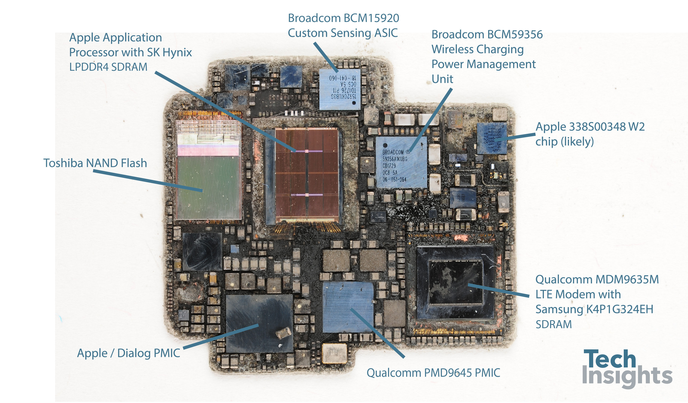
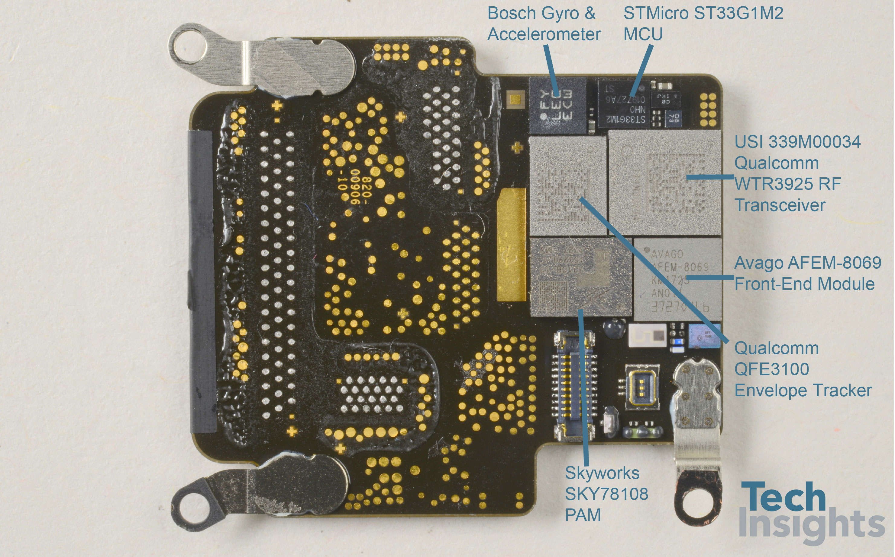

## Apple Watch Series 3

### Overview

There is little information available for the Series 3, but the [Apple Wiki](https://theapplewiki.com/wiki/Apple_Watch_Series_3) and [Wikipedia](https://en.wikipedia.org/wiki/Apple_silicon) both describe the [Apple S3](https://en.wikipedia.org/wiki/Apple_silicon#Apple_S3) as containing a GPS module / receiver.

An article by [eWisetech](https://www.sohu.com/a/437646820_120062023) gives some interesting details about the Apple S3, but nothing specific about the GNSS chipset:

> The two versions of the S3 dual-core processor in the third-generation watch differ due to differences in motherboard packaging. The internal processor packaging also differs; the cellular version uses the same packaging as previous versions, while the non-cellular version uses a standard plastic BGA package. The S3 processor is similar in chip area to the S2 processor, but significantly smaller than the S1 processor, resulting in lower power consumption and improved performance.
>
> The third-generation Apple Watch is the first to use Apple's W2 wireless chip, supporting 2.4G Wi-Fi and Bluetooth 4.2, and features a built-in GPS chip. The cellular version is also the first to use an E-SIM chip, enabling independent calls between the watch and the phone. This E-SIM chip is manufactured by STMicroelectronics. Additionally, there is a Qualcomm baseband chip.
>
> Regarding antennas, the most representative example is the antenna module in the third-generation Apple Watch cellular and non-cellular versions. The two antenna modules are completely different, and their connection methods to the motherboard also differ. The cellular version's antenna is directly connected to the motherboard via a BTB connector. The non-cellular version's antenna is soldered onto a flexible circuit board on the motherboard and then fixed via an interface.

The Series 3 cannot be using the [BCM47734](../../../chipsets/broadcom/bcm-4773.md) that was in the Series 2, because that chipset does not support Galileo.

The Apple Watch Series 3 could have used the [BCM4774X](../../../chipsets/broadcom/bcm-4774.md) family of GNSS chipset as that supports Galileo.

The baseband processor in the cellular version of the S3 is the Qualcomm MDM9635, and wireless chip is the Apple W2.

### Teardown

#### Apple Watch Series 3 (non-cellular)

The [eWisetech](https://www.sohu.com/a/437646820_120062023) image of the non-cellular SiP allows two Broadcom chips to be easily identified, after adjusting the brightness and contrast:

- BCM59356 - Wireless Charging Power Management Integrated Circuit (PMIC)
- BCM15920 - Custom Sensing Application-Specific Integrated Circuit (ASIC)

The large silver component (red) to the left of the Apple S1 (blue) could be the GNSS chip. It is a similar size and shape to the Broadcom GNSS chips seen in the [Apple Watch Series 4](series-4.md), [Apple Watch Series 5](series-5.md), and [Apple Watch SE](se-1.md).

#### Apple Watch Series 3 (cellular)

The [eWisetech](https://www.sohu.com/a/437646820_120062023) image of the cellular SiP shows a noticeably different motherboard layout to the non-cellular model. The additional Qualcomm Power Management Integrated Circuit (PMIC) and Qualcom LTE Modem take up considerable space on the motherboard.

The Broadcom BCM59356 (wireless charging PMU) and BCM15920 (custom sensing ASIC) seen on the non-cellular SiP are also visible. The large silver component (suspected GNSS chip) identified on the non-cellular SiP is not visible on the cellular SiP.

Some sources say the [Apple W2 chip](https://www.techinsights.com/products/far-1712-903) (part number 338S00348) includes GPS functionality, but I cannot find anything that suggests it does anything more than Wi-Fi + Bluetooth. The front of the cellular S3 is also provided by Tech Insights, but there is no sign of a Broadcom GNSS chip.

### Summary

The non-cellular Series 3 contains a component which may be a Broadcom GNSS chip, looing similar to the Series 4 and Series 5. This same chip is not visible in the cellular Series 3, so it could be using the Qualcomm baseband processor (MDM9635) for GNSS.

Another possibility is that the [Apple W2 chip](https://www.techinsights.com/products/far-1712-903) (part number 338S00348) provides GNSS functionality, but only utilised in the Apple Watch Series 3. The GNSS chipset in the Series 3 may never be confirmed without further information being readily available.

### Links

- [Teardown](https://www.sohu.com/a/437646820_120062023) - eWisetech, 11 Dec 2020
  - Clear photograph of the non-cellular S3, but no sign of the GNSS chip
- [Teardown](https://www.techinsights.com/blog/apple-watch-series-3-teardown) - Tech Insights, 13 Sep 2017
  - Clear photographs of the cellular S3, but no sign of the GNSS chip
- [Teardown](https://www.ifixit.com/Teardown/Apple+Watch+Series+3+Teardown/97521) - iFixit, Sep 2017
  - Clear photograph of the outside of the cellular S3, but not the inside
- [Video](https://www.youtube.com/watch?v=Qi2jzmpDPD4&t=322s) - iFixit, 26 Sep 2017
  - Shows the SiP differences and the 6 exposed chips on cellular version
- [Changes in the Apple Watch](https://www.sohu.com/a/437646820_120062023) - eWisetech, 11 Dec 2020
  - Summary of changes from Series 1 to Series 5
