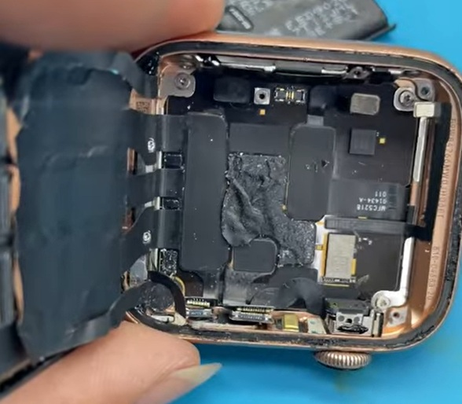
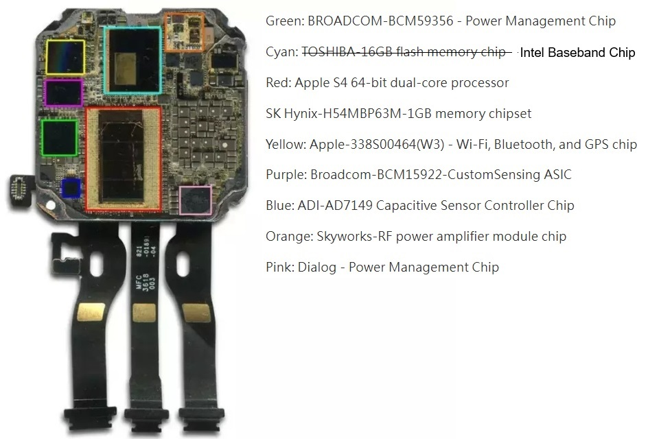
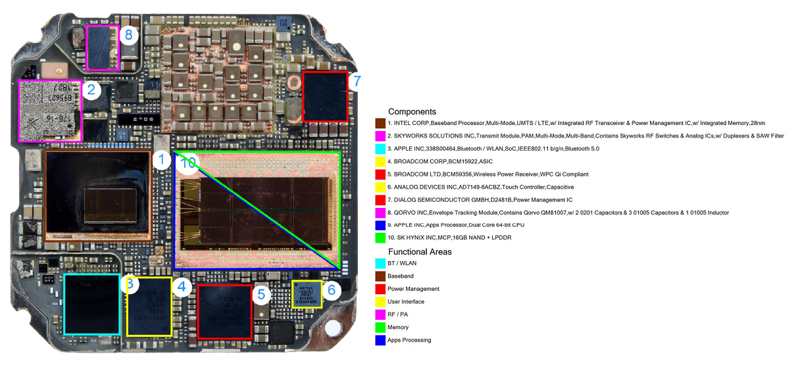
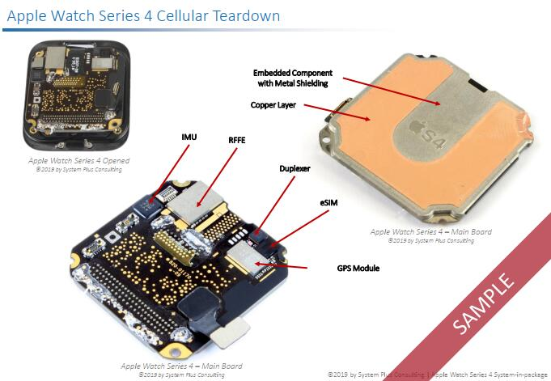
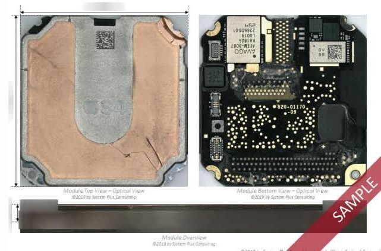

## Apple Watch Series 4

### Overview

The Apple Watch Series 4 supports GPS, GLONASS, Galileo, and QZSS. It cannot be using the same GNSS receiver as the Series 2, because the [BCM47734](../../../chipsets/broadcom/bcm-4773.md) does not support Galileo.

There are two different versions of the S4 SiP for the Apple Watch Series 4, corresponding to the cellular and non-cellular models. The Apple Watch Series 4 was released in Sep 2018, so it could have used one of the following Broadcom chips:

- [BCM4774X](../../../chipsets/broadcom/bcm-4774.md) was released between Sep 2014 and 2015 and possibly used in the [Apple Watch Series 3](series-3.md)
- [BCM47754](../../../chipsets/broadcom/bcm-4775.md) was probably used in the [Apple Watch Series 5](series-5.md) and definitely in the [Apple Watch Series 6](series-6.md) + [Apple Watch SE](se-1.md)

Whatever the chipset, it is almost certain the GNSS receiver will have been produced by Broadcom.

### Teardown

#### Apple Watch Series 4 (non-cellular)

Without a teardown of the non-cellular SiP the components inside the resin cannot be confirmed. There is very little on the outside of the SiP, but in addition to the connectors and the Bosch accelerometer / gyroscope there is a silver module which appears to be a GNSS module.

An [executive summary](https://www.slideshare.net/slideshow/advanced-packaging-technology-in-the-apple-watch-series-4s-systeminpackage/129577618) from SystemPlus Consulting says an IMU and GPS module are soldered beneath the SiP. The GPS module looks to be the same size as the [BCM47754](../../../chipsets/broadcom/bcm-4775.md) found inside the [Apple Watch Series 5](series-5.md) and [Apple Watch SE](se-1.md).

#### Apple Watch Series 4 (cellular)

The teardown by [Mobile China Alliance](https://read01.com/jjd2j5P.html) clearly shows the addition of some cellular components.

- Intel - baseband processor (cyan)
- Skyworks - RF power amplifier (orange)
- Qorvo - RF chip - black chip to the right of the Skyworks RF power amplifier

The other components will be largely the same as the non-cellular SiP, but the circuit board design will be different. The main cellular components (Intel, Skyworks and Qorvo) are quite large and do not leave sufficient room for a Broadcom GNSS receiver.

Note: This teardown has incorrectly labelled the Intel Baseband Chip (cyan) as Toshiba Flash Memory, so the labels need to be taken with a pinch of salt.

A teardown by [Electronics 360](https://electronics360.globalspec.com/article/13473/teardown-apple-watch-series-4) also shows the inside of the cellular SiP, which correctly identifies the Intel baseband processor.

The teardown by [Mobile China Alliance](https://read01.com/jjd2j5P.html) also labels some of the components on the outside of the SiP.

- Bosch accelerometer / gyroscope (red) is in a slightly different location to the non-cellular SiP
- Avago RF power amplifier (yellow) which is inside the SiP for Series 5, Series 6, and Series 7
- GPS module (green) which appears to be in exactly the same place as the non-cellular SiP

Note: This teardown has also mis-labelled the GPS module (green), referring to it as a Skyworks RF power amplifier.

[SystemPlus Consulting](https://www.sohu.com/a/293156755_406495) (now Yole Group) have provided an image clearly identifying the GPS module.

Another image also shows the part numbers very clearly. The use of 4 alphanumeric characters on the GPS module is consistent with other products such as the Apple Watch Series 5 and Series 6. It is interesting how the code differs for [SystemPlus Consulting](https://www.sohu.com/a/293156755_406495) (OV 5B), [iFixit](https://www.ifixit.com/Teardown/Apple+Watch+Series+4+Teardown/113044) (OU JQ) and [YouTube](https://www.youtube.com/shorts/c0o9RYIKloA) (11 OE). Perhaps the code is a serial number or batch number?

### Summary

The teardown by Mobile China Alliance describes the [Apple W3](https://www.techinsights.com/products/far-1810-808) as Wireless, Bluetooth, and GPS. It seems somewhat unlikely that the W3 is used for GPS because the Apple Watch Series 4 to Series 7 also have the Apple W3, but also have a dedicated Broadcom GNSS receiver.

The SystemPlus Consulting [executive summary](https://www.slideshare.net/slideshow/advanced-packaging-technology-in-the-apple-watch-series-4s-systeminpackage/129577618) says the following about the Apple Watch Series 4:

> The smartwatch came with two version of the SiP. The first is a non-cellular version with a single side molding and soldered beneath the package, an IMU and a GPS Front-End-Module (FEM). The second, analyzed by this report, is the cellular version with addition RF FEM, inside and outside the SiP, and a baseband processor included in the packaging, all in a single package smaller than 700 mm2, representing 40% of the watch form factor.

The executive summary is consistent with all of the images on this page, and the GPS module being located on the outside of the SiP.

The [Apple Watch Series 6 evolution](https://www.reverse-costing.com/teardown-notes/apple-watch-series-6-evolution/) by Reverse Costing (Yole Group) also hinted at Broadcom GPS chip:

> The similarities between the series are much more numerous...
>
> Broadcom wireless charging, custom sensing, and GPS chips

The Apple Watch Series 4 almost certainly uses a Broadcom GNSS receiver, perhaps identical to the Series 5 and Series 6.

- [BCM4774X](../../../chipsets/broadcom/bcm-4774.md) was released between Sep 2014 and 2015 and possibly used in the [Apple Watch Series 3](series-3.md)
- [BCM47754](../../../chipsets/broadcom/bcm-4775.md) was probably used in the [Apple Watch Series 5](series-5.md) and definitely in the [Apple Watch Series 6](series-6.md) + [Apple Watch SE](se-1.md)

Which one is not clear at this time... perhaps it is the BCM47754?

### Links

- [Apple Watch Series 4 teardown](https://read01.com/jjd2j5P.html) - Mobile China Alliance, 5 Dec 2018
  - Teardown of the Apple Watch Series 4 40mm cellular version with de-capped SiP
- [Teardown: Apple Watch Series 4](https://electronics360.globalspec.com/article/13473/teardown-apple-watch-series-4)  - SystemPlus Consulting, 22 Feb 2019
  - Teardown of the Apple Watch Series 4 with clear [image](https://electronics360.globalspec.com/images/assets/473/13473/appleWatch6-fullsize.png) of de-capped SiP
- [Reverse costing study of the SiP](https://medias.yolegroup.com/uploads/2019/02/SP19439-YOLE_Apple-Watch-4-SiP-Sample.pdf) - SystemPlus Consulting, Jan 2019
  - Sample slide deck showing the contents of their report, provides GPS insights
- [Apple Watch Series 4 Teardown](https://www.ifixit.com/Teardown/Apple+Watch+Series+4+Teardown/113044) - iFixit, 24 Sep 2018
  - Teardown with good photos, but fails to identify the GNSS receiver
- [Apple Watch Series 4 Water Damage](https://www.youtube.com/shorts/c0o9RYIKloA) - @irevivecenter, 4 Apr 2023
  - Clear view of what may be a Broadcom GNSS receiver
- [What's inside Series 4 Apple Watch?](https://www.youtube.com/watch?v=IqUjGc8zsCQ&t=514s) - What's Inside? 22 Sep 2018
  - Brutal comparison of the Apple Watch Series 3 and Series 4
- [Apple Watch Series 6 evolution](https://www.reverse-costing.com/teardown-notes/apple-watch-series-6-evolution/) - Reverse Costing (Yole Group), 20 Oct 2020
  - "The similarities between the series are much more numerous... Broadcom... GPS chips"
- [Changes in the Apple Watch](https://www.sohu.com/a/437646820_120062023) - eWisetech, 11 Dec 2020
  - Summary of changes from Series 1 to Series 5
