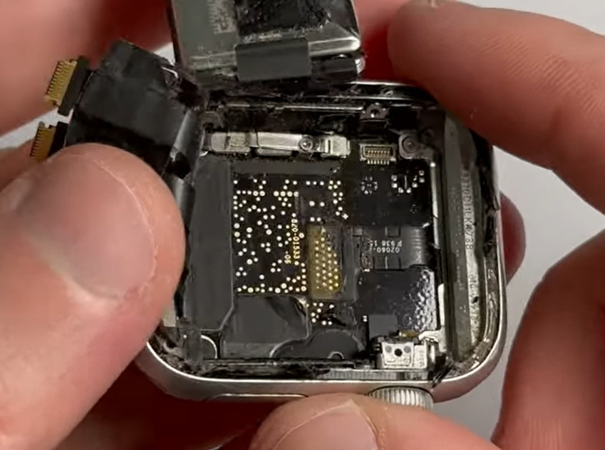
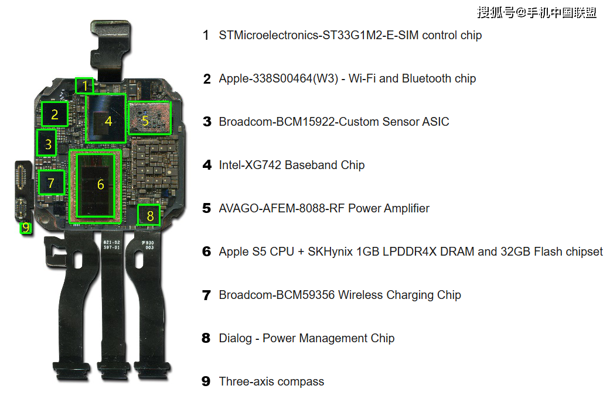
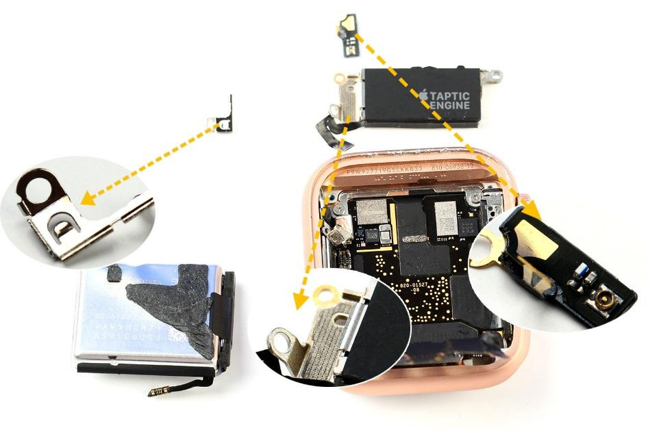
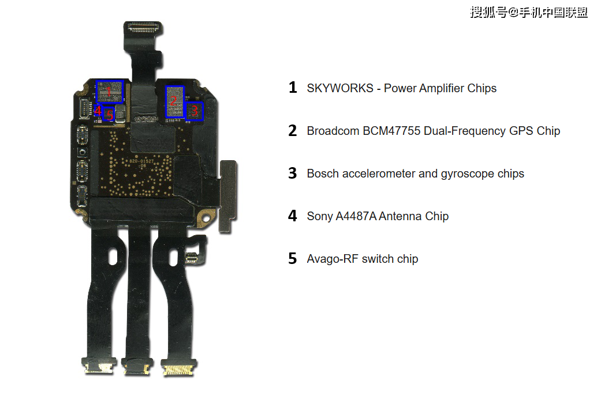

## Apple Watch Series 5

### Overview

The Apple Watch Series 5 supports GPS, GLONASS, Galileo, and QZSS and is very similar in design to the Series 4.

There are two different versions of the S5 SiP for the Apple Watch Series 5, corresponding to the cellular and non-cellular models.

The SiP designs in the Apple Watch Series 5 are very similar to the Apple Watch SE which was released the following year.

It seems highly likely the Apple Watch Series 5 uses the Broadcom [BCM47754](../../../chipsets/broadcom/bcm-4775.md), just like the [Apple Watch SE](se-1.md) and [Series 6](series-6.md).

### Teardown

#### Apple Watch Series 5 (non-cellular)

There is no available teardown of the non-cellular S5 SiP, so the components inside the resin cannot be confirmed. There is very little on the outside of the SiP, aside from connectors and the Bosch accelerometer / gyroscope.

The Apple Watch SE had a Broadcom [BCM47754](../../../chipsets/broadcom/bcm-4775.md) inside the SiP, which was confirmed after decapsulation. The outside of the non-cellular Series 5 SiP looks almost identical to the non-cellular version of the [Apple Watch SE](se-1.md). 

#### Apple Watch Series 5 (cellular)

The teardown by [eWisetech](https://zhuanlan.zhihu.com/p/87349219) of the 40mm GPS + cellular version clearly shows the addition of some cellular components.

- Intel - baseband processor (4)
- Avago - RF power amplifier (5)
- Qorvo - RF chip (just above the Avago)

The other components will be largely the same as the non-cellular S5, but the circuit board design will be different. The main cellular components (Intel and Avago) are quite large and have displaced the Broadcom GNSS chip to the outside of the SiP.

The outside of the cellular SiP looks near-identical to the cellular version of the [Apple Watch SE](se-1.md), but the RF components are clearly visible.

The teardown from eWisetech also labels the following components on the outside of the SiP.

- The Broadcom GNSS chip (2) which is next to the Bosch accelerometer / gyroscope (3)
- RF components from Skyworks (1), Sony (4), and Avago (5) are located in the adjacent corner

The components and their layout are practically identical to the cellular version of the [Apple Watch SE](se-1.md).

### Summary

The teardown by [eWisetech](https://zhuanlan.zhihu.com/p/87349219) and the [Apple Silicon S Series](https://hubweb.cn/apple-silicon/chip-s/) specifications both claim the Apple Watch Series 5 uses the [BCM47755](../../../chipsets/broadcom/bcm-4775.md), but this may be not be correct. The chip could easily have been mis-identified, or perhaps based on an assumption.

It seems highly likely that the Apple Watch Series 5 uses the [BCM47754](../../../chipsets/broadcom/bcm-4775.md), just like the [Apple Watch SE](se-1.md) and [Series 6](series-6.md). The BCM477x4 appears to be unique to Apple products and appears in the Series 2, Series 6, Series 7, and SE (Gen 1) so the BCM47755 seems strange.

There is no further information as to whether the BCM47754 is single-band (like the BCM47752), or dual-band (like the BCM47755).

The SiP in the Apple Watch Series 5 is slightly different to the Apple Watch SE, but they are very similar. They are so similar that it is possible to install an Apple Watch Series 5 motherboard in the Apple Watch SE as demonstrated on [YouTube](https://youtu.be/SLanIrFd6H0?t=25).

### Links

- [Teardown](https://mp.ofweek.com/mobile/a145683228896) - eWisetech, 11 Nov 2019
  - Decapsulated SiP from inside the 40mm GPS + cellular version
- [Bill of materials](https://www.sohu.com/a/351924885_166680) - Jiwei.com, 6 Nov 2019
  - Same photos as the eWisetech teardown, but higher resolution
- [Teardown](https://www.ifixit.com/Teardown/Apple+Watch+Series+5+Teardown/126205) - iFixit, 9 Oct 2019
  - Clear photos but no decapsulation and ICs on the outside of the SiP are unidentified
- [Apple Watch Series 5 40mm Teardown](https://youtu.be/1y3j0cDNOvw?t=789) - svetnovinek.cz, 18 Mar 2024
  - Clear view of the front of the non-cellular SiP, just the Bosch accelerometer / gyroscope
- [Apple Watch Series 5 Teardown](https://youtu.be/y5UaGhkTLv8?t=589) - FIXD I Repair, 10 Oct 2019
  - Clear view of the front of the non-cellular SiP, just the Bosch accelerometer / gyroscope
- [Install the Apple Watch Series 5 Motherboard to Apple Watch SE](https://www.youtube.com/watch?v=SLanIrFd6H0&t=25s) - How-FixIT, 20 Jul 2022
  - DIY instructions how to convert Apple Watch SE to Apple Watch 5 replacing motherboard
- [Apple Watch Series 6 evolution](https://www.reverse-costing.com/teardown-notes/apple-watch-series-6-evolution/) - Reverse Costing (Yole Group), 20 Oct 2020
  - "The similarities between the series are much more numerous... Broadcom... GPS chips"
- [Changes in the Apple Watch](https://www.sohu.com/a/437646820_120062023) - eWisetech, 11 Dec 2020
  - Summary of changes from Series 1 to Series 5

