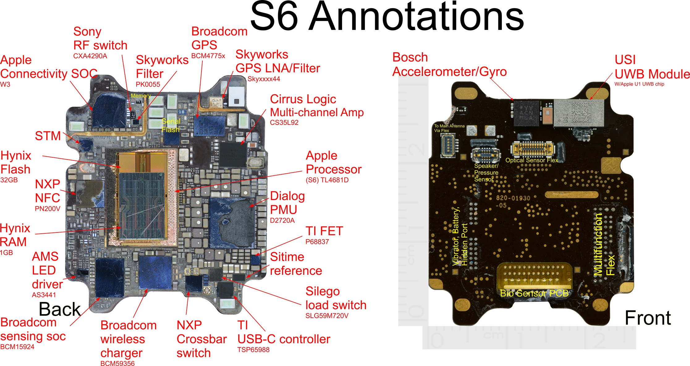
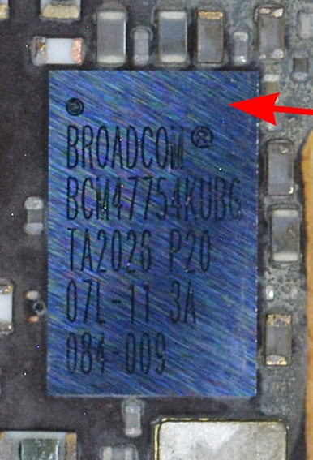
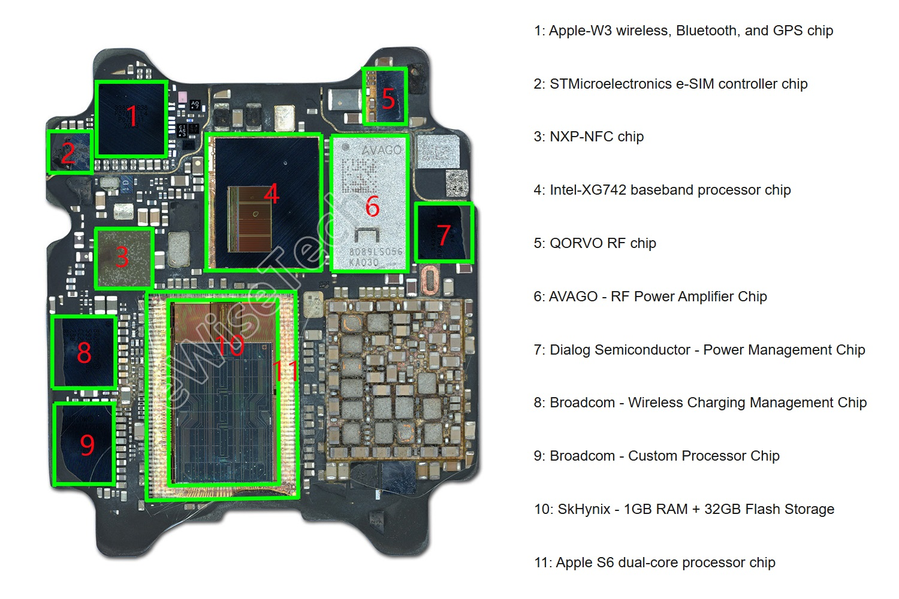
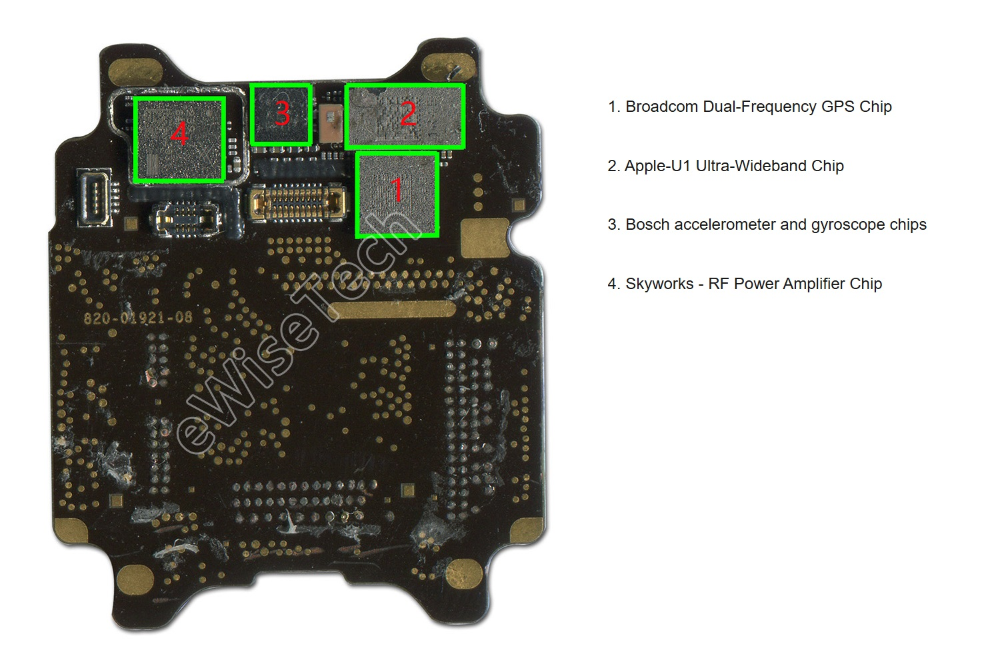
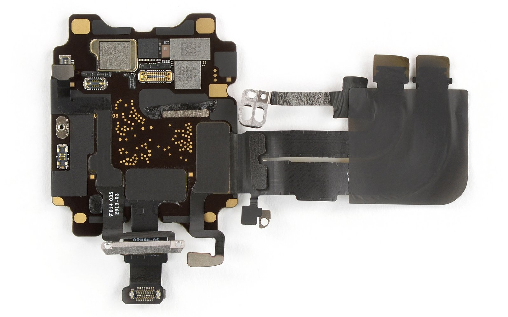

## Apple Watch Series 6

### Overview

The Apple Watch Series 6 supports GPS, GLONASS, Galileo, and QZSS.

There are two different versions of the S6 SiP, corresponding to the cellular and non-cellular Apple Watch Series 6.

- The decapsulated S6 SiP (non-cellular) from [Yole Group](https://www.reverse-costing.com/teardown-notes/apple-watch-series-6-evolution/) clearly shows the Broadcom [BCM47754](../../../chipsets/broadcom/bcm-4775.md) inside the S6 SiP
- The S6 SiP (cellular) is shown in the [eWiseTech](https://www.sohu.com/a/439808467_120062023) teardown and reports a Broadcom GPS chip on the the outside of the S6 SiP

The Apple Watch Series 6 included an Ultra-Wideband (UWB) chip which is not present on Apple Watch Series 5 or Apple Watch SE. The UWB chip is on the outside / front of the SiP in both models of the Apple Watch Series 6, cellular and non-cellular.

It has been confirmed the Apple Watch Series 6 uses the Broadcom [BCM47754](../../../chipsets/broadcom/bcm-4775.md).

### Teardown

#### Apple Watch Series 6 (non-cellular)

Thanks to the teardown of the Apple S6 (non-cellular) by Yole Group, we can see the rectangular Broadcom [BCM47754](../../../chipsets/broadcom/bcm-4775.md).

It is worth noting the relative sizes of the BCM47754 and the Apple U1 ultra-wideband module (USI UWB module).

The product code BCM47754KUBG is easy to read, especially if the photo is rotated.

#### Apple Watch Series 6 (cellular)

The teardown by [eWiseTech](https://www.sohu.com/a/439808467_120062023) shows the inside of the S6 (cellular) which clearly shows the addition of some cellular components.

- Intel - baseband processor (4)
- Qorvo - RF chip (5)
- Avago - RF power amplifier (6)

The other components are the same as the non-cellular S6, but the circuit board design is different. The three main cellular components (4, 5, 6) are quite large and have displaced the GNSS chips (Broadcom and Skyworks) to outside of the S6.

The image above describes the Apple W3 wireless chip (1) as supporting GPS, but this appears to be a recurrent error. The same description is also present in eWisetech teardowns for the [Series 4](series-4.md), [SE (Gen 1)](se-1.md), and [Ultra](ultra-1.md). There is no evidence that the Apple W3 Wireless chip supports GPS.

The teardown by [eWiseTech](https://www.sohu.com/a/439808467_120062023) labels the various components on the the outside of the cellular SiP.

- The Bosch accelerometer / gyroscope (3) and Apple U1 ultra-wideband chip (2) are identical to the non-cellular SiP
- The Skyworks RF power amplifier (4) and Broadcom GNSS chip (1) are unique to the cellular SiP

It should be noted that the GNSS module (1) is square, but it may contain the Broadcom BCM47754 and Skyworks GPS LNA / filter.

Another website includes identical photos, but [Jiwei.com](https://zhuanlan.zhihu.com/p/345231689) have provided actual part numbers and specifically mention the BCM47754.

The teardown by [iFixit](https://www.ifixit.com/Teardown/Apple+Watch+Series+6+Teardown/136694) also shows the the front of the S6 (cellular) and a clearer view of the various ICs / modules.

The square GNSS module looks to be the correct size to contain the Broadcom BCM47754 and Skyworks GPS LNA / filter.

### Summary

[The5KRunner](https://the5krunner.com/2021/09/16/apple-watch-7-new-gps-chip-what-it-means/) considered whether the Series 6 GPS chip was silently updated around 2019, but said "My sneaking suspicion (guess) would be that the hardware did NOT change because my extensive GPS tests of the Apple Watch 6 found little difference to what came before".

Thanks to the decapsulation of the Apple S6 (non-cellular) by Yole Group, we know that the non-cellular S6 definitely contains the Broadcom [BCM47754](../../../chipsets/broadcom/bcm-4775.md). The BCM47754 was definitely in the [Apple Watch SE](se-1.md) and likely the [Apple Watch Series 5](series-5.md).

The cellular version sees the GNSS chips (Broadcom BCM47754 and Skyworks GPS LNA/filter) displaced from the back of the S6 circuit board to the front. They appear to be contained within a square housing which is described as a Broadcom GPS chip by eWiseTech.

The eWisetech teardown refers to the BCM47754 as dual-frequency, but it may have been an assumption. The BCM47752 is a single-band GNSS receiver, whereas the BCM47755 is dual-band GNSS receiver. The BCM47754... who knows!

### Links

- [Apple Watch Series 6 evolution](https://www.reverse-costing.com/teardown-notes/apple-watch-series-6-evolution/) - Reverse Costing (Yole Group), 20 Oct 2020
  - The BCM47754 is located at the top-right of the non-cellular Series 6
- [Strategy Insights](https://www.yolegroup.com/strategy-insights/cirrus-logic-enters-apples-smart-watch-world/) relating to the non-cellular Series 6 - Yole Group, 30 Nov 2020
  - This page shows both sides of the non-cellular Series 6
- Independent [teardown](https://www.sohu.com/a/439808467_120062023) of the 40 mm cellular Series 6 - eWisetech, 23 Dec 2020
  - This page shows both sides of the decapped SiP and also available on [ofweek.com](https://mp.ofweek.com/wearable/a356714988007)
- Tweaked [teardown](https://zhuanlan.zhihu.com/p/345231689) of the 40 mm cellular Series 6 - Jiwei.com, 18 Jan 2021
  - The same photos as eWisetech but with part numbers such as BCM47754
- Partial [teardown](https://www.ifixit.com/Teardown/Apple+Watch+Series+6+Teardown/136694) of the 44 mm cellular Series 6  - iFixit, 21 Sep 2020
  - Shows the front of the SiP from the 44 mm GPS + LTE model
- [Series 6 Repair](https://www.ifixit.com/Device/Apple_Watch_Series_6) article - iFixit
  - Includes the annotated [image](https://guide-images.cdn.ifixit.com/igi/HQtVOPFju3JNqrAG.huge) of the non-cellular S6 from Yole Group
- 77-ball WLBGA package of the BCM47755 - see [100 spare parts Ukraine](https://1000parts.com/ua/zapchasti-dlya-telefonov/bcm47755-gps-modul.html) + [Taobao](https://www.taobao.com/list/item/SEhhNXpLcVRrUDM3bkRtYnk5cU91QT09.htm)
  - Perhaps the BCM47754 uses the same packaging?
- [Apple Watch 7 – new GPS & Wi-Fi Chips](https://the5krunner.com/2021/09/16/apple-watch-7-new-gps-chip-what-it-means/) - The5KRunner, 16 Sep 2021
  - "My sneaking suspicion (guess) would be that the hardware did NOT change"
