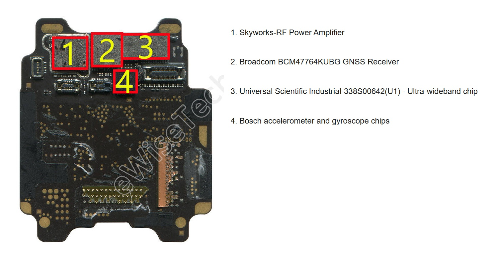

## Apple Watch Series 7

### Overview

The Apple Watch Series 7 supports GPS, GLONASS, Galileo, BeiDou, and QZSS.

There are two different versions of the S7 SiP, corresponding to the cellular and non-cellular Apple Watch Series 7. The Ultra-Wideband (UWB) chip is on the outside of the SiP in both models of the Apple Watch Series 7, cellular and non-cellular.

The GPS receiver is only on the outside of the cellular SiP for the Apple Watch Series 7. The teardown by [eWisetech](https://www.sohu.com/a/507056859_120062023) identifies the [BCM47764](../../../chipsets/broadcom/bcm-4776.md) as the GPS receiver, and multiple parts websites describe it as a spare part for the Apple Watch Series 7.

### Teardown

#### Apple Watch Series 7 (non-cellular)

It is assumed that like earlier models of the Apple Watch the GNSS chip is on the circuit board inside the SiP. Without a teardown of the non-cellular SiP the components inside the resin cannot be confirmed. 

The [YouTube](https://youtu.be/Y8bVrc_NecA?t=61) screenshot shows little on the outside of the S7 SiP, except the Bosch accelerometer / gyroscope (red) and the USI UWB chip (blue). These two components were identified from the teardown of the cellular SiP.

The SiP from the non-cellular Apple Watch Series 7 looks very similar to the non-cellular [Apple Watch Series 8](series-8.md) (see below). This photo of the S8 SiP from the non-cellular Apple Watch Series 8 was published by [TechInsights](https://www.techinsights.com/blog/apple-watch-series-8-teardown).

#### Apple Watch Series 7 (cellular)

The teardown by [eWisetech](https://www.sohu.com/a/507056859_120062023) shows the inside of the S7 (cellular) which clearly shows the addition of some cellular components.

- Intel - baseband processor (3)
- Avago - RF power amplifier (4)
- Qorvo - RF chip (9)

The other components are probably the same as the non-cellular S7, but the circuit board design will be different. The three main cellular components (3, 4, 9) are quite large and have displaced the Broadcom GNSS receiver to outside of the S7. The circuit board design looks somewhat similar to the S6, but they are also quite different.

The teardown also labels various components on the the outside of the cellular SiP.

- The Bosch accelerometer / gyroscope (4) and USI UWB chip (3) are in slightly different locations to the non-cellular SiP
- The Skyworks RF power amplifier (1) and Broadcom GNSS chip (2) are only present on the cellular SiP

It should be noted that the GNSS module (2) is square, corresponding to the [BCM47764KUBG](../../../chipsets/broadcom/bcm-4776.md) on parts websites.

### Summary

The Apple Watch Series 7 added support for [BeiDou](https://www.bbc.co.uk/news/technology-45471959) which became fully operational in [June 2020](https://www.bbc.co.uk/news/business-53132957).

In terms of GNSS hardware the Series 7 adopted Broadcom's [BCM47764](../../../chipsets/broadcom/bcm-4776.md) which replaced the [BCM47754](../../../chipsets/broadcom/bcm-4775.md).

The BCM47764 can be found on parts websites such as [integrated-ic.com](https://www.integrated-ic.com/sale-36831695-iphone-ic-chip-bcm47764kubg-gnss-receiver-bga-package-apple-watch-7-ic-chip.html), [chinax.com](https://www.chinax.com/integrated-ic/pz681d537-iphone-ic-chip-bcm47764kubg-gnss-receiver-bga-package-apple-watch-7-ic-chip.html), and [hkmjd.com](http://en.hkmjd.com/goods/show-935.html).

### Links

- [Teardown](https://www.sohu.com/a/507056859_120062023) - eWisetech, 10 Dec 2021
  - Teardown of the cellular Apple Watch Series 7 with the parts labelled
- [How to Disassemble/ Assemble the Apple Watch Series 7](https://youtu.be/Y8bVrc_NecA?t=61) - N world creations, 21 Jun 2024
  - Teardown of the non-cellular Apple Watch Series 7
- [Apple Watch Ultra + Series 7](https://www.ifixit.com/News/65598/apple-watch-ultra-is-beautiful-rugged-and-repairability-is-just-within-reach) - iFixIt, 27 Sep 2022
  - Nice [photo](https://valkyrie.cdn.ifixit.com/media/2022/09/26102339/Apple_Watch_Ultra-Series-7-Comparison.jpg) comparison of the SiP inside the Apple Watch Ultra and Series 7

- [Apple Watch 7 – new GPS & Wi-Fi Chips](https://the5krunner.com/2021/09/16/apple-watch-7-new-gps-chip-what-it-means/) - The5KRunner, 16 Sep 2021
  - Speculation about a new GNSS chip due to BeiDou support

- Parts websites such as [integrated-ic.com](https://www.integrated-ic.com/sale-36831695-iphone-ic-chip-bcm47764kubg-gnss-receiver-bga-package-apple-watch-7-ic-chip.html), [chinax.com](https://www.chinax.com/integrated-ic/pz681d537-iphone-ic-chip-bcm47764kubg-gnss-receiver-bga-package-apple-watch-7-ic-chip.html), and [hkmjd.com](http://en.hkmjd.com/goods/show-935.html)
  - The BCM47764 is described as GNSS receiver for the Apple Watch 7

