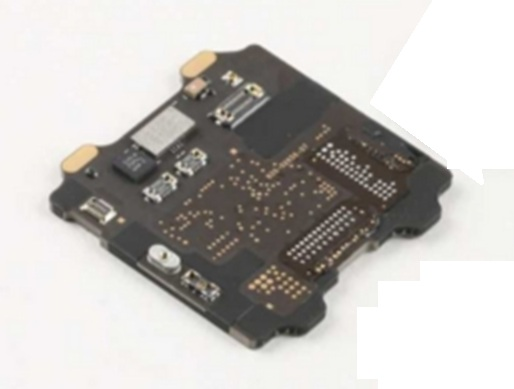
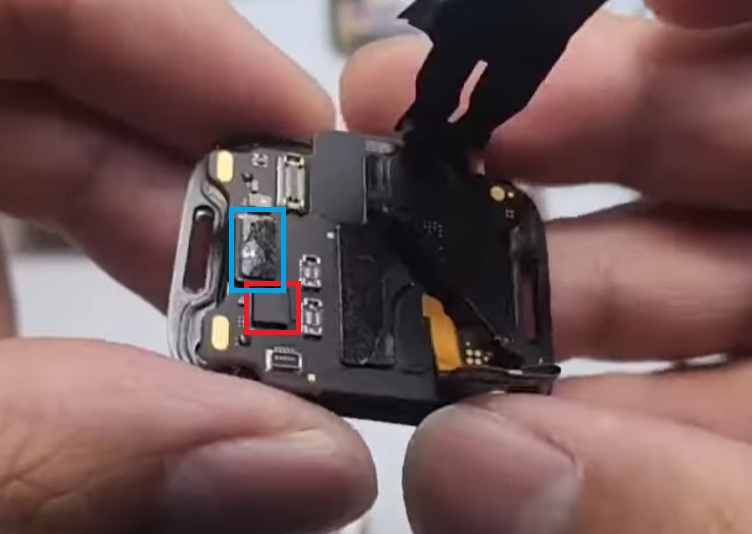

## Apple Watch Series 8

### Overview

The Apple Watch Series 8 was released at the same time as the Apple Watch SE 2 and Apple Watch Ultra. All three watches contain the S8 processor, but the SiP in the Apple Watch Series 8 is nothing like the Apple Watch SE 2 or Apple Watch Ultra.

The Apple Watch Series 8 supports GPS, GLONASS, Galileo, BeiDou, and QZSS, just like the Apple Watch Series 7.

There are two different versions of the SiP, corresponding to the cellular and non-cellular Apple Watch Series 8. The Ultra-Wideband (UWB) chip is on the outside of the SiP in both models of the Apple Watch Series 8, cellular and non-cellular.

### Teardown

#### Apple Watch Series 8 (non-cellular)

The [TechInsights](https://www.techinsights.com/blog/apple-watch-series-8-teardown) teardown shows little on the outside of the SiP, except the Bosch accelerometer / gyroscope and the USI UWB chip. It is assumed that like earlier models of the Apple Watch the GNSS chip is on the circuit board inside the SiP.

The external SiP connectors and components on the non-cellular Apple Watch Series 8 look very similar to the [Apple Watch Series 7](series-7.md) (see below). The components on the Apple Watch Series 7 are the Bosch accelerometer / gyroscope (red) and the USI UWB chip (blue).

#### Apple Watch Series 8 (cellular)

There may be some similarity between the cellular Apple Watch Series 8 and Apple Watch Series 9.

Perhaps the GNSS chip will be inside the SiP, just like the Apple Watch Series 9?

### Summary

Little is known about the components inside the Apple Watch Series 8.

In terms of GNSS hardware the Apple Watch Series 8 could be using the Broadcom [BCM47764](../../../chipsets/broadcom/bcm-4776.md) like the Apple Watch Series 7.

### Links

- [Teardown](https://www.techinsights.com/blog/apple-watch-series-8-teardown) of the non-cellular Apple Watch Series 8 45 mm - TechInsights
  - Limited information but provides a photo of the outside of the S8 SiP
- [Apple Watch Series 8 Motherboard Replacement Guide](https://youtu.be/VLSi1ueFSAI?t=564) - How-FixIT, 15 Jan 2025
  - Clear view of the SiP inside the non-cellular Apple Watch Series 8
- [Apple Watch Series 8 Disassembly & Repair Tutorial](https://youtu.be/Ck7RhYcsMZs?t=629) - How-FixIT, 5 Jan 2025
  - Clear view of the SiP inside the non-cellular Apple Watch Series 8
- [Apple Watch Ultra Teardown](https://www.youtube.com/watch?v=b4-lT12eSQs&t=214s) - iFixit, 26 Sep 2022
  - Comparison of the Apple Watch Series 8 and Apple Watch Ultra
