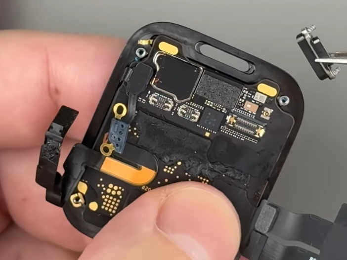

## Apple Watch Series 9

### Overview

The Apple Watch Series 9 was released at the same time as the Apple Watch Ultra 2. Both contain the S9 processor, but the SiP in the Apple Watch Series 9 is nothing like the Apple Watch Ultra 2. The Ultra 2 also supports multi-band GNSS using the L1 + L5 signals.

There are two different versions of the Apple Watch Series 9 SiP, corresponding to the cellular and non-cellular models. The U2 Ultra-Wideband (UWB) chip from USI is on the outside of the cellular SiP, but this is yet to be confirmed for the non-cellular model.

### Teardown

#### Apple Watch Series 9 (non-cellular)

The outside of the non-cellular SiP is yet to be seen, so little can be said about it at this time.

The Ultra-Wideband (UWB) chip may be on the inside of the non-cellular SiP, but the GNSS chip will certainly be inside the SiP.

#### Apple Watch Series 9 (cellular)

The outside of the cellular SiP has a few components, including some RF components, accelerometer / gyroscope and USI UWB chip.

The GNSS chip must be on the other side of the SiP, encased within the resin and thus tricky to identify.

### Summary

Little is known about the components inside the Apple Watch Series 9, especially the GNSS chip inside the SiP.

In terms of GNSS hardware the Apple Watch Series 9 could be using the Broadcom [BCM47764](../../../chipsets/broadcom/bcm-4776.md) like the Apple Watch Series 7.

### Links

- [Complete Apple Watch Series 9 Teardown](https://youtu.be/m2DaB80uEnw?t=846) - How-FixIT, 25 Apr 2025
  - View of the S9 SiP inside the cellular Apple Watch Series 9
- [Apple Watch Series 9 Full Teardown](https://youtu.be/lC2eko-DnkU?t=306) - Joe's Gaming & Electronics, 10 Jun 2025
  - View of the S9 SiP inside the cellular Apple Watch Series 9 41 mm
- [Apple Watch S9 and Ultra 2: Double Teardown](https://youtu.be/fYLLtDxT_sM?t=179) - iFixit, 24 Sep 2023
  - Brief glimpse of the S9 SiP inside the cellular Apple Watch Series 9

