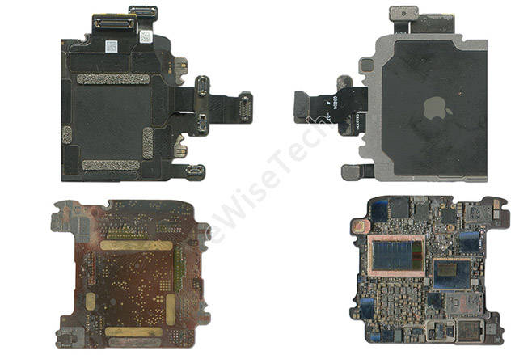
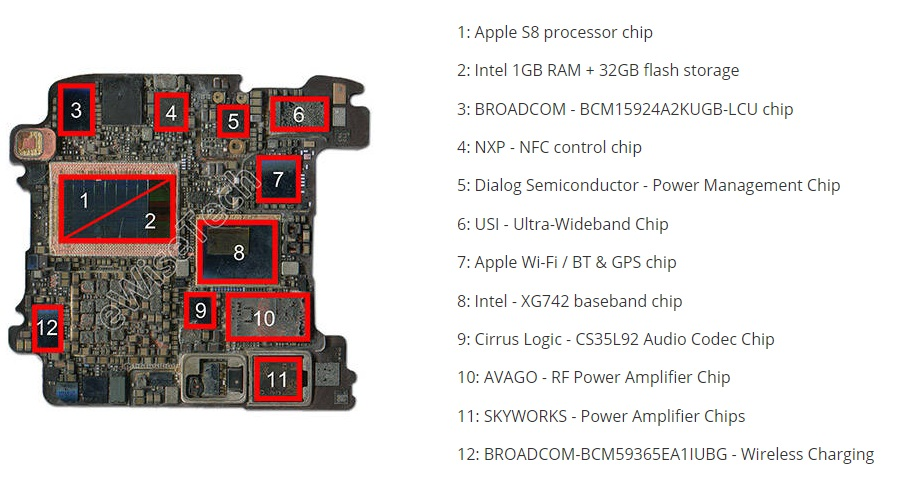

## Apple Watch Ultra

### Overview

The Apple Watch Ultra has multi-band GNSS and supports L1 + L5 for GPS, GLONASS, Galileo, BeiDou, and QZSS.

The SiP in the Apple Watch Ultra bears no resemblance to the Apple Watch Series 8 or Apple Watch SE (Gen 2).

There are no components on the outside of the SiP, so it needs to be decapped to identify the part numbers.

Possible candidates for the GNSS receiver include the Broadcom [BCM4776X](../../../chipsets/broadcom/bcm-4776.md) family - BCM47764, BCM47765, BCM47768.

### Teardown

The teardown from [eWisetech](https://www.sohu.com/a/637672302_120062023) shows that Apple Watch Ultra uses the first SiP without any components on the outside.

All of the components that would be expected are present inside the SiP, including the Skyworks Power Amplifier and USI Ultra-Wideband (UWB) chip that would typically be on the outside.

The one component that is not identified is the GNSS chip, which may be located between the Broadcom LCU chip (3) and NXP NFC chip (4). Comparing it to the Skyworks Power Amplifier and USI UWB chip, it resembles the shape and size of the [BCM47764](../../../chipsets/broadcom/bcm-4776.md) in the Apple Watch [Series 7](series-7.md).

The image above describes the Apple W3 Wi-Fi / BT chip (7) as supporting GPS, but this appears to be a recurrent error. The same description is also present in eWisetech teardowns for the [Series 4](series-4.md), [Series 6](series-6.md), and [SE (Gen 1)](se-1.md). There is no evidence that the Apple W3 Wireless chip supports GPS.

The anonymous component between the Broadcom LCU chip (3) and NXP NFC chip (4) cannot be the Neural Engine, because that is embedded in the Apple S8 Processor Chip as shown in the SOC die at [hubweb.cn](https://hubweb.cn/apple-silicon/chip-s/). Hover over the SOC die labels and double-click the images to view them in detail.

There are no other major components missing in the annotations by eWisetech, hence the belief that the anonymous component is the GNSS chip. Possible candidates include the Broadcom [BCM4776X](../../../chipsets/broadcom/bcm-4776.md) family - BCM47764, BCM47765, BCM47765.

### Summary

The Apple Watch Ultra supports multi-band GNSS (L1 + L5), possibly using a Broadcom GNSS chip.

There is an anonymous component in the teardown by eWisetech, which is likely to be the GNSS receiver.

Possible candidates include the Broadcom [BCM4776X](../../../chipsets/broadcom/bcm-4776.md) family - BCM47764, BCM47765, BCM47765.

It is not known whether the BCM47764 supports multi-band, unlike the BCM47765 + BCM47765.

### Links

- [Teardown](https://www.sohu.com/a/637672302_120062023) - eWisetech, 6 Feb 2023
  - Teardown of the cellular Apple Watch Ultra with the parts labelled
- [Apple Watch Ultra Teardown](https://www.youtube.com/watch?v=b4-lT12eSQs&t=214s) - iFixit, 26 Sep 2022
  - Comparison of the Apple Watch Series 8 and Apple Watch Ultra
- [Apple Watch Ultra + Series 8](https://www.ifixit.com/News/65598/apple-watch-ultra-is-beautiful-rugged-and-repairability-is-just-within-reach) - iFixIt, 27 Sep 2022
  - Comparison of the Apple Watch Ultra and Series 8, including a [photo](https://valkyrie.cdn.ifixit.com/media/2022/09/26102339/Apple_Watch_Ultra-Series-7-Comparison.jpg) of the SiP

