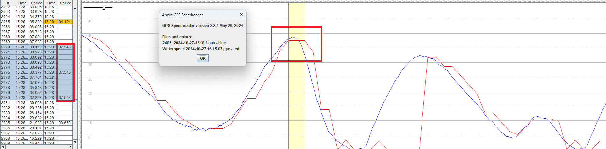

## Apple Watch Ultra

Author: Michael George

Created: 16 Nov 2024

### Overview

This is a very quick look at a single test of the Apple Watch Ultra, recorded using the Waterspeed app.

The data from the Apple Watch Ultra (red) has been compared against a 5 Hz Motion GPS (blue).

There are similarities in many places but also some big differences.

Here is the Apple and Motion data, should you wish to examine it for yourself.

- [ultra-data-20241017.zip](ultra-data-20241017.zip)

### Obvious Issues

#### Initial Acceleration

When zooming in to the the latter part of the session, initial periods of acceleration are not being recorded by the Apple watch.

#### Repeated Speeds

Zooming in further a little further it is also evident that identical speeds are being recorded. 3 seconds worth of 37.543 knots is highlighted.

### Expectations

Neither of the issues described above should be evident if a GPS device is faithfully recording speed data. The data below compares the Garmin Forerunner 255 (green) against a 1 Hz Motion (blue) and 5 Hz Motion (red), showing the Garmin doing a great job.

### Subtle Issues

In the interests of saving myself some time, subtle differences have not been written up in this short document.

### Summary

This is document is a quick illustration of two obvious issues affecting the Apple Watch Ultra.

- Lack of speed data during initial periods of acceleration
- Identical speeds being recorded for multiple seconds, suggesting timing issues, duty cycling or filtering.

Neither of these issues should be evident if a GPS device is faithfully recording speed data.
