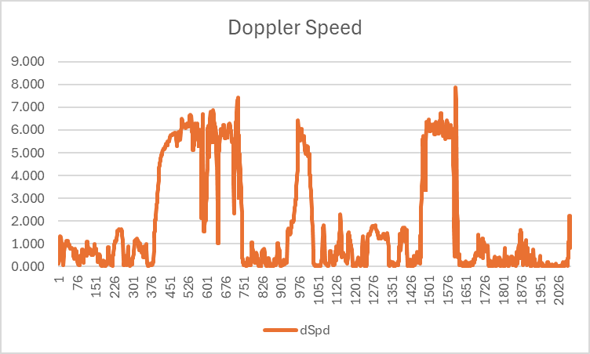

## Apple Watches

### Doppler-Derived Speeds

This page looks at a number of wingfoiling and kiteboarding sessions recorded on a selection of Apple Watches.

It focuses on the speeds calculated by the GNSS chipsets (almost certainly using the Doppler observables).

Notes:

- The charts are very basic in nature (e.g. simple legends and lack of axis labels), saving time during production.
- The units for speed are m/s, but you can double the values to approximate the speed in knots.
- The data was recorded without any filters applied, thus showing the true nature of the raw GNSS data.

### Apple Watch Ultra

#### Apple Watch Ultra #1 - Wingfoiling

The Doppler speeds are quite plausible for this particular session, peaking at around 9 m/s (approximately 18 knots).

#### Apple Watch Ultra #2 - Wingfoiling

The Doppler speeds are quite plausible for this particular session, peaking at around 8 or 9 m/s (approximately 16-18 knots).

During this session it is almost certain that the fastest speed was actually a spike.

#### Apple Watch Ultra #3 - Kitesurfing

The Doppler speeds are quite plausible for this particular session, peaking at around 10 or 11 m/s (approximately 20-22 knots).

#### Apple Watch Ultra #4 - Wingfoiling

The Doppler speeds are quite plausible for this particular session, peaking at around 10 m/s (approximately 20 knots).

During this session it is almost certain that the fastest speed was actually a spike.

### Apple Watch SE 40 mm Cellular

#### Apple Watch SE 40 mm Cellular #1 - Kiteboarding (or maybe Wingfoiling)

The Doppler speeds are quite plausible for this particular session, peaking at just over 8 m/s (exceeding 16 knots).

### Apple Watch SE 44 mm

#### Apple Watch SE 44 mm #1 - Kiteboarding

The Doppler speeds are quite plausible for this particular session, peaking at around 10 m/s (approximately 20 knots).

### Apple Series 8 45 mm Cellular

A further investigation might wish to look into whether the cellular models of Apple Watches suffer from RF interference?

#### Apple Series 8 45 mm Cellular #1 - Kiteboarding

The Doppler speeds are quite plausible for this particular session, peaking at around 15 m/s (approximately 30 knots).

During this session it is almost certain that the fastest speed was actually a spike.

#### Apple Series 8 45 mm Cellular #2 - Kiteboarding

The Doppler speeds are quite plausible for this particular session, peaking at about 12.5 m/s (approximately 25 knots).

During this session it is almost certain that the fastest speed was actually a spike.

### Apple Watches Series 5

#### Apple Watches Series 5 #1 - Wingfoiling

The Doppler speeds are quite plausible for this particular session, peaking at around 8 m/s (approximately 16 knots).

During this session it is quite possible that the fastest speeds were actually spikes.

#### Apple Watches Series 5 #2 - Wingfoiling

The Doppler speeds are quite plausible for this particular session, peaking at around 8 m/s (approximately 16 knots).

During this session it is almost certain that the fastest speed was actually a spike.

### Summary

- Speeds calculated by the devices (almost certainly using the Doppler observables) are relatively plausible.
- Spikes are still evident in the data but can potentially be identified using the speed accuracy estimates.
