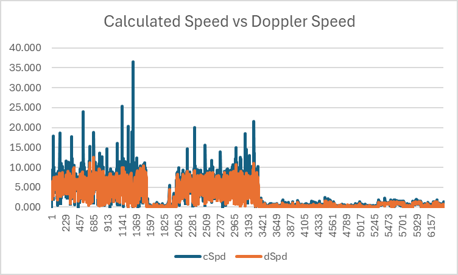

## Apple Watches

### Apple Watch (possibly Series 8 or SE)

This session is from an Apple Watch (possibly Series 8 or SE), recorded whilst Kiteboarding.

#### Calculated Speed vs Doppler Speed

This graph illustrates the difference between speeds calculated by software using latitude + longitude (shown in blue), versus speeds calculated by the GNSS receiver itself (almost certainly) using the Doppler observables (shown in orange). Large spikes are clearly evident in speeds calculated from latitude and longitude (shown in blue), especially after a crash / fall.

Note: The units used for speeds are m/s but you can estimate the speed in knots by doubling the m/s.

Ignoring occasions when the Doppler-derived speed is < 5 m/s (approximately 10 knots) the largest spike in speeds calculated from latitude and longitude disappears, likely due to submersions of the GNSS receiver. However, when such spikes are removed it is still clear that speeds calculated from latitude and longitude are often much higher than the Doppler-derived speeds.

#### Doppler Speed

The Doppler speeds are quite plausible for this particular session, peaking at over 12 m/s (approximately 24 knots). Without having a trusted device as a benchmark, little can be said about the actual accuracy and thus the simple statement "plausible".

#### Doppler Speeds vs Accuracy Estimates

It has already been observed that crashes / falls will often cause spikes when speeds are calculated by software using latitudes and longitudes. It should be noted that Doppler speeds are generally far more robust than the speeds calculated from latitudes and longitudes, but they can (and will) be prone to inaccuracies when the tracking of GNSS signals is impaired.

The most common causes of accuracy issues affecting the Doppler-derived speeds will usually be the result of a submersion. This can be observed in the graph below, showing that speed (in)accuracy estimates are most affected during a fall / crash. These are almost certainly being caused by submersions, when the GNSS signal tracking is severely impaired (or lost entirely).

The highest speed of the session was slightly over over 12 m/s (approximately 24 knots) and was recorded at around point 685. This was quite likely to be a "spike" due to the speed accuracy estimate (orange) being around 2 m/s. This serves as a simple illustration of where the speed accuracy estimate can be useful in identifying spikes.

#### Doppler Speed Accuracy during Crashes

To see how the speed (in)accuracy estimates can be affected during crashes / falls take a look at the graph below, which compares the speed accuracy estimate at all times, versus when the speed is over 5 m/s (approximately 10 knots).

The chart shows how the speed accuracy estimate is quite variable even under normal circumstances, such as when on the rider is travelling at a speed in excess of 5 m/s (approximately 10 knots).

Note: The use of 5 m/s is somewhat arbitrary but works well for the purposes of this illustration.

#### Typical Doppler Speed Accuracy

It is possible to determine "typical" speed (in)accuracy estimates for this GNSS receiver when the rider is exceeding 5 m/s (approximately 10 knots). During this session the median speed accuracy estimate is 1.22, mean is 1.25 and σ is 0.25.

There are a lot of times where the speed accuracy estimate is between 1.5 m/s and 2.0 m/s, indicating possible issues with the accuracy of speeds being reported.

#### Possible Spike

The highest speed reported during the session was around 12.5 m/s (roughly 25 knots), but it appears likely that it is a spike. It is very much an outlier when compared to the typical speeds average around 4 or 5 m/s (roughly 8 to 10 knots).

The variability in the speed accuracy estimate in the track is somewhat unusual and exceeds 1.5 m/s at the top speed. The track is quite hard to assess for accuracy due to the relatively low speeds an variability in speed accuracy estimates.

A speed accuracy filter of 1.5 m/s is probably quite useful for this session.

#### Summary

This is a very brief piece of analysis for a single session which serves to illustrate some key points. It is by no means a comprehensive analysis and it does not compare this specific device against a known / reliable benchmark device.

However, simple takeaways are as follows:

- Speeds calculated in software from longitude and latitude can be extremely unreliable.
- Speeds calculated by the device itself (almost certainly using the Doppler observables) are far more robust.
- Typical speed accuracy estimates can easily be determined for this specific GNSS receiver.
- General interpretation of speed accuracy estimates is a complex topic and has not been discussed in detail.
