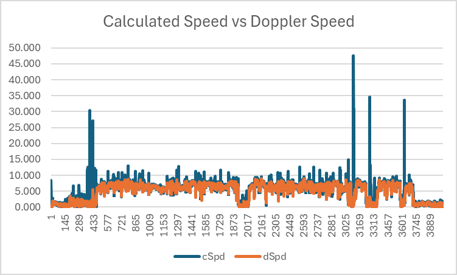
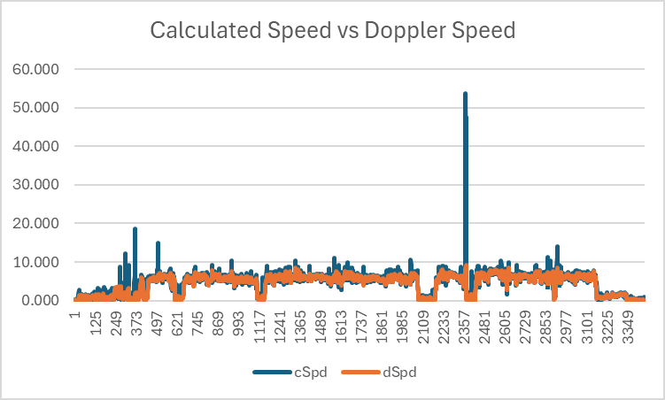
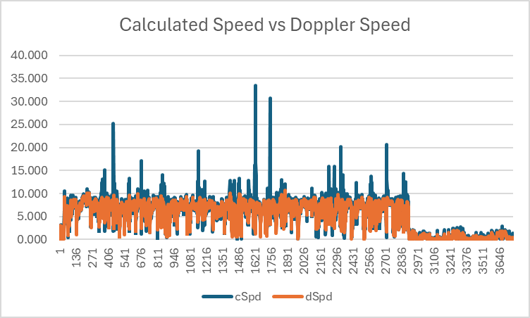
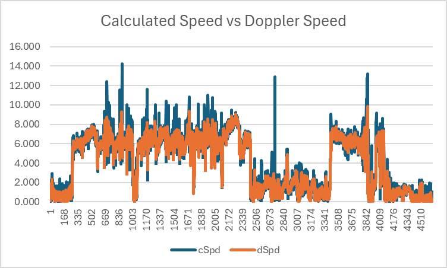
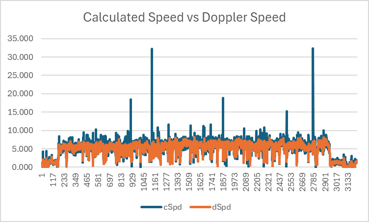
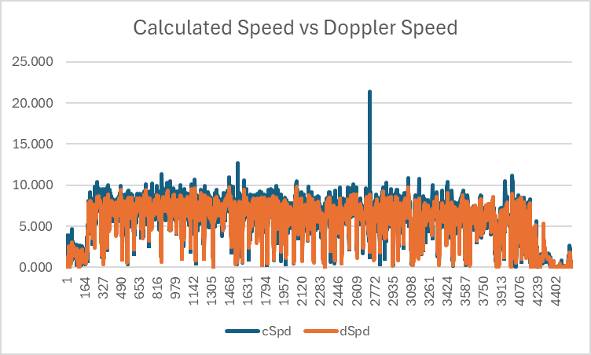
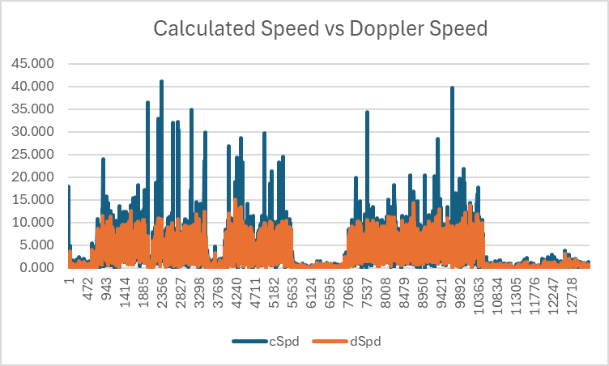
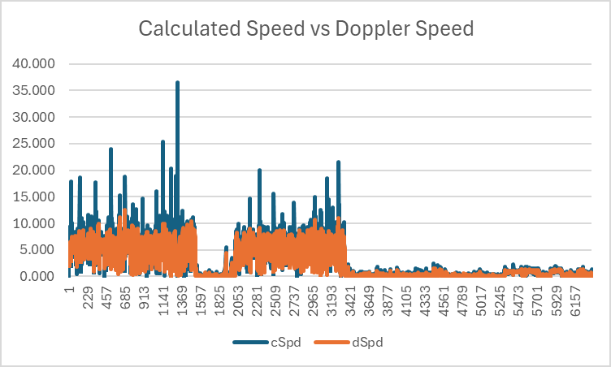
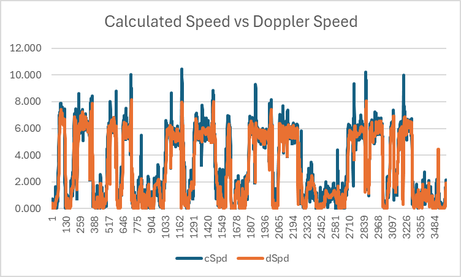

## Apple Watches

### Speed Comparisons

This page looks at a number of wingfoiling and kiteboarding sessions recorded on a selection of Apple Watches.

It focuses on the difference between software-calculated speeds (simply using latitudes and longitudes), versus speeds calculated by the GNSS chipsets (almost certainly using the Doppler observables).

Notes:

- The charts are very basic in nature (e.g. simple legends and lack of axis labels), saving time during production.
- The data was recorded without any filters applied, thus showing the true nature of the raw GNSS data.
- Whilst standard speed sailing filters can remove some spikes in the software-calculated speeds, they are not 100% effective.
- Doppler-derived speeds are far more robust than software-calculated speeds that rely on longitudes and latitudes.

### Apple Watch Ultra

#### Apple Watch Ultra #1 - Wingfoiling

Large spikes are clearly evident in speeds calculated from latitude and longitude, especially after a crash / fall.

#### Apple Watch Ultra #2 - Wingfoiling

A large spike is clearly evident in speeds calculated from latitude and longitude, likely due to a crash / fall.

#### Apple Watch Ultra #3 - Kitesurfing

Large spikes are clearly evident in speeds calculated from latitude and longitude, especially after a crash / fall.

#### Apple Watch Ultra #4 - Wingfoiling

Large spikes are clearly evident in speeds calculated from latitude and longitude, especially after a crash / fall.

### Apple Watch SE 40 mm Cellular

#### Apple Watch SE 40 mm Cellular #1 - Kiteboarding (or maybe Wingfoiling)

Large spikes are clearly evident in speeds calculated from latitude and longitude, especially after a crash / fall.

### Apple Watch SE 44 mm

#### Apple Watch SE 44 mm #1 - Kiteboarding

A large spike is clearly evident in speeds calculated from latitude and longitude, likely due to a crash / fall.

### Apple Series 8 45 mm Cellular

A further investigation might wish to look into whether the cellular models of Apple Watches suffer from RF interference?

#### Apple Series 8 45 mm Cellular #1 - Kiteboarding

Large spikes are clearly evident in speeds calculated from latitude and longitude, especially after a crash / fall.

#### Apple Series 8 45 mm Cellular #2 - Kiteboarding

Large spikes are clearly evident in speeds calculated from latitude and longitude, especially after a crash / fall.

### Apple Watches Series 5

#### Apple Watches Series 5 #1 - Wingfoiling

Significant spikes are clearly evident in speeds calculated from latitude and longitude, especially after a crash / fall.

#### Apple Watches Series 5 #2 - Wingfoiling

Significant spikes are clearly evident in speeds calculated from latitude and longitude, especially after a crash / fall.

### Summary

- Speeds calculated in software from longitude and latitude can be extremely unreliable.
- Speeds calculated by the devices (almost certainly using the Doppler observables) are far more robust.
