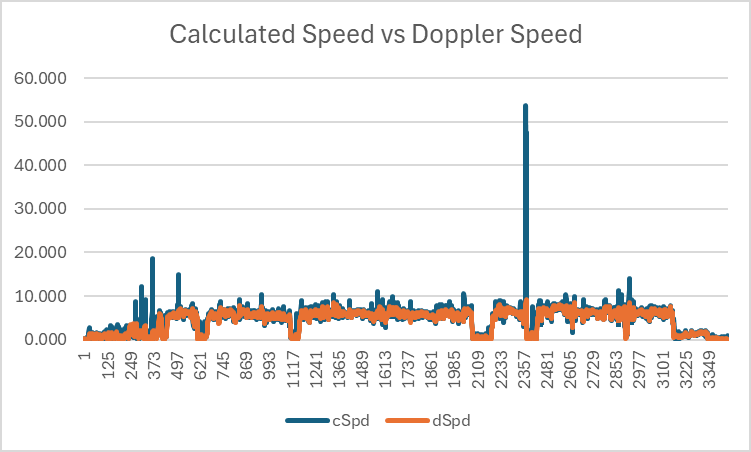
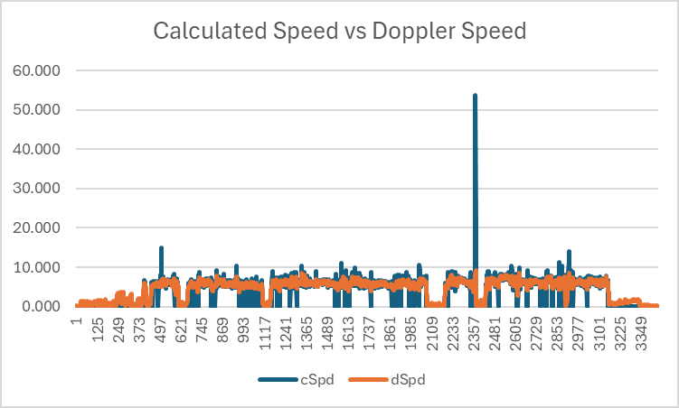
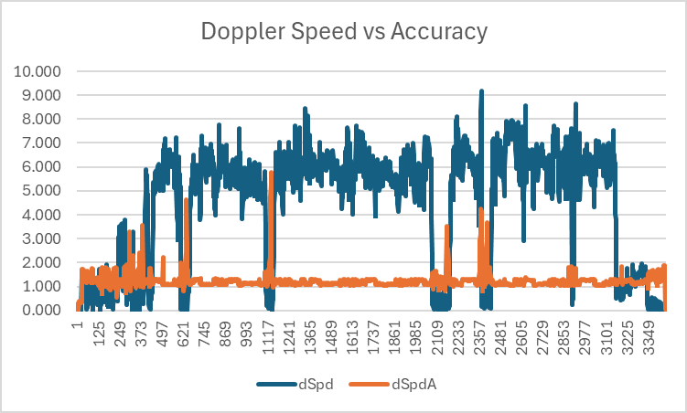
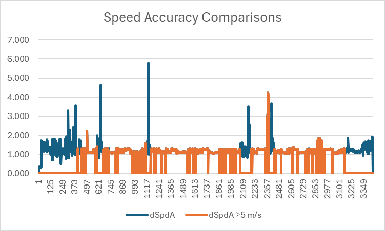
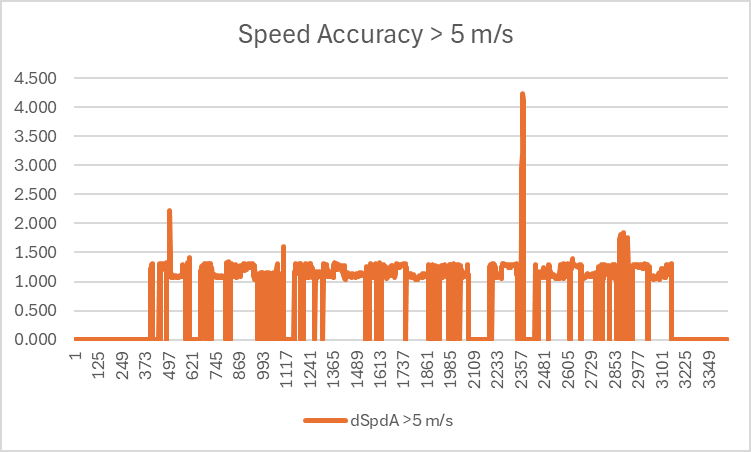
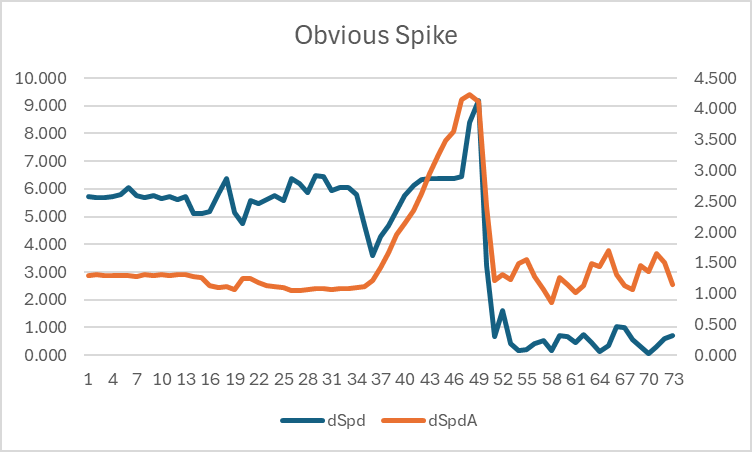

## Apple Watches

### Apple Watch Ultra #2

This session is from an Apple Watch Ultra, recorded whilst Wingfoiling.

#### Calculated Speed vs Doppler Speed

This graph illustrates the difference between speeds calculated by software using latitude + longitude (shown in blue), versus speeds calculated by the GNSS receiver itself (almost certainly) using the Doppler observables (shown in orange). A large spike is clearly evident in speeds calculated from latitude and longitude (shown in blue), likely due to a crash / fall.

Note: The units used for speeds are m/s but you can estimate the speed in knots by doubling the m/s.

Ignoring occasions when the Doppler-derived speed is < 5 m/s (approximately 10 knots) several of the larger spikes in speeds calculated from latitude and longitude disappear, likely due to submersions of the GNSS receiver. However, when those spikes are removed it is still clear that speeds calculated from latitude and longitude are often higher than the Doppler-derived speeds.

#### Doppler Speed

The Doppler speeds are quite plausible for this particular session, peaking at around 8 or 9 m/s (approximately 16-18 knots). Without having a trusted device as a benchmark, little can be said about the actual accuracy and thus the simple statement "plausible".

During this session it is almost certain that the fastest speed was actually a spike.

#### Doppler Speeds vs Accuracy Estimates

It has already been observed that crashes / falls will often cause spikes when speeds are calculated by software using latitudes and longitudes. It should be noted that Doppler speeds are generally far more robust than the speeds calculated from latitudes and longitudes, but they can (and will) be prone to inaccuracies when the tracking of GNSS signals is impaired.

The most common causes of accuracy issues affecting the Doppler-derived speeds will usually be the result of a submersion. This can be observed in the graph below, showing that speed (in)accuracy estimates are most affected during a fall / crash. These are almost certainly being caused by submersions, when the GNSS signal tracking is severely impaired (or lost entirely).

The highest speed of the session was slightly over 9 m/s (over 18 knots) and was recorded at around point 2357. This was almost certainly a "spike" due to the speed accuracy estimate (orange) exceeding 4 m/s. This serves as a simple illustration of where the speed accuracy estimate can be useful in identifying spikes. This was almost certainly a submersion during a fall / crash.

#### Doppler Speed Accuracy during Crashes

To see how the speed (in)accuracy estimates can be affected during crashes / falls take a look at the graph below, which compares the speed accuracy estimate at all times, versus when the speed is over 5 m/s (approximately 10 knots).

The chart shows how the speed accuracy estimate is relatively stable under normal circumstances, such as when on the rider is travelling at a speed in excess of 5 m/s (approximately 10 knots).

The worst speed accuracy estimate was over 4 m/s (over 8 knots) and was recorded at around point 2357. This was almost certainly a submersion during a fall / crash and the speed at this time should be deemed invalid.

Note: The use of 5 m/s is somewhat arbitrary but works well for the purposes of this illustration.

#### Typical Doppler Speed Accuracy

It is possible to determine "typical" speed (in)accuracy estimates for this GNSS receiver when the rider is exceeding 5 m/s (approximately 10 knots). During this session the median speed accuracy estimate is 1.14, mean is 1.19 and σ is 0.18.

As mentioned earlier, the worst speed accuracy estimate was over 4 m/s (over 8 knots) and was recorded at around point 2357. This was almost certainly a submersion during a fall / crash and the speed at this time should be deemed invalid.

#### Obvious Spike

As mentioned earlier, the worst speed accuracy estimate during this session was over 4 m/s (over 8 knots) and was recorded at around point 2357.

Looking at this more closely, it can be seen that it was definitely a spike. The speed (shown in blue) had fallen from around 6 m/s (12 knots) to under 4 m/s (8 knots) then the speed accuracy estimate (shown in orange) began to rise, ending at just over 4 m/s.

At this same time the reported speed rose to over 9 m/s (18 knots) which was the highest reported speed during the session, but it was obviously a spike due to a crash / fall, and the watch was probably submerged.

It is also worth noting that during this period, speeds calculated using latitudes and longitudes were in excess of 53 m/s, over 107 knots. The Doppler spike was just over 18 knots, but speed from longitude and latitude was around 107 knots!

#### Summary

This is a very brief piece of analysis for a single session which serves to illustrate some key points. It is by no means a comprehensive analysis and it does not compare this specific device against a known / reliable benchmark device.

However, simple takeaways are as follows:

- Speeds calculated in software from longitude and latitude can be extremely unreliable.
- Speeds calculated by the device itself (almost certainly using the Doppler observables) are far more robust.
- Typical speed accuracy estimates can easily be determined for this specific GNSS receiver.
- General interpretation of speed accuracy estimates is a complex topic and has not been discussed in detail.
