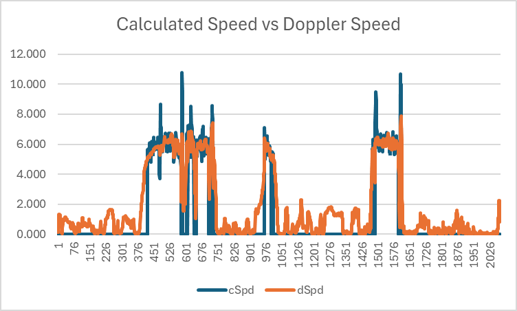
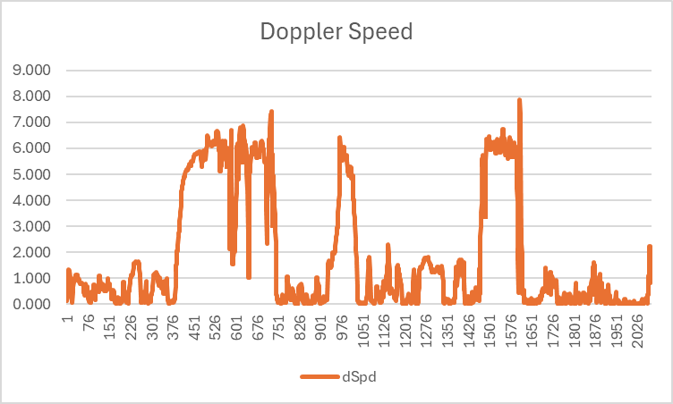
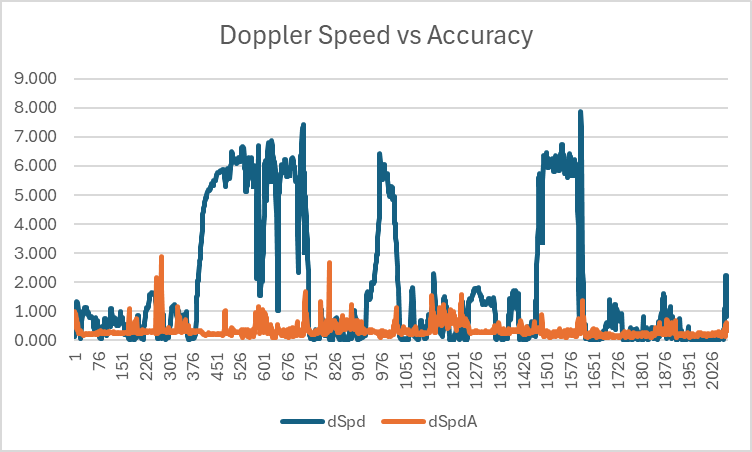
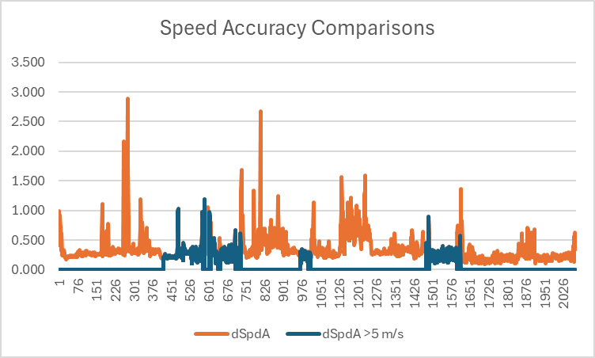
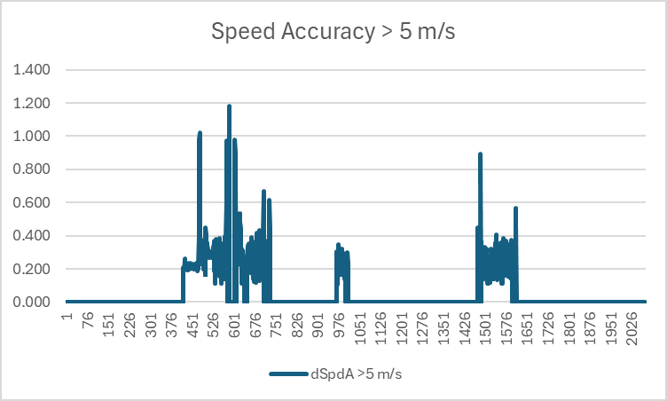
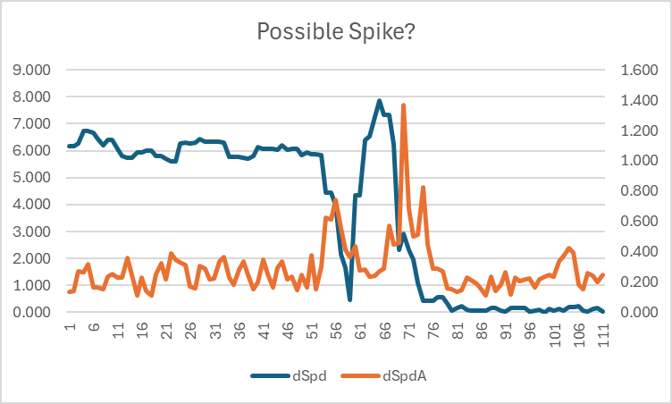

## Apple Watches

### Apple Watch Series 5 #2

This session is from an Apple Watch Series 5, recorded whilst Wingfoiling.

#### Calculated Speed vs Doppler Speed

This graph illustrates the difference between speeds calculated by software using latitude + longitude (shown in blue), versus speeds calculated by the GNSS receiver itself (almost certainly) using the Doppler observables (shown in orange). Large spikes are clearly evident in speeds calculated from latitude and longitude (shown in blue), especially after a crash / fall.

Note: The units used for speeds are m/s but you can estimate the speed in knots by doubling the m/s.

Ignoring occasions when the Doppler-derived speed is < 5 m/s (approximately 10 knots) several of the larger spikes in speeds calculated from latitude and longitude disappear, likely due to submersions of the GNSS receiver. However, when those spikes are removed it is still clear that speeds calculated from latitude and longitude are often higher than the Doppler-derived speeds.

#### Doppler Speed

The Doppler speeds are quite plausible for this particular session, peaking at around 8 m/s (approximately 16 knots). Without having a trusted device as a benchmark, little can be said about the actual accuracy and thus the simple statement "plausible".

During this session it is almost certain that the fastest speed was actually a spike which will be discussed later on this page.

#### Doppler Speeds vs Accuracy Estimates

It has already been observed that crashes / falls will often cause spikes when speeds are calculated by software using latitudes and longitudes. It should be noted that Doppler speeds are generally far more robust than the speeds calculated from latitudes and longitudes, but they can (and will) be prone to inaccuracies when the tracking of GNSS signals is impaired.

The most common causes of accuracy issues affecting the Doppler-derived speeds will usually be the result of a submersion. This can be observed in the graph below, showing that speed (in)accuracy estimates are most affected during a fall / crash. These are almost certainly being caused by submersions, when the GNSS signal tracking is severely impaired (or lost entirely).

The highest speed of the session was around 8 m/s (approximately 16 knots) and was recorded at around point 1610. This was almost certainly a "spike" but determining this fact from the speed accuracy estimate is not trivial.

#### Doppler Speed Accuracy during Crashes

To see how the speed (in)accuracy estimates can be affected during crashes / falls take a look at the graph below, which compares the speed accuracy estimate at all times, versus when the speed is over 5 m/s (approximately 10 knots).

The chart shows how the speed accuracy estimate is relatively stable under normal circumstances, such as when on the rider is travelling at a speed in excess of 5 m/s (approximately 10 knots).

However, closer inspection of the data reveals that the best speed of the track was around point 1610 and almost certainly a spike. The evidence for this will be discussed shortly.

Note: The use of 5 m/s is somewhat arbitrary but works well for the purposes of this illustration.

#### Typical Doppler Speed Accuracy

It is possible to determine "typical" speed (in)accuracy estimates for this GNSS receiver when the rider is exceeding 5 m/s (approximately 10 knots). During this session the median speed accuracy estimate is 0.26, mean is 0.29 and σ is 0.15.

Closer inspection of the data reveals that the best speed of the track was around point 1610 and almost certainly a spike. The evidence for this will be discussed in the next section of this document.

#### Possible Spike

The top speed in this track was just under 8 m/s (around 16 knots) but it was almost certainly a spike caused by a crash / fall and subsequent submersion of the watch.

Zooming in to the area of interest it can be seen that the Doppler-derived speed (shown in blue) suddenly decreased whilst the speed accuracy estimate began to increase (shown in orange). The speed then increased to almost 8 m/s (16 knots) over the period of about 6 seconds, but the worst speed accuracy estimate was another 5 seconds after the actual spike.

A simple filter based on a speed accuracy threshold is therefore not adequate for detecting some issues. However, intelligent filters can potentially be used to identify periods of time where speeds may be invalid; e.g. between points 53 and 78.

It should be noted that the speed calculated from latitude and longitude is affected even more at this point in time, peaking at more than 11 m/s (22 knots) when in reality the rider was in the water, stationary.  

#### Summary

This is a very brief piece of analysis for a single session which serves to illustrate some key points. It is by no means a comprehensive analysis and it does not compare this specific device against a known / reliable benchmark device.

However, simple takeaways are as follows:

- Speeds calculated in software from longitude and latitude can be extremely unreliable.
- Speeds calculated by the device itself (almost certainly using the Doppler observables) are far more robust.
- Typical speed accuracy estimates can easily be determined for this specific GNSS receiver.
- General interpretation of speed accuracy estimates is a complex topic and has not been discussed in detail.
