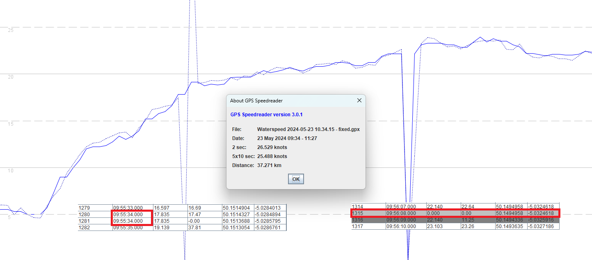
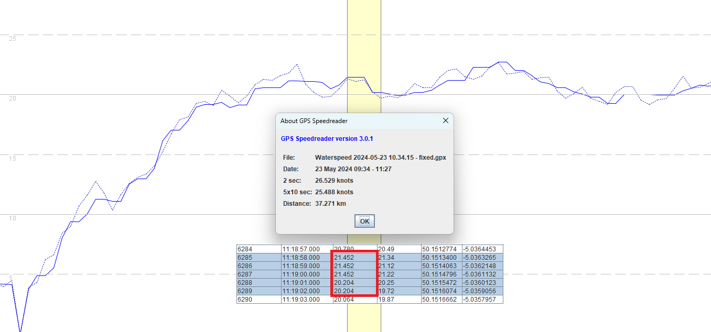
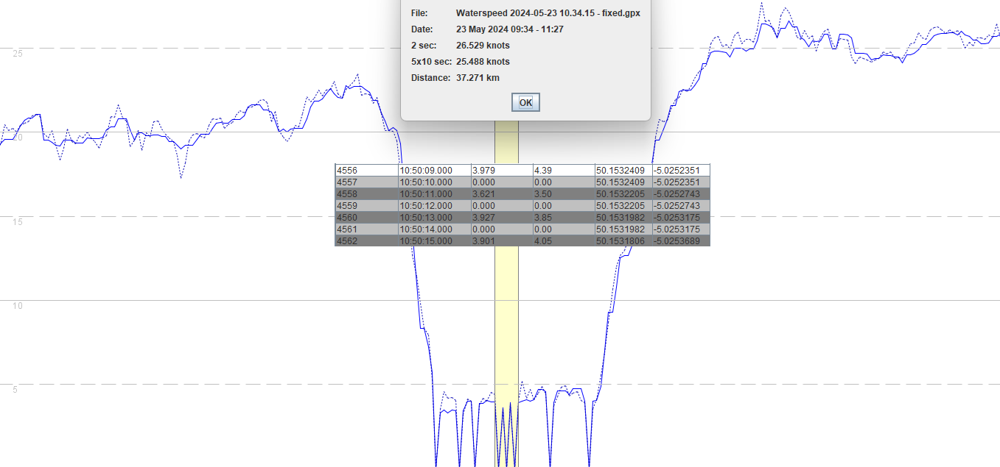
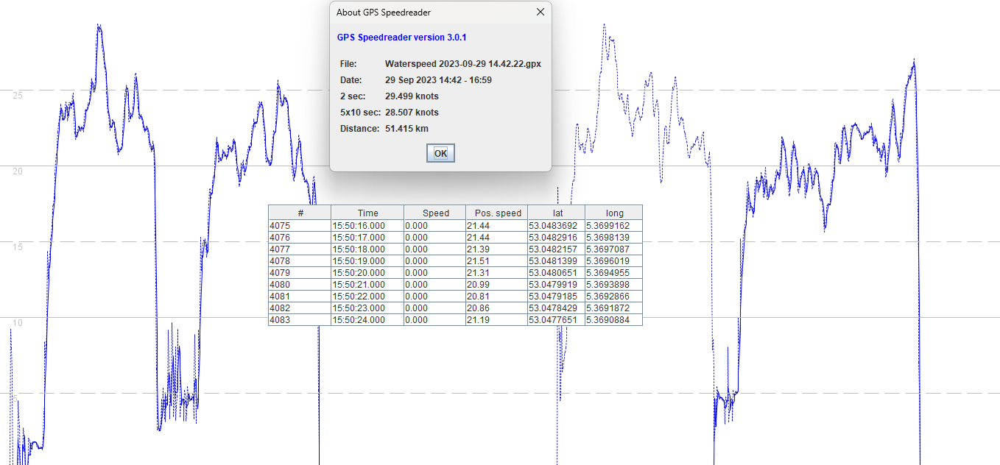

## Waterspeed

Date created: 5 Feb 2025

### Introduction

This document describes some data quality issues that are present in the GPX exports of Waterspeed.

Five issues have been documented for the transparency, and the benefit of anyone trying to use the GPX files for analysis.

1. Timestamps
2. Repeated speeds
3. Missing points
4. Missing speeds
5. GPX compliance

Each of the issues will be described in the following sections.

### 1. Timestamps

The screenshot below shows two glitches which are caused by timestamp issues:

- 09:55:34 is used twice, affecting speeds calculated from latitude and longitude (dotted blue line).
- 09:56:09 is missing, affecting analysis that relies upon contiguous Doppler-derived speeds.

It is important to note that the underlying data (latitude + longitude + speed) is contiguous, and it is probably related to the handling of Apple timestamps. In reality the Apple timestamps probably hover around whole-second boundaries and differences between .999 and .001 are causing issues.

Waterspeed just needs to round the precise timestamps (e.g. 999 ms or 1 ms) to the nearest whole-second boundary, prior to the GPX export.

### 2. Repeated Speeds

It has been observed that multiple Apple Watches have a tendency for Waterspeed to record the same speed for 2 or 3 seconds in a row.

This does not reflect the true board speed and the cause of this issue is unclear. but it affects almost every session.

This issue affects every Apple watch that has been tested - Apple Watch Series 6, Apple Watch Series 7, Apple Watch Ultra, Apple Watch Ultra 2.

### 3. Missing Points

There is an abundance of missing points in the GPX files created by Waterspeed, typically at low speeds.

The screenshot below shows a number of missing points but 3 have been highlighted.

- 10:50:10
- 10:50:12
- 10:50:14

These missing points are undesirable because they affect speed-based distance calculations and speed categories such as 30 mins and 60 mins. They also cause files to be rejected by GPS-Speedsurfing because they are so numerous.

### 4. Missing Speeds

The image below shows 4 runs from an Apple Watch Ultra, but the third run is clearly missing the Doppler-derived speed data.

The position-derived speeds (dotted blue line) are based on the recorded changes in latitude and longitude.

This particular example is from an Apple Watch Ultra. It is unclear whether this is a common issue, or a one-off.

### 5. GPX Compliance

Waterspeed has 4 different GPX exports which is confusing to users.

- Garmin
- Google
- GPSAR
- Strava

It would appear that the different variants have been created in response to the various apps handling non-compliant GPX files in different ways. There only needs to be one GPX export in Waterspeed, which should be GPX 1.1 compliant.

The required changes have been documented at [https://logiqx.github.io/gps-wizard/gpx/issues/waterspeed.html](https://logiqx.github.io/gps-wizard/gpx/issues/waterspeed.html)

### Summary

The issues described above appear to affect every model of Apple Watch when using Waterspeed.

Ideally they should be resolved to ensure the integration of Waterspeed with GPS-Speedsurfing produces reliable results.
