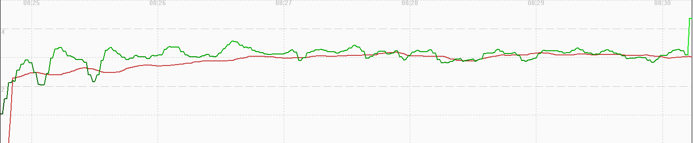
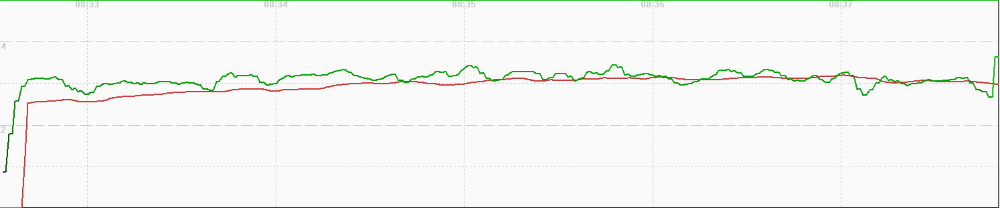
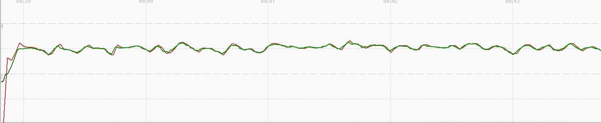
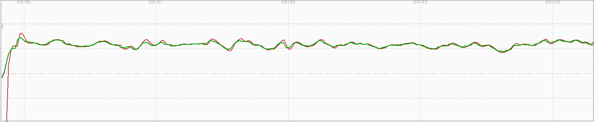
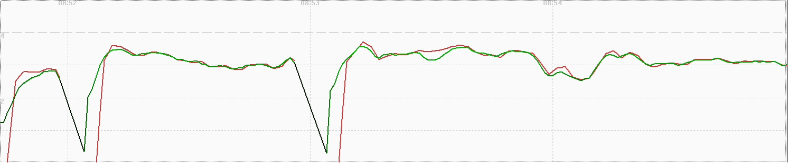

## COROS Activity Testing

Author: Michael George

Created: 9 July 2024

### Overview

This page documents activity testing that was performed on 2024-05-27.

- COROS APEX 2 Pro
  - Run
  - Hike
  - Flatwater
  - Bike
  - Windsurfing

The testing was relatively unstructured but has been documented for completeness.

### Data

All of the FIT data is available for download in ZIP format:

- [2024-05-27-walking-coros.zip](2024-05-27-walking-coros.zip) - APEX 2 Pro

### Observations

#### Run

The image below shows how speed (red) is heavily smoothed. Positional data (green) is also smoothed, but not as much as the speed data. Note that the beginning of the walk included some cornering.

#### Hike

The image below shows how speed (red) is heavily smoothed. Positional data (green) is also smoothed, but not as much as the speed data. After a minute or so the hike looks much like the walk.

#### Flatwater

The image below shows how position-derived speed and Doppler-derived speed are very similar. There are some fluctuations, but speed and position are clearly smoothed.

#### Bike

The image below shows how position-derived speed and Doppler-derived speed are very similar. There are some fluctuations, but speed and position are clearly smoothed.

Note there were a couple of periods where I briefly stopped walking!

####  Windsurfing

The image below shows how position-derived speed and Doppler-derived speed are very similar. There are some fluctuations, but speed and position are clearly smoothed.

Note there were a couple of periods where I briefly stopped walking!

### Summary

Run / Hike:

- Speed is heavily smoothed.
- Position is smoothed, but not as much as speed.

Flatwater / Bike / Windsurfing:

- Position-derived speed and Doppler-derived speed are very similar
- Some fluctuations, but clearly smoothed.
- Intriguing that the smoothing of speed and position produces similar results.