## COROS Activity Testing

Author: Michael George

Created: 10 July 2024

### Overview

This page documents activity testing that was performed on 2024-06-30, whilst driving around a short circuit.

It compares the performance of several activity types, prior to testing the beta firmware on 1 July 2024.

- COROS APEX 2 Pro - Firmware V3.0408.0
  - Hike
  - Bike
  - Flatwater
  - Speedsurfing
  - Climbing
  - Custom Activity - Sailing

1 Hz and 5 Hz data was also collected using Motion Minis.

The devices were carried as shown in this photograph, including a Garmin Forerunner 255 on the right:

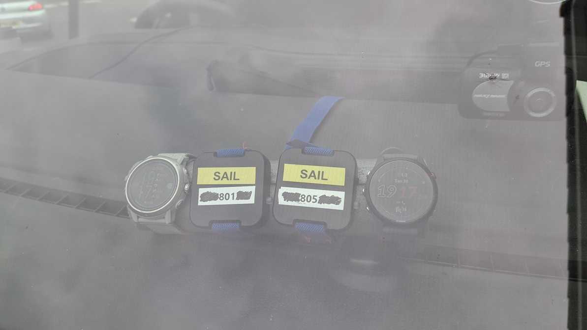

### Data

All of the FIT data is available for download in ZIP format:

- [2024-06-30-driving-apex-2-pro.zip](2024-06-30-driving-apex-2-pro.zip) - APEX 2 Pro

The OAO data from the Motions is available for download in ZIP format:

- [2024-06-30-driving-motion.zip](2024-06-30-driving-motion.zip) - Motions @ 1 Hz and 5 Hz

### Observations

#### Hike

The image below shows how position-derived speed (green) and Doppler-derived speed (red) differ.

The position-derived speed data exhibits steps (green), and large dips + plateaus are clearly evident in the Doppler-derived speed data (red).

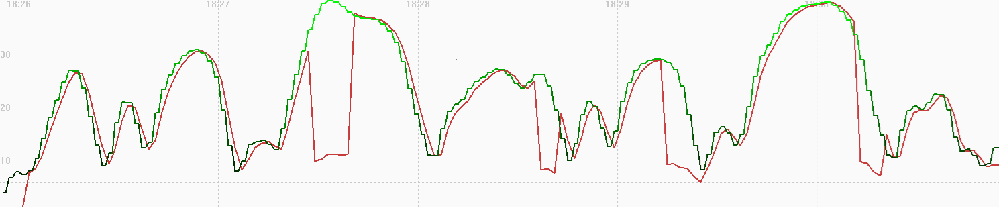

A comparison of 5 Hz Motion data (red), 1 Hz Motion data (blue) and 1 Hz COROS data (green) shows the speed related issues for this activity type.

Large dips and plateaus are clearly evident in the COROS speed data (green).

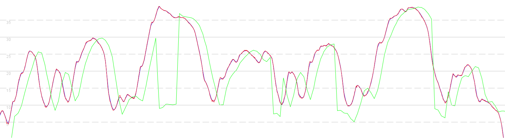

#### Bike

The image below shows how position-derived speed (green) and Doppler-derived speed (red) differ.

This position-derived speeds contain strange spikes, and the speed data exhibits a lot of smoothing.

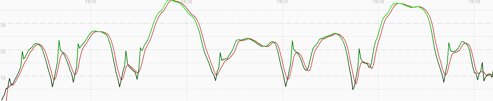

A comparison of 5 Hz Motion data (red), 1 Hz Motion data (blue) and 1 Hz COROS data (green) shows the reasonable performance of this activity type.

This COROS speed data is much better than the hike activity but there is a lot of smoothing, and some dips are lower than motion.

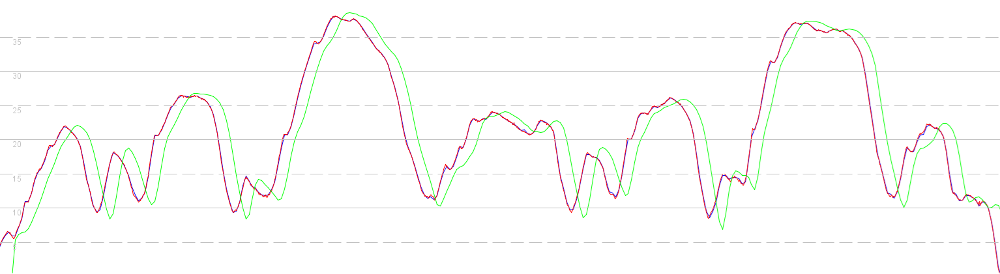

#### Flatwater

The image below shows how position-derived speed (green) and Doppler-derived speed (red) differ.

This position-derived speeds contain strange spikes, and the speed data exhibits a lot of smoothing.

A comparison of 5 Hz Motion data (red), 1 Hz Motion data (blue) and 1 Hz COROS data (green) shows the reasonable performance of this activity type.

This COROS speed data is much better than the hike activity but there is a lot of smoothing, and some dips are lower than motion.

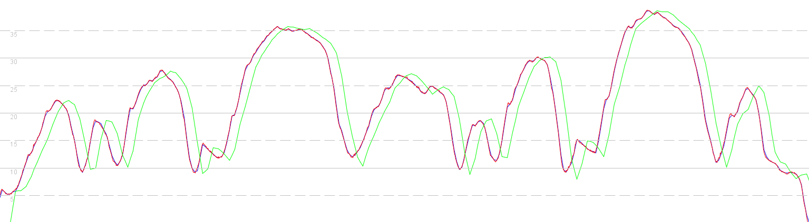

#### Speedsurfing

The image below shows how position-derived speed (green) and Doppler-derived speed (red) differ.

The position-derived speeds contain strange upward spikes. The speed data exhibits weird downward spikes during periods of acceleration in addition to a lot of smoothing. The poor speed data is due to the issue in firmware V3.0408.0 and V3.0409.0.

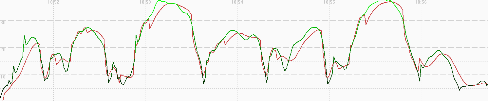

A comparison of 5 Hz Motion data (red), 1 Hz Motion data (blue) and 1 Hz COROS data (green) shows the speed related issues for this activity type.

The COROS speed data exhibits weird downward spikes during periods of acceleration as well as a lot of smoothing

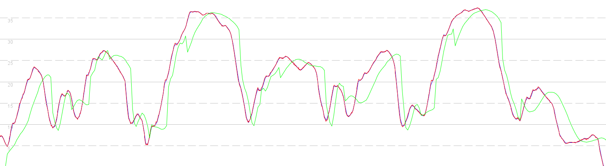

#### Climbing

The image below shows how position-derived speed (green) and Doppler-derived speed (red) differ.

The position-derived speed data exhibits steps (green), and large dips are clearly evident in the Doppler-derived speed data (red).

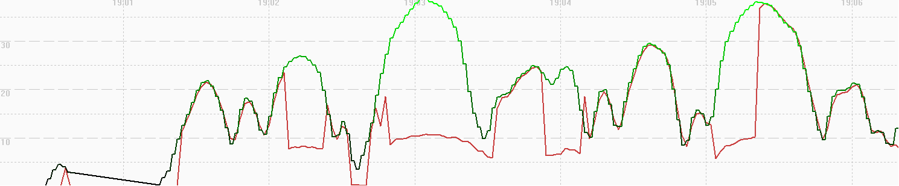

A comparison of 5 Hz Motion data (red), 1 Hz Motion data (blue) and 1 Hz COROS data (green) shows the speed related issues for this activity type.

Large dips and plateaus are clearly evident in the COROS speed data (green), seemingly a lot worse than the hike activity.

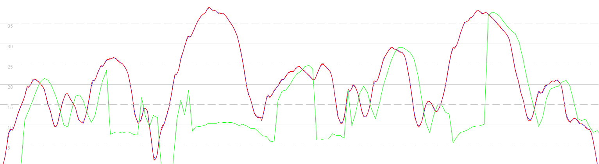

#### Custom

The image below shows how position-derived speed (green) and Doppler-derived speed (red) differ.

Plateaus are clearly evident in the Doppler-derived speed data, possibly due to filtering that is unique to the custom activity.

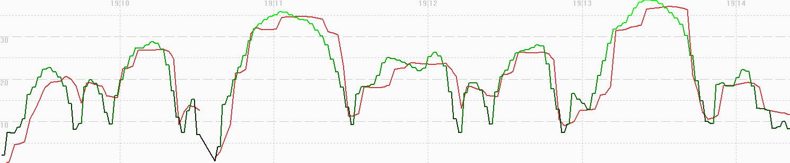

A comparison of 5 Hz Motion data (red), 1 Hz Motion data (blue) and 1 Hz COROS data (green) shows the speed related issues for this activity type.

Plateaus are clearly evident in the COROS speed data (green), possibly due to filtering that is unique to the custom activity.

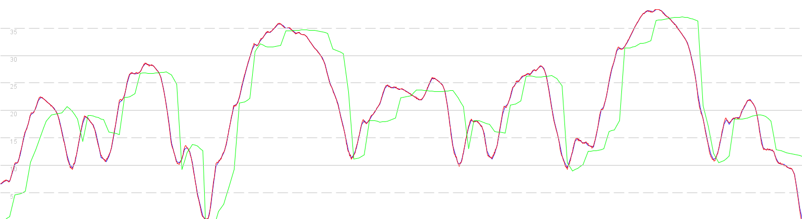

### Comparison

It is interesting to contrast this data with that of the Garmin Forerunner 255, since it uses the same Airoha AG3335M chipset.

The Garmin Forerunner 255 results for this test session can be found on a separate [page](../../../garmin/activities/driving-2024-06-30/README.md).

### Summary

#### Hike

- The position-derived speed data exhibits steps.
- Large dips + plateaus are clearly evident in the Doppler-derived speed data.

#### Climbing

- The position-derived speed data exhibits steps, like the hike activity
- Large dips are clearly evident in the Doppler-derived speed data, seemingly a lot worse than the hike activity.

#### Bike / Flatwater

- The filtering of position + speed data from bike and flatwater activities seems to be identical.
  - n.b. This contrasts with the stand up paddling activity on Garmin devices, which implements different filtering / smoothing.
- The speed data is much better than the hike / climb activities but there is a lot of smoothing, and some dips are lower than motion.

#### Speedsurfing

- The position-derived speeds contain strange upward spikes.
- The speed data exhibits weird downward spikes during periods of acceleration in addition to a lot of smoothing.
  - n.b. The poor speed data is due to the issue in firmware V3.0408.0 and V3.0409.0.

#### Custom

- The position-derived speed data exhibits steps, just like hike / climb activities.
- Plateaus are clearly evident in the Doppler-derived speed data, possibly due to filtering that is unique to the custom activity.

