## COROS Activity Testing

Author: Michael George

Created: 9 July 2024

### Overview

This page documents activity testing that was performed on 2024-05-29, whilst walking in an open-sky environment.

- COROS APEX 2 Pro + PACE 3 - Firmware V3.0408.0
  - Flatwater
  - Open Water Swim
  - GPS Cardio
  - Bike
  - Walk

5 Hz data was also collected using a Motion Mini.

### Data

All of the FIT data is available for download in ZIP format:

- [2024-05-29-walking-apex-2-pro.zip](2024-05-29-walking-apex-2-pro.zip) - APEX 2 Pro
- [2024-05-29-walking-pace-3.zip](2024-05-29-walking-pace-3.zip) - PACE 3

The OAO data from the Motion is available for download in ZIP format:

- [2024-05-29-walking-motion.zip](2024-05-29-walking-motion.zip) - Motion @ 5 Hz

### Observations

#### Flatwater

The images below shows how position-derived speed and Doppler-derived speed are very similar. There are some fluctuations, but speed and position are clearly smoothed.

Differences between the two watches may be due to them being worn on different wrists.

APEX 2 Pro:

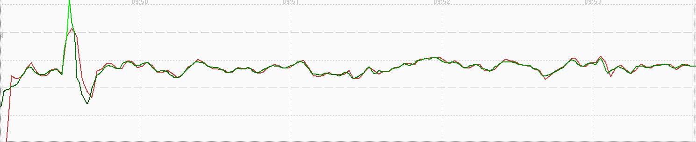

PACE 3:

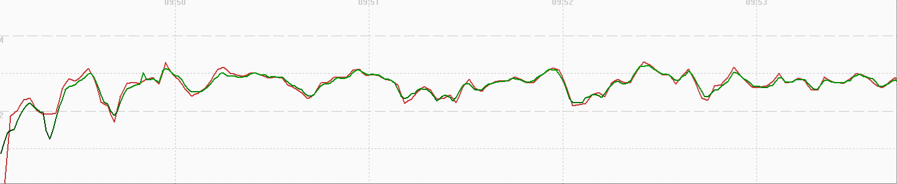

#### Open Water Swim

The images below shows how speed (red) is heavily smoothed. Positional data (green) is also smoothed, but not as much as the speed data.

Differences between the two watches may be due to them being worn on different wrists.

APEX 2 Pro:

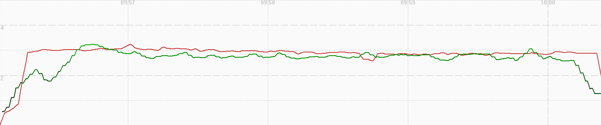

PACE 3:

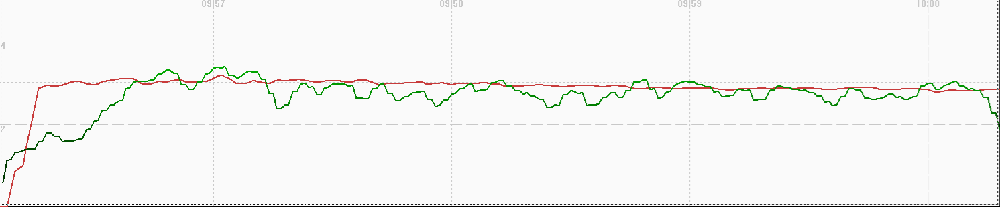

#### GPS Cardio

The images below shows how position-derived speed and Doppler-derived speed are very similar. There are some fluctuations, but speed and position are clearly smoothed.

Differences between the two watches may be due to them being worn on different wrists.

APEX 2 Pro:

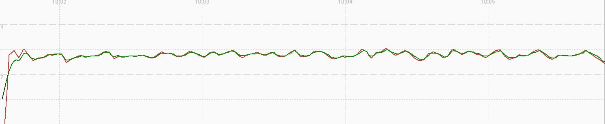

PACE 3:

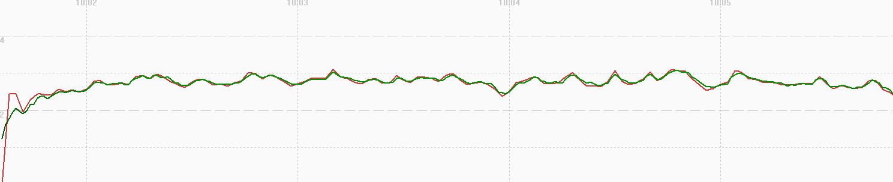

#### Bike

The images below shows how position-derived speed and Doppler-derived speed are very similar. There are some fluctuations, but speed and position are clearly smoothed.

Differences between the two watches may be due to them being worn on different wrists.

APEX 2 Pro:

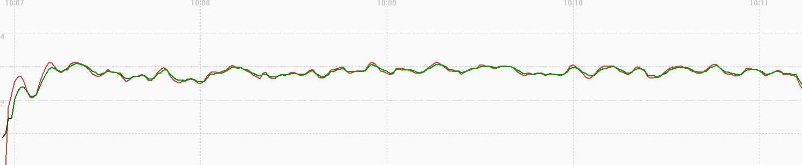

PACE 3:

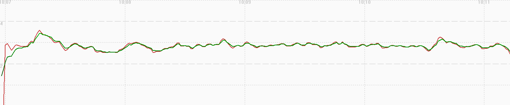

#### Walk

The images below shows how speed (red) is heavily smoothed. Positional data (green) is also smoothed, but not as much as the speed data. A slowdown was detected in the positional data (slightly before 10:18), but that was not evident in the speed data.

Differences between the two watches may be due to them being worn on different wrists.

APEX 2 Pro:

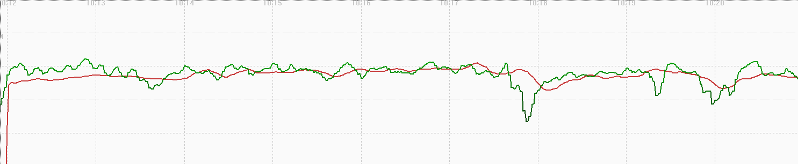

PACE 3:

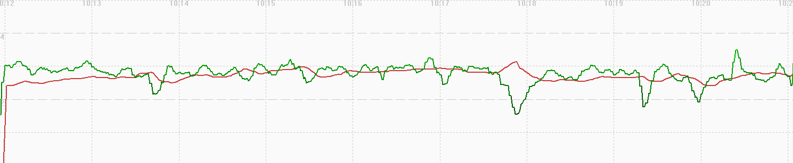

### Comparison

A simple comparison of the speeds for Flatwater (red), Open Water Swim (green), GPS Cardio (magenta), Bike (yellow) vs 5 Hz Motion (blue):
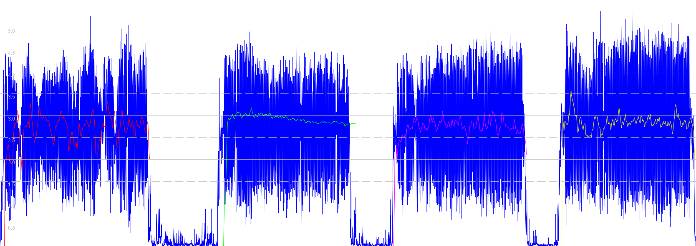

Notes:

- It is pretty clear from this graph that open water swim applies more filtering / smoothing than the other activities.
- The walk has been excluded the diagram above because it was longer than the other activities and was not so uniform, including stops, etc.

### Summary

Flatwater / GPS Cardio / Bike:

- Position-derived speed and Doppler-derived speed are very similar.
- Some fluctuations, but both are clearly smoothed.
- Intriguing that the smoothing of speed and position produces similar results.

Open Water Swim / Walk:

- Speed is heavily filtered / smoothed.
- Position is potentially smoothed, but not as much as speed, and not as much as for flatwater / GPS cardio / bike.
