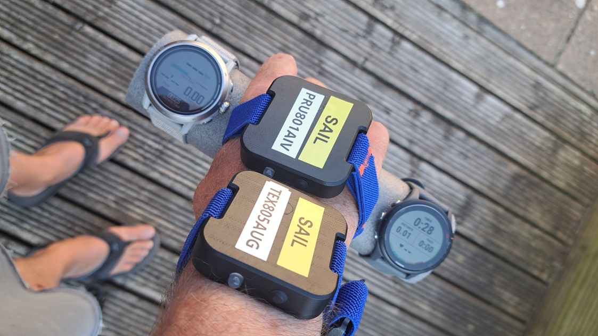

## COROS Activity Testing

Author: Michael George

Created: 9 July 2024

### Overview

This page documents activity testing that was performed on 2024-06-25, whilst walking in an open-sky environment.

- Session 1 - COROS APEX 2 Pro - Firmware V3.0408.0
  - Bike
  - Flatwater
  - Windsurfing
  - GPS Cardio
- Session 2 - COROS APEX 2 Pro - Firmware V3.0408.0
  - Run
  - Trail Run
  - Hike
  - Walk

These tests were more structured than the earlier tests in May 2024.

1 Hz and 5 Hz data was also collected using Motion Minis.

The devices were carried as shown in this photograph, including a Garmin Forerunner 255 on the right:

### Data

All of the FIT data is available for download in ZIP format:

- [2024-06-25-walking-apex-2-pro.zip](2024-06-25-walking-apex-2-pro.zip) - APEX 2 Pro

The OAO data from the Motions is available for download in ZIP format:

- [2024-06-25-walking-motion.zip](2024-06-25-walking-motion.zip) - Motions @ 1 Hz and 5 Hz

### Session 1

#### Bike

The image below shows how position-derived speed and Doppler-derived speed are very similar. There are some fluctuations, but speed and position are clearly smoothed. Intriguing that the smoothing of speed and position produces similar results.

#### Flatwater

The image below shows how position-derived speed and Doppler-derived speed are very similar. There are some fluctuations, but speed and position are clearly smoothed. Intriguing that the smoothing of speed and position produces similar results.

#### Windsurfing

The image below shows how position-derived speed and Doppler-derived speed are very similar. There are some fluctuations, but speed and position are clearly smoothed. Intriguing that the smoothing of speed and position produces similar results.

#### GPS Cardio

The image below shows how position-derived speed and Doppler-derived speed are very similar. There are some fluctuations, but speed and position are clearly smoothed. Intriguing that the smoothing of speed and position produces similar results.

### Session 2

#### Run

The image below shows how speed (red) is heavily smoothed. Positional data (green) is also smoothed, but not as much as the speed data. Note that the beginning of the walk included some cornering.

#### Trail Run

The image below shows how speed (red) is heavily smoothed. Positional data (green) is also smoothed, but not as much as the speed data.

#### Hike

The image below shows how speed (red) is heavily smoothed. Positional data (green) is also smoothed, but not as much as the speed data.

#### Walk

The image below shows how speed (red) is heavily smoothed. Positional data (green) is also smoothed, but not as much as the speed data.

### Comparison

Comparison of the speeds for Bike (red), Flatwater (green), Windsurfing (magenta), GPS Cardio (yellow) vs 5 Hz Motion (blue):

Comparison of the speeds for Run (red), Trail Run (green), Hike (magenta), Walk (yellow) vs 5 Hz Motion (blue):

Notes:

- The two graphs above show two distinct types of filtering / smoothing:
  - Bike / flatwater / windsurfing / GPS cardio is the closest to the raw GNSS speeds, but not as close as Garmin.
  - Run / trail run / hike / walk apply the most aggressive levels of filtering / smoothing.
- It is interesting to contrast this data with that of the Garmin Forerunner 255, since it uses the same Airoha AG3335M chipset.
  - The Garmin Forerunner 255 results for these test sessions can be found on a separate [page](../../../garmin/activities/walking-2024-06-25/README.md).

### Summary

#### Bike / Flatwater / Windsurfing / GPS Cardio

- Position-derived speed and Doppler-derived speed are very similar.
- Some fluctuations, but both are clearly smoothed.
- Intriguing that the smoothing of speed and position produces similar results.

#### Run / Trail Run / Hike / Walk

- Speed is heavily filtered / smoothed.
- Position is potentially filtered but more choppy than bike / flatwater / windsurfing / GPS cardio.
