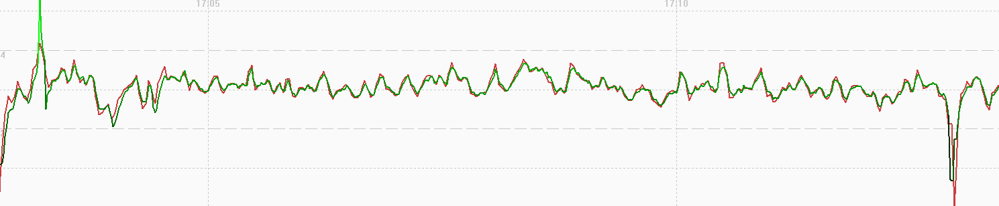
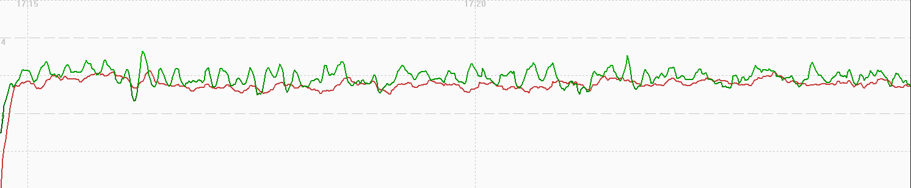
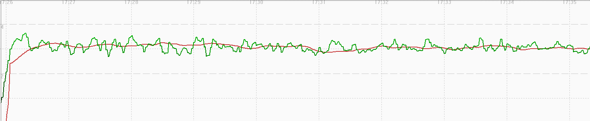
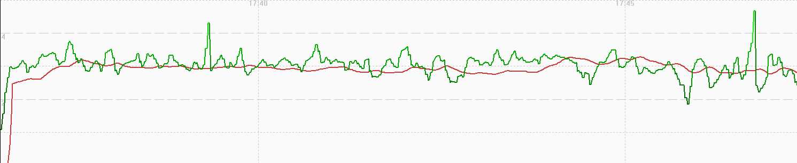
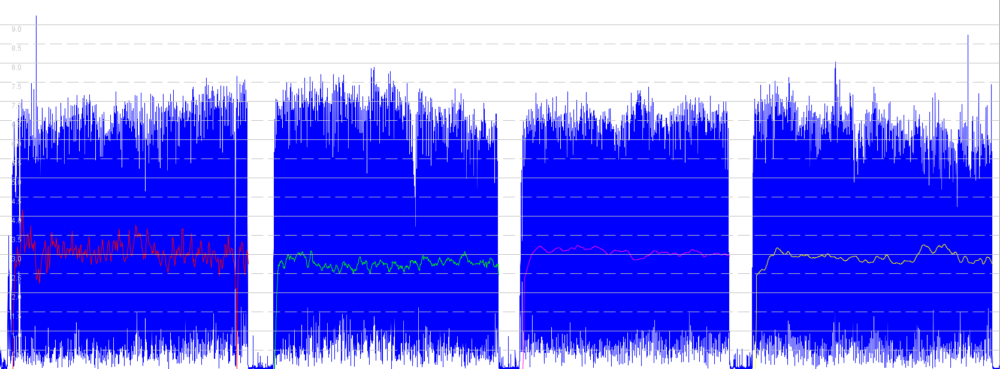

## COROS Activity Testing

Author: Michael George

Created: 9 July 2024

### Overview

This page documents activity testing that was performed on 2024-06-30, whilst walking in an open-sky environment.

It compares speedsurfing against windsurfing, and also looks at two custom activities.

- COROS APEX 2 Pro - Firmware V3.0408.0
  - Windsurfing
  - Speedsurfing
  - Custom Activity (Sailing)
  - Custom Activity (Driving)

1 Hz and 5 Hz data was also collected using Motion Minis.

The devices were carried as shown in this photograph, including a Garmin Forerunner 255 on the right:

### Data

All of the FIT data is available for download in ZIP format:

- [2024-06-30-walking-apex-2-pro.zip](2024-06-30-walking-apex-2-pro.zip) - APEX 2 Pro

The OAO data from the Motions is available for download in ZIP format:

- [2024-06-30-walking-motion.zip](2024-06-30-walking-motion.zip) - Motions @ 1 Hz and 5 Hz

### Observations

#### Windsurfing

The image below shows how position-derived speed and Doppler-derived speed are very similar. There are some fluctuations, but speed and position are clearly smoothed. Intriguing that the smoothing of speed and position produces similar results.

#### Speedsurfing

The image below shows how the speedsurfing activity looks quite different to the windsurfing activity. This is due to a bug in the firmware V3.0408.0 (released in May 2024) which adversely affected the speed data.

#### Custom Activity (Sailing)

The position-derived speeds (green) are reminiscent of the data from run / hike / walk activities in the previous test. The speed data looks a little different though and the is not exhibiting the same type of filtering / smoothing.

#### Custom Activity (Driving)

The position-derived speeds (green) are reminiscent of the data from run / hike / walk activities in the previous test. The speed data looks a little different though and the is not exhibiting the same type of filtering / smoothing.

### Comparison

Comparison of the speeds for Windsurfing (red), Speedsurfing (green), Custom - Sailing (magenta), Custom - Driving (yellow) vs 5 Hz Motion (blue):

Notes:

- The filtering / smoothing of speed data for speedsurfing (green) is clearly different to the windsurfing activity.
  - This is due to a bug in the firmware V3.0408.0 (released in May 2024) which adversely affected the speed data.
- It is interesting to contrast this data with that of the Garmin Forerunner 255, since it uses the same Airoha AG3335M chipset.
  - The Garmin Forerunner 255 results for this test session can be found on a separate [page](../../../garmin/activities/walking-2024-06-30/README.md).

### Summary

#### Windsurfing

- Position-derived speed and Doppler-derived speed are very similar.
- Some fluctuations, but both are clearly smoothed.
- Intriguing that the smoothing of speed and position produces similar results.

#### Speedsurfing

- Position-derived speed and Doppler-derived speed are clearly different.
- Doppler-derived speed is heavily filtered.

#### Custom Activities

- Speed is heavily filtered / smoothed, but not quite so much as running / hiking / walking.
- Position is potentially filtered but more choppy than bike / flatwater / windsurfing / GPS cardio.
