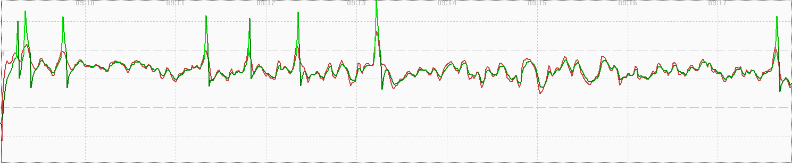

## COROS Activity Testing

Author: Michael George

Created: 9 July 2024

### Overview

This page documents activity testing that was performed on 2024-07-03, whilst walking in an open-sky environment.

It compares speedsurfing against windsurfing to ensure the new firmware has fixed the speedsurfing smoothing issue.

- COROS APEX 2 Pro - Firmware V3.0506.0
  - Speedsurfing
  - Windsurfing
  - Speedsurfing
  - Windsurfing

1 Hz and 5 Hz data was also collected using Motion Minis.

The devices were carried as shown in this photograph, including a Garmin Forerunner 255 on the right:

### Data

All of the FIT data is available for download in ZIP format:

- [2024-07-03-walking-apex-2-pro.zip](2024-07-03-walking-apex-2-pro.zip) - APEX 2 Pro

The OAO data from the Motions is available for download in ZIP format:

- [2024-07-03-walking-motion.zip](2024-07-03-walking-motion.zip) - Motions @ 1 Hz and 5 Hz

### Observations

#### Speedsurfing

The image below shows how position-derived speed and Doppler-derived speed are very similar, when ignoring the spikes in the position-derived speeds! There are some fluctuations, but speed and position both appear to be smoothed, despite spikes in the position-derived speeds.

#### Windsurfing

The image below shows how position-derived speed and Doppler-derived speed are very similar, when ignoring the spike in the position-derived speeds! There are some fluctuations, but speed and position both appear to be smoothed, despite spikes in the position-derived speeds.

#### Speedsurfing

The image below shows how position-derived speed and Doppler-derived speed are very similar, when ignoring the spikes in the position-derived speeds! There are some fluctuations, but speed and position both appear to be smoothed, despite spikes in the position-derived speeds.

#### Windsurfing

The image below shows how position-derived speed and Doppler-derived speed are very similar, when ignoring the spikes in the position-derived speeds! There are some fluctuations, but speed and position both appear to be smoothed, despite spikes in the position-derived speeds.

### Comparison

Comparison of the speeds for Speedsurfing (red), Windsurfing (green), Speedsurfing (magenta), Windsurfing (yellow) vs 5 Hz Motion (blue):

Notes:

- First and last sections (same location but different direction) are pretty much identical - speedsurfing and windsurfing.
- Middle sections (same location but different direction) also very similar, bar some minor spikey variations - windsurfing and speedsurfing.
- It appears the a bug in the firmware V3.0408.0 (released in May 2024) has been resolved in V3.0506.0.
- It is interesting to contrast this data with that of the Garmin Forerunner 255, since it uses the same Airoha AG3335M chipset.
  - The Garmin Forerunner 255 results for this test session can be found on a separate [page](../../../garmin/activities/walking-2024-07-03/README.md).

### Summary

#### Windsurfing and Speedsurfing

- Position-derived speed and Doppler-derived speed are very similar.
- Some fluctuations, but both are clearly smoothed.
- It appears the a bug in the firmware V3.0408.0 (released in May 2024) has been resolved in V3.0506.0.
