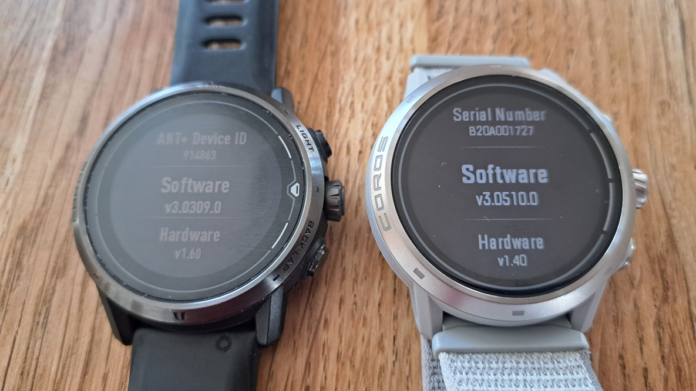
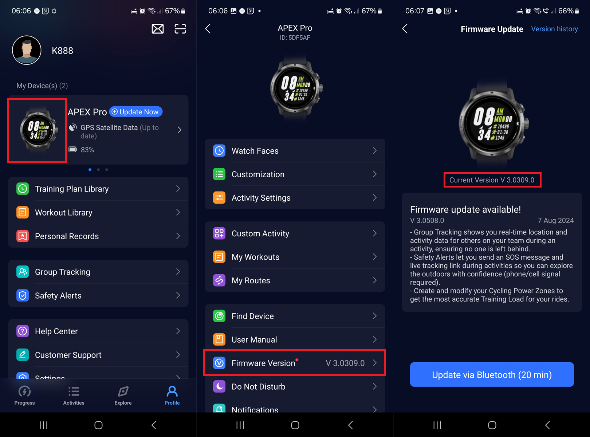
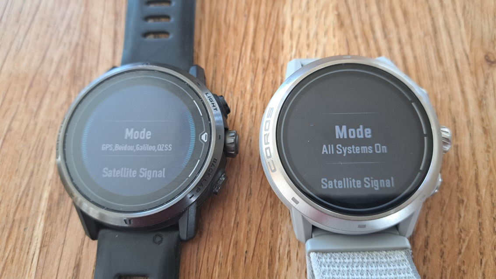
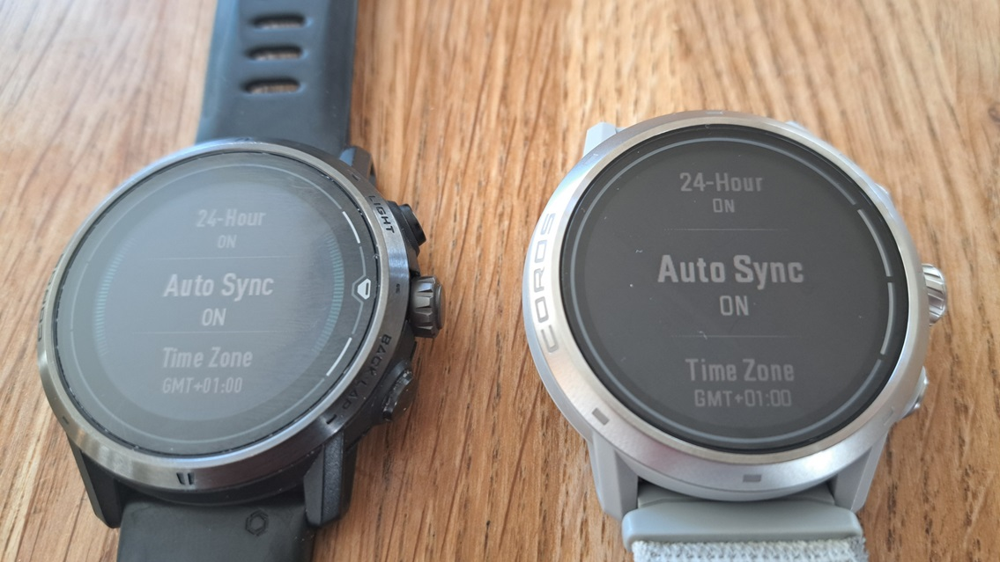
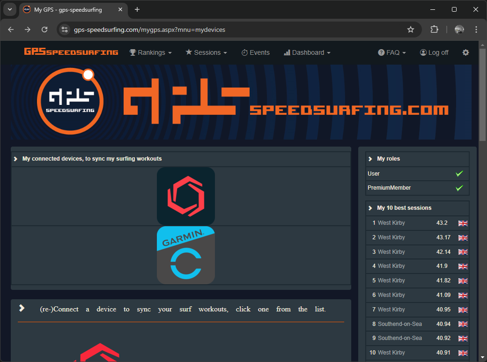
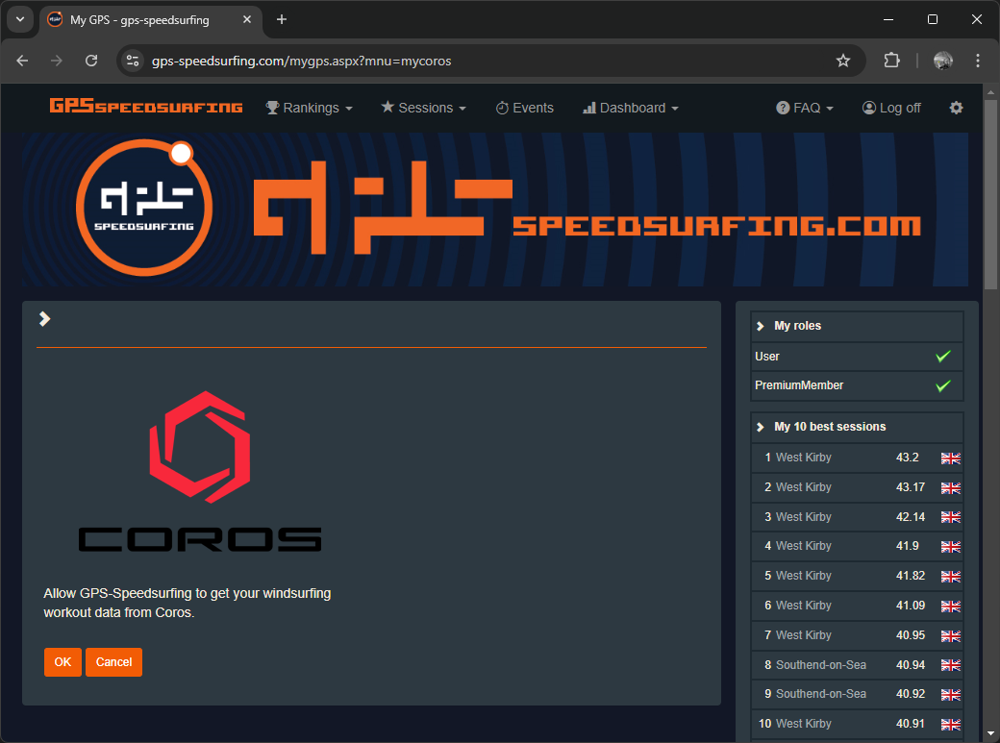

## COROS Advice for Speed Sailors

### Introduction

This article will focus specifically on the COROS range

The problem with max speeds, popular at all levels... most prone to errors

The GNSS chipset is probably the most significant factor when it comes to the accuracy and reliability of GPS watches. Additional factors include antenna design, GNSS firmware, watch firmware, and user settings. The activity mode and / or app choice are also really important.

Important factors to avoid speed sailing roulette, plus additional tips:

- Watch choice - GNSS chipset, general features
- Watch setup - firmware, settings, and accounts
- Watch Usage - wearing the watch, recording an activity, plus additional tips
- Data analysis - reviewing results, exporting activities, and importing activities

Until COROS released watches there were limited options for speedsailing

Nice speedsurfing activity but they weren't perfect

Last couple of years, good watches started to appear

### Watch Choice

#### GNSS Chipset

- GNSS chipset is a primary factor
  - Early models used Sony
    - Repeated speeds
    - Spikes after loss of lock
    - Low resolution / precision of speeds - unique to COROS
  - Latest models use Airoha
    - Decent data when using the right firmware, settings, activity
    - Can be pretty terrible data if you get these things wrong!

#### General Features

Records sats, HDOP, COG

Activity profiles

- Speedsurfing
- Windsurfing

Things to consider:

- Satellite systems (Multi-Band, All Systems, GPS + Galileo / GPS + GLONASS)
- HR monitor - improved in VERTIX 2S
- Battery life

Mileage might vary... excuse the pun!

#### Recommendations

- Choose Airoha - APEX 2, APEX 2 Pro, VERTIX 2, VERTIX 2S
- Avoid Sony - APEX, APEX Pro, VERTIX

### Watch Setup

#### Firmware

Firmware

IMPORTANT

- APEX Pro and VERTIX
  - 3.0309.0 and 3.0409.0 were the last good versions, keep them installed
  - DO NOT upgrade to 3.0508.0
- APEX 2, APEX 2 Pro, VERTIX 2 and VERTIX 2S
  - 3.0308.0 was the last good version, keep it installed
  - DO NOT upgrade to 3.0408.0, 3.0409.0, 3.0508.0 or 3.0510.0

App

If you have 3.0508.0 on your APEX Pro or VERTIX you can downgrade using this page:

[How to manually update my COROS watch](https://support.coros.com/hc/en-us/articles/15344945273620-How-to-manually-update-my-COROS-watch) published by COROS

#### Settings

Sats

GPS - mode - all systems or dual frequency

Time auto-sync

- https://support.coros.com/hc/en-us/articles/5859961688212-The-watch-is-not-displaying-the-correct-time

Less important

- Auto lock - Standby mode + Activity mode - hold to unlock
- Touch screen - off
- Gesture backlight - off
- WiFi - manual sync, downloading maps and firmware updates

Be sure to re-check your settings after a firmware update.

#### Applications

COROS do not support 3rd part applications like Apple or Garmin.

Use speedsurfing mode, or GPS cardio.

### Linking Accounts

#### GP3S

Link to COROS to GP3S

[https://www.gps-speedsurfing.com/mygps.aspx?mnu=mydevices](https://www.gps-speedsurfing.com/mygps.aspx?mnu=mydevices)

COROS

It knows how to process speeds correctly, when provided with  a FIT upload

Filters will remove the worst spikes, but other errors will still be present

#### Hoolan and Waterspeed

Link to Garmin Connect to Hoolan and Waterspeed

They know how to process speeds correctly, when provided with  a FIT upload

#### Strava and Relive

Link to Garmin Connect to Strava and Relive as an activity diary.

They do not know how to process speeds correctly, even when provided with  a FIT upload

You will see bogus numbers recorded

### Watch Usage

#### Wearing the Watch

- How to wear - over wetsuit, back hand, not underhand
- Rinse under tap

#### Recording an Activity

Firmware and setttings

What is the latest GPS data?

Activity profiles / filters - show example

Use speedsurfing mode, not windsurfing

#### Additional Tips

- Backlight during night
- Find my phone + find my watch
- Camera control - Insta360 / GoPro
  - GoPro - COROS help on [control](https://support.coros.com/hc/en-us/articles/4411031553044-How-to-control-GoPro-Cameras) + article by [GoPro](https://gopro.com/en/gb/news/open-gopro-coros)
  - Insta360 - COROS help on [control](https://support.coros.com/hc/en-us/articles/4406181409300-How-to-control-Insta360-from-your-COROS-watch) + [data overlay](https://support.coros.com/hc/en-us/articles/28945366751764-Insta360-Data-Overlay)

- Marking a waypoint - lost something!

### Data Analysis

#### Reviewing Results

Ignore max and take 2s with a pinch of salt, compare to 10s / 100m / 250m

- [GPSResults](https://www.gps-speed.com/download_e.html) by Manfred Fuchs

- [GpsarPro](http://gpsactionreplay.free.fr/index.php?menu=2) by Yann Mathet

- [GPS Speedreader](https://github.com/prichterich/GPS-Speedreader/) by Peter Richterich

#### Exporting Activities

- FIT vs GPX

Spikes are capped in exports

Beware subsequent conversions - e.g. GPSBabel

#### Importing Activities

- Import to suitable platform
  - GP3S using FIT
  - Ignore Strava and SportsTrackLive
    - Don't know about Relive which is also popular

- Waterspeed does not handle COROS GPX properly at this time

### Known Issues

Firmware since May 2024

Run detection

Alphas - watch / app and the actual data

- Temporal delay affecting position vs speed

### Summary

Choose an Airoha watch, set it up properly.

Use speedsurfing, not windsurfing

Be mindful of the pitfalls when exporting and importing sessions. Use FIT.

Known issues - firmware, stats and data

Sail fast, and have fun!
