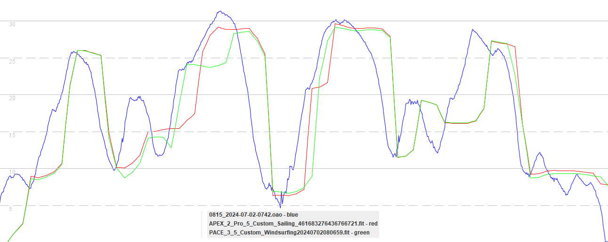
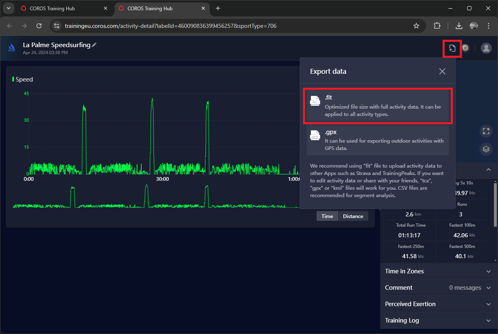
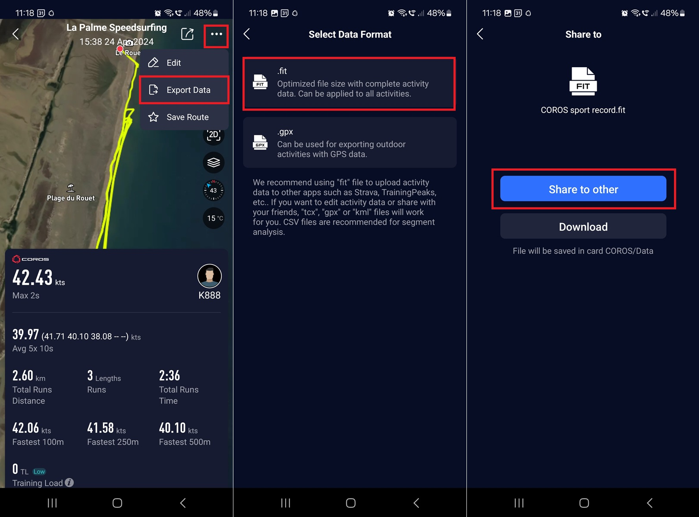

## Introduction

Do you own a COROS watch, or planning to buy one for windsurfing / wingfoiling / kitesurfing? If your answer is yes, then this guide has been written specifically for you and your mates!

Knowing your speed on the water and whether you are faster than your mates adds an element of fun to your water time, but your watch choice and setup makes a big difference to the accuracy.

The problem with max speeds (popular at all levels) is their susceptibility to errors; small and large! Last week my APEX Pro reported a max of [37.88](https://www.facebook.com/michael.george.545/posts/10220672656646659) knots when I was wingfoiling, instead of the actual 23 knots.

All GPS receivers are prone to errors, but some are more prone to issues than others. Even if you own a decent GPS watch, your setup and usage will have a huge impact on the likelihood of speeds being accurate / real.

This is why I've written dedicated guides for the COROS and Garmin watches. There is quite a lot to cover, but I'll try to be concise. Both of the guides have an identical structure:

- Watch choice
  - GNSS chipset and general features

- Watch setup
  - Firmware and watch settings

- Linked accounts
  - GP3S, Hoolan, Waterspeed, Strava, Relive

- Watch usage
  - Wearing the watch, recording an activity, additional tips

- Data analysis
  - Reviewing results, exporting activities, importing activities

- Known issues

This guide has been written to help you get the best out of your watch, and avoid the various pitfalls that are present in default settings!

## Watch Choice

The COROS watches have become popular on [gps-speedsurfing.com](https://www.gps-speedsurfing.com/) since being approved. It all began when the Locosys devices were becoming scarce / discontinued and a suitable alternative was desperately required.

At the time, COROS were the only brand willing to collaborate with the speedsurfing community and they developed a dedicated speedsurfing activity. Sure, it wasn't perfect (and a bit buggy) but it was a decent start.

Since the original APEX Pro / VERTIX, several new watches released and approved for use on [gps-speedsurfing.com](https://www.gps-speedsurfing.com/); APEX 2 / APEX 2 Pro / VERTIX 2 / VERTIX 2S. The newer devices are significantly better in terms of accuracy.

### GNSS Chipset

The [GNSS](https://en.wikipedia.org/wiki/Satellite_navigation) chipset is the primary limiting factor when it comes to the accuracy of GPS watches. Additional factors include the antenna design, GNSS firmware, watch firmware, user settings and activity mode / watch app.

The APEX Pro and VERTIX both use a Sony GNSS chipset which prioritises low power usage over accuracy. This comes at the expense of trustworthy speeds, which isn't ideal but at the time deemed good enough.

The Sony-based watches (COROS and Garmin) have a number of inherent issues:

- Identical speeds being repeated several seconds in a row
- Big spikes after loss of lock; submersion, inside buildings / vehicles, etc.
- Low resolution / precision of speed; unique to the Sony chipset used by COROS.

The APEX 2, APEX 2 Pro, VERTIX 2 and VERTIX 2S use an Airoha / MediaTek chipset. These can produce significantly better data with the right firmware, watch settings, and activity mode. They can also be unreliable / inaccurate if you get any of these things wrong!

### General Features

When choosing a COROS watch you should ensure that it includes the speedsurfing mode. You might assume the windsurfing mode would be much the same as speedsufing (aside from displaying different information), but that simply isn't the case. More on this later!

Pertinent differences between the watch ranges:

- Watch size
  - VERTIX 2 > APEX 2 Pro > APEX 2
- Battery life
  - VERTIX 2 > APEX 2 Pro > APEX 2
- Ruggedness
  - VERTIX 2 > APEX 2 Pro > APEX 2
- GNSS antenna design
  - VERTIX 2S better than VERTIX 2
- HR monitor
  - VERTIX 2S better than VERTIX 2

These differences might help your to choose the watch best suited to your own requirements and budget.

### Recommendations

Nowadays, I can recommend the APEX 2, APEX 2 Pro, VERTIX 2, and VERTIX 2S. Although the PACE 3 uses the Airoha GNSS chipset, it does not have the speedsurfing activity which is crucial for reliable / accurate data.

The earlier models such as the APEX Pro and VERTIX are too prone to inaccuracies, just like Garmin watches using the same family of Sony GNSS chipset. If you own an APEX Pro or VERTIX then it may be worth treating yourself to an upgrade!

## Watch Setup

### Firmware

The firmware version is of particular importance with the COROS watches. You can check which version you have installed on the watch itself.

System -> More Settings -> Device Info -> Software

**IMPORTANT** - recent firmware releases have been detrimental to the accuracy / reliability of COROS watches. Those issues are being worked on right now!

- APEX Pro + VERTIX
  - 3.0309.0 and 3.0409.0 were the last good versions, so keep them installed.
  - DO NOT upgrade to 3.0508.0
- APEX 2 + APEX 2 Pro + VERTIX 2 / 2S
  - 3.0308.0 was the last good version, so keep it installed.
  - DO NOT upgrade to 3.0408.0, 3.0409.0, 3.0508.0 or 3.0510.0

You can also check the firmware version from within the COROS application, but be wary of the available upgrades!

**TOP TIPS**

- If you have 3.0508.0 on your APEX Pro or VERTIX you can downgrade to 3.0309.0 by following the [instructions](https://support.coros.com/hc/en-us/articles/15344945273620-How-to-manually-update-my-COROS-watch) from COROS.
- If you have 3.0308.0 or earlier on APEX 2 / APEX 2 Pro / VERTIX 2 / VERTIX 2S then leave it installed at this time.
- You should re-check your GPS / GNSS settings after every firmware update because they have a tendency to revert to standard GPS.

### Watch Settings

The GPS / GNSS mode has far more impact than you might think. The default mode of standard GPS gives longer battery life which is great for ultra-running / endurance-cycling but far more likely to record fictitious speeds.

The worst errors that I have seen from the Airoha-based COROS watches have occurred when using the standard GPS mode. It's really important that you use All Systems or Dual Frequency on the latest watches.

If you have one of the older Sony-based watches then you should choose one of the modes which uses multiple systems, and not the standard GPS. Personally, I use GPS + BeiDou + Galileo + QZSS.

System -> More Settings -> Satellite Systems -> Mode

The time of day on COROS watches can start to drift quite quickly, but this can be avoided by ensuring [auto-sync](https://support.coros.com/hc/en-us/articles/5859961688212-The-watch-is-not-displaying-the-correct-time) is switched on. The time will then be kept up-to-date by the COROS app.

System -> More Settings -> Date / Time -> Auto Sync

These are some other settings that I would recommend / advise:

- System -> Activity Interface
  - Auto Scroll = off / on, depending on personal preference
- System -> Wi-Fi
  - Add network for manual sync, and faster downloads of maps + newer firmware
- System -> More Settings
  - Gesture Backlight = off, avoiding the annoyingly bright light when in bed
  - Touch Screen = map only, since touch screens tend to be eratic when wet
  - Auto Lock
    - Standby Mode - hold to unlock, since it is easier than using the dial
    - Activity Mode - hold to unlock, since it is easier than using the dial

Prior to starting the activity you can also change the following settings:

- Speed into a Run
  - 12 knots or 22 km/h

- Speed Units
  - knots or km/h

- Activity Alert
  - New Record Alert = on

Within the COROS app you can also configure the speedsurfing activity:

- Activity data pages
  - Set according to personal preference(s)

- Button settings
  - Set according to personal preference(s)

- Activity alert
  - New Record Alert = on

Notes:

- The COROS settings are clearly described in the [guide](https://drive.google.com/file/d/1YQbuPNeTJ3ivgykGI4qOz2yzMxxHmD9B/view?usp%3Dsharing) by Ingolf van Oostveen.
- You should re-check your GPS / GNSS settings after every firmware update!

### Applications

COROS watches do not benefit from third party applications, like Apple or Garmin watches.

If you have a watch that includes speedsurfing and windsurfing activities, you should use the speedsurfing activity.

If you are using an APEX, PACE 2 or PACE 3 then GPS cardio is probably your best bet. You should avoid custom activities.

Activity modes will be discussed in the section "Recording an Activity".

## Linking Accounts

### GP3S

You can link your COROS account to [GP3S](https://www.gps-speedsurfing.com/) using the "[My Devices](https://www.gps-speedsurfing.com/mygps.aspx?mnu=mydevices)" page.

Dashboard -> My Items -> My Devices

Select the COROS option under (re-)Connect a device which will then walk you through the process, probably requiring your registered COROS username and password.

Once the connection process has been completed your speedsurfing sessions will automatically be uploaded to GP3S, allowing you to quickly post to any of the GP3S sites.

What actually happens is the FIT files for your sessions are processed by GP3S, whereby obvious spikes are removed. Some spikes (especially Sony ones) can slip through the filters.

### Hoolan + Waterspeed

Hoolan and Waterspeed are popular apps with Apple watch users. Hoolan and Waterspeed can both be linked to your Garmin Connect account, ensuring that watersport activities are automatically uploaded to their platforms.

This capability doesn't exist for COROS watches right now, but maybe might become available in the future. I'm not privy to any information saying that this will ever happen, just saying that it is theoretically possible!

### Strava + Relive

You can link your COROS account to Strava and Relive, but I feel obliged to provide a warning. Strava does NOT know how to process the speed data recorded by your COROS watch (or any watch tbh) and can lead to fictitious speeds.

If you want to get techie, Strava does not process the Doppler-derived speeds from the GPS / GNSS chipset and therefore prone to spikes. These spikes may be small (e.g. just a few knots), or large (e.g. tens of knots).

Strava is fine as an activity diary, recording where you sailed and how far, but you should completely disregard and high speeds being reported. No, you can't just eyeball the data and remove obvious spikes yourself...

## Watch Usage

### Wearing the Watch

Sadly we don't live in an ideal world where your GPS is either working, or not working. GPS errors vary by orders of magnitude and speeds being displayed does not mean the GPS / GNSS receiver is working either working or accurate.

How you wear your GPS receiver can significantly impact the accuracy and reliability of the data being recorded, but you can minimise the risk of errors by following these principles:

- Do not just stick your GPS device down your wetsuit, use an aqua-pack on your arm.
- Wear the GPS device over your wetsuit, or fold back your neoprene sleeve.
- When speed sailing, wear your watch on your back hand to ensure it is facing upwards.

I was guilty of denying these were actually relevant when I started speedsurfing, but nowadays I recognise their importance. Maybe I'll document it properly at some time!

### Recording an Activity

**QUICK REMINDER**

Ensure you are always using an appropriate firmware:

- APEX / VERTIX
  - Use 3.0309.0 or 3.0409.0.
  - Avoid 3.0508.0.

- APEX 2 Pro / VERTIX 2 / VERTIX 2S
  - Use 3.0308.0.
  - Avoid 3.0408.0, 3.0409.0, 3.0508.0 and 3.0510.0.

Ensure you are always using the corrrect watch settings:

- Ensure you are using multiple systems, not standard GPS.
- Ensure you have latest GPS data, which makes the initial signal acquisition faster.

**ACTIVITY MODE**

Now to the next thing of importance which is the choice of activity mode. The image below compares an APEX 2 Pro (red) and PACE 3 (green) against a Motion GPS (blue). The terrible accuracy from the watches is very clear, and entirely due to use of the "custom" activity.

Different activity modes use different data sources, filtering and smoothing. The activity modes are proprietary to the watch manufacturer and the "custom" activity was chosen to illustrate the significance of activity modes.

**IMPORTANT**

- Use the speedsurfing activity for the best possible accuracy from your COROS.
  - Do NOT use the windsurfing activity which is [non-Doppler](https://medium.com/@mikeg888/the-importance-of-doppler-b886b14bb65d) - prone to errors and significant spikes.
- Use the GPS cardio activity on watches such as the APEX, PACE 2 or PACE 3.
  - Do not use the "custom" activities - ideal as they might sound the resulting data is absolutely terrible!

### Additional Tips

To ensure the crown dial doesn't seize up:

- Regularly clean as described by [COROS](https://support.coros.com/hc/en-us/articles/4407431266836-COROS-Watches-Maintenance-and-Cleaning-Tips).

Handy everyday tips:

- The backlight makes for a handy torch in the middle of the night.
- Find my phone + find my watch can be super-useful when they have been misplaced.

Additional tips and features:

- You can control your action camera from some of the COROS watches.
  - GoPro - COROS help on [control](https://support.coros.com/hc/en-us/articles/4411031553044-How-to-control-GoPro-Cameras) + article by [GoPro](https://gopro.com/en/gb/news/open-gopro-coros).
  - Insta360 - COROS help on [control](https://support.coros.com/hc/en-us/articles/4406181409300-How-to-control-Insta360-from-your-COROS-watch) + [data overlay](https://support.coros.com/hc/en-us/articles/28945366751764-Insta360-Data-Overlay).
- Learn to save your location, just in case you lose something in the sea!
  - This will allow you to return to the spot with a mask + snorkel, or a diver.

## Data Analysis

### Reviewing Results

Ignore max and take 2s with a pinch of salt, compare to 10s / 100m / 250m

- [GPSResults](https://www.gps-speed.com/download_e.html) by Manfred Fuchs
- [GpsarPro](http://gpsactionreplay.free.fr/index.php?menu=2) by Yann Mathet
- [GPS Speedreader](https://github.com/prichterich/GPS-Speedreader/) by Peter Richterich

### Exporting Activities

- FIT vs GPX

App

Spikes are capped in exports

Warn against converting to GPX with GPSBabel.

### Importing Activities

- Import to suitable platform
  - GP3S using FIT
  - Ignore Strava and SportsTrackLive
    - Don't know about Relive which is also popular

- Waterspeed does not handle COROS GPX properly at this time

## Known Issues

Firmware since May 2024

New record alerts

Run detection

Alphas - watch / app and the actual data

- Temporal delay affecting position vs speed

## Summary

Choose an Airoha watch, set it up properly.

Use speedsurfing, not windsurfing

Be mindful of the pitfalls when exporting and importing sessions. Use FIT.

Known issues - firmware, stats and data

Sail fast, and have fun!
